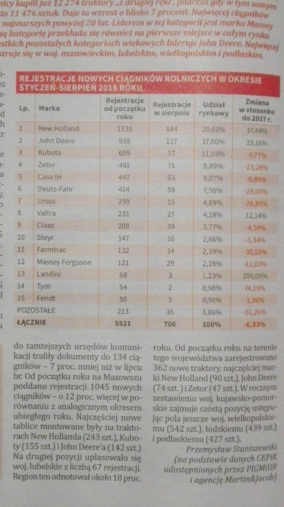

```{r setup, include=FALSE}
knitr::opts_chunk$set(echo = FALSE)
```

Pracę domową przygotowałem na podstawie artykułu z tygodnika "Tygodnik Poradnik Rolniczy" nr. 41 (751) z 14 października 2018 roku zamieszczonego na stronie 26. Tytuł artykułu brzmiał "Susza uderzyła w rynek ciągników", a tabela z tego artykułu, umieszona poniżej na rysunku \ref{rys1}, przedstawia liczbę rejestracji nowych ciągnikow rolniczych w okresie styczeń-sierpień 2018 roku.


A teraz wykres przedstawiający porównanie dla każdej marki jaki ma udział w zarejestrowanych ciągnikach w okresie styczeń-sierpień oraz w samym sierpniu.

```{r wykres}
suppressMessages(library(ggplot2))
options(stringsAsFactors = FALSE)

ciagniki <- read.csv('rejestracjeCiagnikow.csv')

marka <- ciagniki[,'marka']
caly_rok <- ciagniki[,'caly_rok']/sum(ciagniki[,'caly_rok'])
sierpien <- ciagniki[,'sierpien']/sum(ciagniki[,'sierpien'])


ciagnik <- data.frame(marka=c(marka,marka),rejestracje=c(caly_rok,sierpien),
           czas=c(rep('styczen-sierpien',length(marka)),
             rep('sierpien',length(marka))))#,ncol=3,colnames=c('marka','rejestracje','czas'))

ggplot(ciagnik, aes(x=marka,y=rejestracje,fill=czas)) +
  geom_col(position = position_dodge()) +
  theme_bw() + 
  xlab("Marka ciagnika") +
  ylab("Udzial w zarejestrowanych ciagnikach") +
  scale_x_discrete(limits = ciagniki$marka[length(ciagniki$marka):1]) +
  scale_fill_discrete(name="Zakres czasowy") +
  theme(legend.position="bottom") + 
  coord_flip()
```

Z wykresu można odczytac, że sprzedaz dominującej marki, czyli New Holland delikatnie maleje natomiast sprzedaż drugiej w kolejności marki rośnie, co może doprowadzić do zmiany lidera za kilka lat. Najbardziej maleje sprzedaż Kuboty, Ursusa (ponad dwukrotny spadek), a także mniej znanych marek: Landini i Tym. Duży wzrost można zaobserować u Classa i Massey Fergusona.