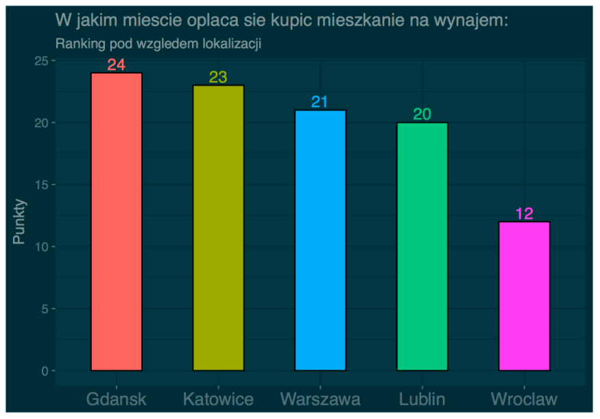

```{r setup, include=FALSE}
knitr::opts_chunk$set(echo = TRUE)
```

## Wstęp

Postanowiłam przerobić wykres zrobiony przez Michała Stawikowskiego, pokazujący, w którym mieście opłaca się zainwestować w mieszkanie na wynajem. Jest w nim pokazane, ile łącznie punktów uzyskało każde miasto w rankingu, lecz nie wiadomo za którą kategorię. Pominięty został dosyć istotny fakt, że punkty były przyznawane w 7 kategoriach wielkości mieszkania i że w każdej kategorii miasto mogło zdobyć od 0 do 5 punktów w zależnosci od tego, na którym miejscu uplasowało się w danej kategorii, np. jeżeli w danym mieście na mieszkaniu wielkości 35-40 metrow kwadratowych można zarobić więcej niż w jakimkolwiek innym mieście to otrzymuje ono 5 punktów w kategorii 35-40 m2, jeżeli jest drugie w tej kategorii to otrzymuje 4 punkty, itd. Chcę uwzględnić tę kwestię na moim wykresie.

## Wersja przed

```{r echo=FALSE, out.width='100%'}

```

## Wersja po
```{r cars, echo=FALSE, warning=FALSE}
#install.packages("ggplot2")
#install.packages("data.table")
#install.packages("ggthemes")
library(ggplot2)
library(data.table)
library(ggthemes)
```

```{r plot1}
dt <- data.table(read.csv2("miasta.csv", stringsAsFactors=FALSE))
dt <- dt[1:5,]
names(dt)<-c("Miasto","< 35 m2", "35-40 m2", "41-50 m2","51-60 m2","61-70 m2", "71-80 m2","> 81 m2","suma")
tmp <- data.table(melt(dt[,-9], id="Miasto"))

theme_set(theme_solarized_2(light=FALSE))
ggplot(tmp, aes(x=reorder(Miasto,-value), y=value, fill=variable)) +
  geom_bar(stat="identity") +
  theme_get() +
  geom_text(size = 3,aes(label=value,hjust = 0.5), position = position_stack(vjust = 0.5)) +
  labs(y = "Punkty",x="Miasta", 
       title="W jakim miescie oplaca sie kupic mieszkanie na wynajem") 
```


W wersji "po" widać, ile punktów zdobyło każde z miast w danej kategorii, przez co jeżeli chcemy zainwestować w małe mieszkanie (< 35 m2) na wynajem, to wiemy, że jest bardziej opłacalnym kupić je w Lublinie, a nie w Gdańsku, jak mógłaby sugerować wersja "przed". Dodatkowo po zsumowaniu punktów widać, że liczba punktów (wziętych ze strony https://forsal.pl/nieruchomosci/aktualnosci/artykuly/1277817,zyski-z-wynajmu-gdzie-i-jakiej-wielkosci-mieszkanie-kupic.html) przyznanych Wrocławiowi wynosi 13 punktów, a nie 12, jak pokazano na wersji "przed" (oraz na oryginalnym wykresie pochodzącym ze wspomnianej już strony). 