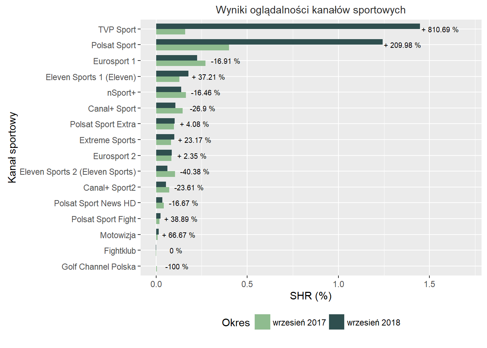

```{r setup, include=FALSE}
knitr::opts_chunk$set(echo = FALSE)
```

#Pierwotny wykres

Postanowiłem wykorzystać wykres na podstawie artykułu  <https://www.wirtualnemedia.pl/artykul/ogladalnosc-kanalow-sportowych-wrzesien-2018-tvp-sport-liderem> pokazujący oglądalność kanałów sportowych w 2017 i 2018 roku.



#Poprawiony wykres

Wykres ten lepiej pokazuje, które stacje odnotowały zysk, a które stratę w oglądalnośći (kolejność na osi y, kolor) i jak duże one były (długość linii), zachowująć przy tym możliwość odróżnienia stacji mniej i bardziej popularnych patrząc na oś x. Dodatkowo mniej widoczne wartośći liczbowe nie odwracają tak uwagi od samego wykresu. Usunięto też skrót SHR, który dla większosci może być niezrozumiały.

```{r warning=FALSE, echo=FALSE, out.width = "100%"}
library(ggplot2)

dane <- readRDS("dane.RDS")
d1 <- dane[,c(1,2,4)]
rok <- rep(2017, times=nrow(d1))
d1 <- cbind(d1, rok)
colnames(d1) <- c("Stacja", "SHR","DynamikaN", "Rok")
d2 <- dane[,c(1,3,4)]
rok <- rep(2018, times=nrow(d1))
d2 <- cbind(d2, rok)
colnames(d2) <- c("Stacja", "SHR", "DynamikaN", "Rok")
data2 <- rbind(d1,d2)

etykiety <- rep("Wzrost", times=nrow(data2))
etykiety[data2[,"DynamikaN"] < 0] <- "Spadek"
etykiety[data2[,"DynamikaN"] == 0] <- "Bez zmian"
etykiety <- factor(etykiety, levels=c("Wzrost", "Bez zmian", "Spadek"))
data2[,"Dynamika"] <- etykiety


ggplot(data2, aes(SHR, y=reorder(Stacja, DynamikaN), group=Stacja, color=Dynamika)) + geom_path() + 
  scale_color_manual(values=c("Wzrost" = "green3","Spadek" = "firebrick2","Bez zmian" = "skyblue4")) + geom_point() + 
  geom_text(data = dane, aes(y = Stacja, x = max_shr, label = dynamic_proc), inherit.aes=FALSE, nudge_y=0.05, nudge_x=0.2, size = 2.5, color="grey60") +
  labs(y = "Kanał", x = "Udział w widowni (%)", title = "Zmiany w oglądalności kanałów sportowych\nmiędzy wrześniem 2017 i 2018") + xlim(0,1.7)
```
