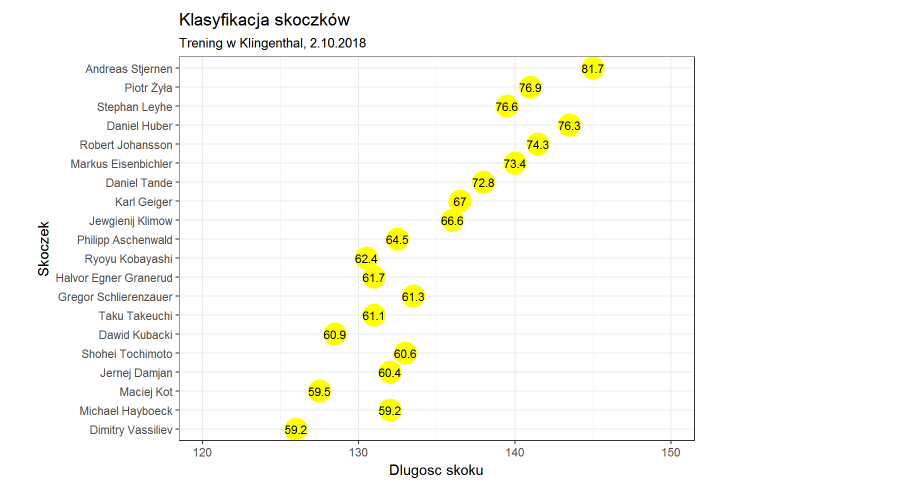

#Wstęp
Celem raportu jest poprawienie wykresu kolegi/koleżanki z poprzedniej pracy domowej.


##Wykres oryginalny

*"Źródło artykułu: "https://sportowefakty.wp.pl/skoki-narciarskie/relacja/93258/2-trening-w-klingenthal*
*"Dane zawierają informacje o wynikach klasyfikacji 67 skoczków z treningu w Klingenthal, 2.10.2018.."*




Na wykresie trudno odczytać długość skoków, a także połączyć ją z odpowiednim skoczkiem. Spowodowane jest to tym, że poszczególne punkty znajdują się daleko od opisu osi pionowej. Odczytywanie długości jest utrudnione przez rzadko rozmieszczone punkty na osi poziomej. Innym problemem wykresu jest to, że liczby podane w zółtych punktach można uznać za odległość pokonaną przez skoczka. Punkty zdobyte przez skoczka nie są uwzgeldnione w żadnym opisie ani legendzie. Dolna oś nie zaczyna się od zera, lecz nie jest to istotne dla tego wykresu i takie rozwiązanie można zaakceptować, ponieważ dzięki takiemu rozwiązaniu lepiej widoczne są różnice w długościach skoków.


\pagebreak

##Wykres zmieniony

```{r error=FALSE, warning=FALSE, message=FALSE}
library(tidyverse)
library(ggplot2)
data <- read.csv("PD2Data")
colorss <- rep(c("a","b","c","d"), 5)
ggplot(data, aes(data$Skoczek, data$Skok, label = paste0(data$Punkty, " pkt."))) +
  geom_segment( aes(x=reorder(data$Skoczek, data$Punkty), xend=data$Skoczek, y=data$Skok, yend=120, color=colorss)) +
  geom_point( aes(x=data$Skoczek, y=data$Skok), color="black", size=2 )+
  geom_label(color = "gray31", size = 3, nudge_y = 3) +
  scale_color_brewer(type="div", palette = "Spectral")+
  scale_y_continuous(breaks = seq(120, 150, by = 5), limits = c(120,150)) +
  coord_flip()+
  theme_light()+
  labs(title = "Klasyfikacja skoczków - Trening w Klingethal - 2.10.2018") +
  theme(axis.title.x = element_text(size = 9),
        axis.title.y = element_text(size = 9),
    legend.position = "none",
    panel.border = element_blank(),
    axis.text.y = element_text(size = 8),
    plot.title = element_text(size = 15, colour = "gray25")) +
    xlab("Skoczkowie oraz ilość zdobytych punktów") + ylab("Długość skoku w metrach")
```

Poszczególne punkty zostały połączone z pionową osią liniami w czterech kolorach, co pozwala na lepszą identyfikację skoku. Odstępy na osi poziomej zostały zagęszczone. Punkty skoczków zostały przedstawione w osobnych tabelkach oraz uwzględnione w opisie pionowej osi.
