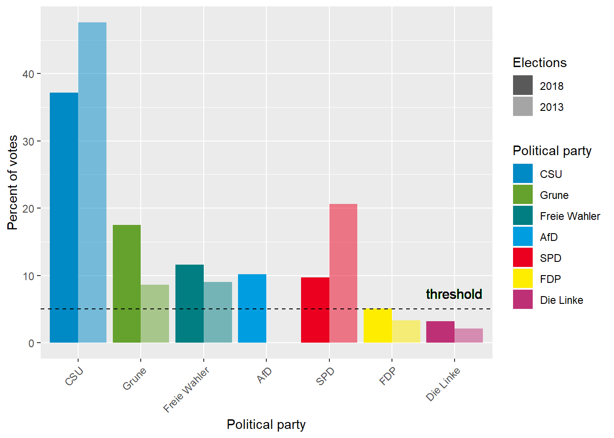

# Wykres bazowy


```{r setup, include=FALSE}
knitr::opts_chunk$set(echo = TRUE)
library(ggplot2)
library(reshape2)
```

# Poprawiony wykres
Co zostało poprawione:

* pokazanie słupków chronologicznie
* pokazanie dokładnej wartości jaką przyjmuje treshold
* podanie maksymalnej wartości na osi 0Y

Uważam, że dane przedstawione chronologicznie o wiele lepiej pokazuje to jak zmieniły się trendy polityczne. Najpierw widzimy trochę wyblakły słupek opisujący dane z 2013, a potem pełny kolor z aktualnymi danymi. Oprócz tego, teraz na pierwszy rzut oka widać ile wynosił próg wyborczy - mamy dodatkową adnotację na osi.
```{r, warning=FALSE}
df <- read.csv("./data.csv")

df$pp <- factor(df$pp, levels=df$pp)
df$elections2013 <- df$elections2018 - df$change
df <- df[, !(names(df) == "change")]
df <- melt(df, id.vars="pp")
df$variable <- factor(df$variable, levels=c("elections2013", "elections2018"), labels=c("2013", "2018"))

ggplot(df, aes(x=pp, y=value, fill=pp, alpha=variable)) +
  geom_bar(stat='identity', position='dodge') +
  scale_y_continuous(limits = c(0,50),
                     expand = c(0, 0),
                     breaks = c(0,5,10,20,30,40,50), 
                     labels = c("0","5","10","20","30","40","50")) +
  theme(axis.text.y = element_text(color = c("black", "red", "black", "black", "black", "black","black")),
        axis.ticks.y = element_line(color = c("black", "red", "black", "black", "black", "black","black")),
        panel.grid.minor = element_blank(),
        panel.grid.major.y = element_line(color = c("white", NA, "white", "white", "white", "white", "white")),
        axis.text.x = element_text(angle = 45, hjust = 1)
        ) +
  scale_fill_manual(values = c("#008AC5", "#64A12D", "#007E82", "#009EE0", "#EB001F", "#FFED00", "#BE3075")) +
  scale_alpha_ordinal(range=c(0.3, 0.9), name="Elections") +
  geom_hline(yintercept = 5, linetype="dashed") + 
  geom_text(aes(7,5,label = "threshold", vjust = -1), show_guide  = F, size = 4) +
  labs(x = "Political party", y="Percent of votes", fill="Political party", alpha="Elections") 


```
