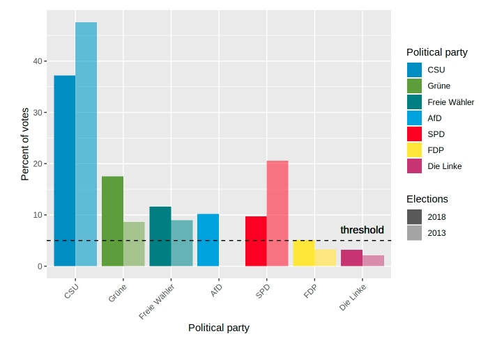

Poniżej załączam grafikę z PD1, którą uznałem za wartą delikatnego dopracowania.

```{r setup, echo = FALSE, include=FALSE}
knitr::opts_chunk$set(echo = TRUE)
library(ggplot2)
library(reshape2)
```

Pierwsze co mi się rzuciło w oczy to kolorowość tego wykresu. Pomimo tego, że to bardzo ładnie wygląda to przeszkadza nam to&nbsp;także w skupieniu się na głównym temacie wykresu. Wyrzuciłem całkowicie tą kolorwankę ponieważ opis parti na osi X jest więcej niż wystarczający do zrozumienia tego wykresu, a dzięki temu zyskaliśmy na czytelność. Pozwoliło mi to na zmienienie z&nbsp;jasnościowych oznaczeń lat wyborów na dwa dość dobrze kontrastujące kolory, dzięki czemu widzimy dokładnie gdzie jest który rok. Co więcej na poprzednim wykresie lata były nieintuicyjnie ustawione w kolejności: 2018, 2013. Zamieniłem je więc miejscami, żeby wykres był spójny chronologicznie. Jako wisienkę na torcie dodałem do wykresu tytuł, żeby tylko patrząc na&nbsp;wykres czytelnik wiedział co on przedstawia.

```{r, echo=FALSE}
df <- read.csv("./data.csv")
df$pp <- factor(df$pp, levels=df$pp)
df$elections2013 <- df$elections2018 - df$change
df <- df[, !(names(df) == "change")]
df <- melt(df, id.vars="pp")
df$variable <- factor(df$variable, levels=c("elections2013", "elections2018"), labels=c("2013", "2018"))
ggplot(df, aes(x=pp, y=value, fill=variable)) +
  geom_bar(stat='identity', position='dodge') +
  geom_hline(yintercept = 5, linetype="dashed") + 
  geom_text(aes(7,5,label = "threshold", vjust = -1), show.legend  = F, size = 4) +
  labs(x = "Political party", y="Percent of votes", fill="Elections") +
  theme(axis.text.x = element_text(angle = 45, hjust = 1)) +
  ggtitle("Votes in Bavaria")
```