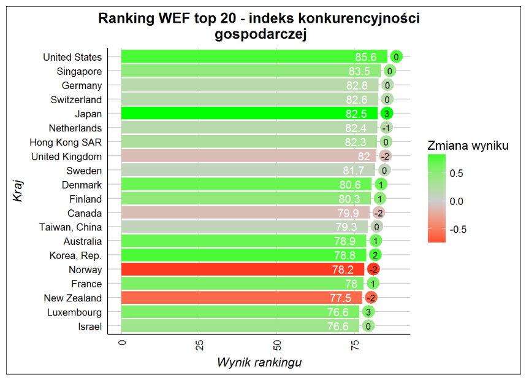

```{r setup, include=FALSE}
library(ggplot2)
library(reshape)
library(RColorBrewer)
wef <- read.csv2("wef.csv", dec = ".", stringsAsFactors = FALSE)
```

Poprawiana praca dotyczy 20 najlepszych krajów wg. indeksu konkurencyjności gospodarczej. Oryginalny wykres poniżej:



Na początek zastąpiłem źle współpracującą z oczami paletę kolorów poprzez znacznie łagodniejszą. Ponadto zamieniłem miejscami oznaczenia zmiany punktacji oraz pozycji, ponieważ jest tylko sześć występujących zmian pozycji, co pozwala zastosować skalę dyskretną bez straty informacji. Użycie skali ciągłej do oznaczenia zmiany punktacji wywołuje większe trudności w odczytaniu. Ponadto teraz łatwiej jest zobaczyć na pierwszy rzut oka, które kraje zmieniły miejsce w rankingu, co wydaje się być ważniejsze od możliwości szybkiego odczytania dokładnej wartości zmiany.

Format napisów zmieniłem na zawierający więcej precyzyjnych danych, ponieważ było to możliwe bez przytłoczenia czytelnika. Oprócz tego skróciłem nieznacznie tytuł, usuwając zbędne słowo "ranking", ponieważ już "top 20" informuje nas, że mamy do czynienia z rankingiem. Na koniec dodałem brakujące informacje na temat roku w opisie osi x oraz legendy.

```{r perfectTime, echo=FALSE}
wef$RankChange <- factor(wef$RankChange)
ggplot(data = wef, aes(x = reorder(Country, -Rank), y = Score, fill = RankChange)) + 
  geom_bar(stat = "identity") + 
  geom_text(aes(label = paste(Score, ifelse(ScoreChange > 0, paste("+", ScoreChange, sep = ""), ScoreChange), sep = " / ")), nudge_y = -12) + 
  scale_fill_manual(values = brewer.pal(6, "RdYlGn")) + 
  theme_light() +
  xlab("Kraj") +
  ylab("Wynik rankingu w 2018") + 
  labs(fill = "Zmiana pozycji wzg. 2017") +
  ggtitle("Top 20 WEF - indeks konkurencyjności gospodarczej") +
  coord_flip()
```
