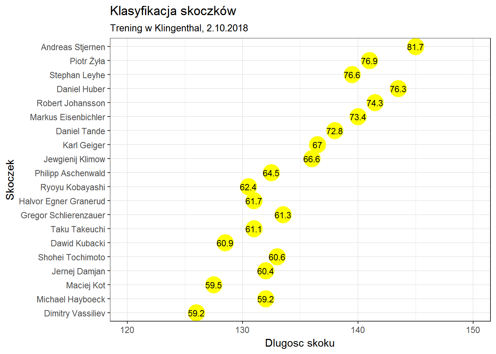

```{r setup, include=FALSE}
knitr::opts_chunk$set(echo = FALSE)
```

W katalogu PD1 znalazłem następujący wykres zrobiony za podstawie artykułu "https://sportowefakty.wp.pl/skoki-narciarskie/relacja/93258/2-trening-w-klingenthal".



Na wykresie zostały umieszczone liczby oznaczające punkty. Nie po to się robi wykres, żeby jeszcze trzeba było czytać liczby. Tak naprawdę ciężko jest nam znaleźć jakieś zależności, ponieważ połowa danych umieszczona jest jako liczby, a oś x jest niewykorzystana, ponieważ na niej znajdują się nazwiska skoczków.

```{r wykres}
suppressMessages(library(ggplot2))
suppressMessages(library(ggrepel))
options(stringsAsFactors = FALSE)

skoki <- read.csv('dane.csv')

ggplot(skoki, aes(x=Punkty, y=Skok, label=Skoczek)) + 
  theme_bw() +
  geom_point(stat='identity', color = "red",  size=3)  +
  geom_text_repel(color="black", size=3, force=1) +
  labs(title="Klasyfikacja skoczków", 
       subtitle="Trening w Klingenthal, 2.10.2018") + 
  ylim(120, 150) +
  xlim(55, 85) +
  ylab('Długość skoku') +
  coord_flip()
```

Na moim wykresie na osi x umieściłem punkty jakie uzyskał zawodnik, natomiast jako podpisy wziąłem nazwiska zawodników, dzięki czemu nadal wiadomo ile punktów i jak długi skok wykonał zawodnik, ale możemy również łatwo porównać punkty w zależności od skoku.
Widać, że jest to zależność prawie wprost proporcjonalna (w skokach narciarskich punkty zależą głównie od długości skoku). Dodatkowo możemy zauważyć, że im dalszy skok tym mniej skoczków. Pierwsze 7 skoczków jest oddalonych od siebie, a w końcówce pierwszej 20-stki wyniki prawie na siebie zachodzą.