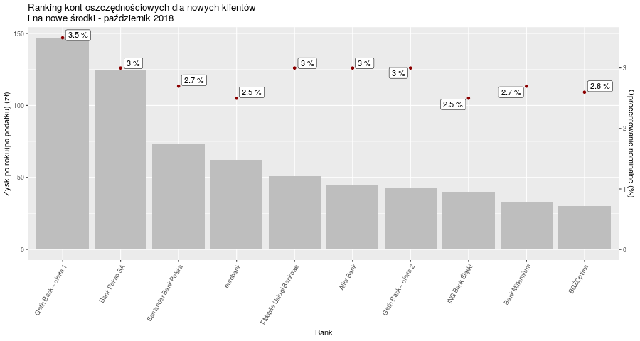

```{r setup, include=FALSE, warning=FALSE, message=FALSE, error=FALSE}
knitr::opts_chunk$set(echo = TRUE)
library(ggplot2)
data <- read.csv("ranking_kont_oszczednosciowych.csv", sep = ";", encoding = "UTF-8", check.names = FALSE)

data$Bank <- factor(data$`Bank`, levels = data$`Bank`[order(-data$`Zysk po roku(po podatku)`)])
```

Jako realizację zadania postanowiłem poprawić wykres stworzony przez Annę Kozak na podstawie artykułu dotyczącego rankingu kont oszczędnościowych. [link]( https://www.money.pl/gospodarka/wiadomosci/artykul/ranking-kont-oszczednosciowych---pazdziernik,25,0,2418201.html)

**Przed:**



Moim zdaniem wykres nie pokazuje wszystkich informacji w sposób przejrzysty, ponieważ etykiety punktów oznaczających wysokość oprocentowania nie są na tej samej wysokości co punkty, co może być mylące oraz porównywanie wysokości punktów, zwłaszcza, gdy są oddalone od siebie, nie jest wygodne dla odbiorcy. Poza tym szary kolor kolumn na szarym tle sprawia, że wykres nie jest przyjemny do czytania.

**Po:**
```{r  ,echo=FALSE, fig.width=10}
ggplot(data = data, aes(x = Bank, y=`Zysk po roku(po podatku)`, fill = `Oprocentowanie nominalne`)) +
  geom_bar(stat = "identity") +
  scale_x_discrete(name="Bank") +
  scale_y_continuous(name="Zysk po roku(po podatku)", 
                     breaks = seq(0,150,25), 
                     labels = paste(seq(0,150,25),"zł"), 
                     expand = expand_scale(add=c(0,5))) +
  scale_fill_gradient(name = "Oprocentowanie \nnominalne", breaks = unique(data$`Oprocentowanie nominalne`), low = "red", high="yellow") +
  theme(axis.text.x = element_text(angle=60, hjust=1)) +
  ggtitle("Ranking kont oszczędnościowych dla nowych klientów \ni na nowe środki - październik 2018")
```
Na moim wykresie postanowiłem przedstawić wysokość oprocentowania za pomocą kolorów słupków. Rozwiązanie to likwiduje problem szarych kolorów, ułatwia porównywanie poszczególnych banków i upraszcza wykres, co czyni go jeszcze łatwiejszym do odczytania. W legendzie zaznaczyłem tylko wartości, które występują w danych, by można było dokładnie odczytać wysokość oprocentowania. Na koniec poprawiłem jeszcze podpisy na osi Y, by łatwiej można było odczytać kwotę.