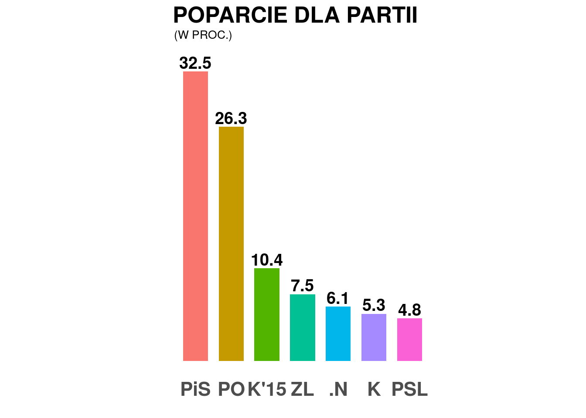

```{R, echo = FALSE}
library("ggplot2")
```

<style>
p {
  text-align: justify;
}
</style>

<center>
<h1>Techniki wizualizacji danych</h1>
<h3>Praca domowa 2</h3>
<h4>Autor: Patryk Wołosz</h4>
</center><br/>
</center>

<h3>
Wykres przed:
</h3>



Moim można poprawić estetykę tego wykresu. To co od razu rzuca się w oczy to brak ramki lub tła wykresu, które mogłoby wyodrębnić go<br/>z pozostałej treści strony.

<h3>
Wykres po:
</h3>
<center>
```{R, echo = FALSE, warning = FALSE, message = FALSE}
values <- c(0.325, 0.263, 0.104, 0.075, 0.061, 0.053, 0.048)
names <- c("PiS", "PO", "K'15", "ZL", ".N", "K", "PSL")
data <- data.frame("Values" <- values, "Names" <- names)

ggplot(data = data, aes(x = reorder(names, -values), y = values)) +
  geom_bar(stat = "identity", width = 0.8, fill = "#4286f4") +
  theme_light() +
  scale_y_continuous(labels = scales::percent, limits = c(0, 0.35), expand = c(0,0)) +
  geom_text(aes(label = scales::percent(values)), color = "#2f3033", vjust = -0.5) + 
  ggtitle("Poparcie dla partii policzycznych (w proc.)") +
  theme(plot.title = element_text(size = 20, face = "bold", hjust = 0.5),
        panel.grid.major.x = element_blank(),
        axis.text = element_text(face = "bold"),
        axis.line = element_line(color = "#4e5056", size = 1),
        axis.title = element_text(color = "#2f3033", face = "bold")) +
  labs(x = "Partia polityczna", y = "Wartość") 
```
</center>

Wprowadziłem następujące zmiany:
<ul>
  <li>dodałem linie na osiach, by wyodrębnić wykres z treści strony</li>
  <li>dodałem podpisy osi</li>
  <li>dodałem wartości na osi y</li>
  <li>zminiejszyłem rozmiar czcionki oraz szerokość słupków, żeby napisy nie wystawały za słupki</li>
  <li>słupki mają taki sam kolor</li>
</ul>

Wykres "przed" spełnia swoją rolę - pozwala na odczytanie różnic pomiędzy poparciem dla poszczególnych partii politycznych, ale moim zdaniem można było w nim poprawić graficzne szczegóły. Moja wersja tego wykresu jest przede wszystkim (moim zdaniem) ładniejsza.
