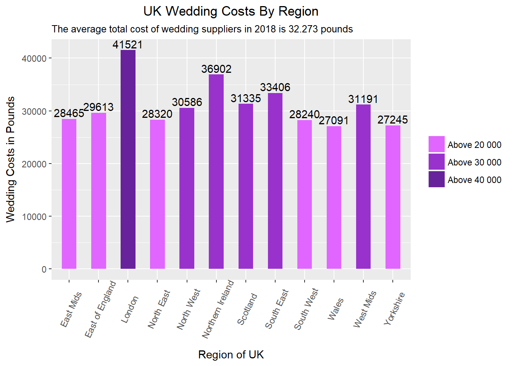

```{r setup, include=FALSE}
knitr::opts_chunk$set(echo = TRUE)
library(ggplot2)
library(reshape2)
library(RColorBrewer)
```

```{r, echo=F}
wedding_data <- data.frame(wedding_costs = c(41521, 29613, 27091, 31191, 28465, 27245, 30586, 28320, 28240, 33406, 31335, 36902), 
                           region= c("London", "East of England", "Wales", "West Mids", "East Mids", "Yorkshire", "North West", "North East", "South West", "South East", "Scotland", "Northern Ireland")) 
```

# Oryginalny wykres


# Poprawiony wykres
```{r, fig.height=6, fig.width=12}
palette <- brewer.pal(7, "PuOr")
wedding_data$region <- reorder(wedding_data$region, -wedding_data$wedding_costs)
avg <- 32273

ggplot(wedding_data, 
  aes(x = region, y = wedding_costs)) +
  geom_bar(position = position_dodge(width=0.8), stat="identity", width=.5, fill=palette[2]) +
  geom_hline(yintercept = avg, color=palette[7], size=1, linetype="dashed") + 
  geom_text(aes(12, avg, label = "2018 average", vjust = -1), color=palette[7], size=4) + 
  theme(axis.line = element_blank(), plot.title = element_text(hjust=0.5)) + 
  labs(title="UK Wedding Costs By Region", x="Region of UK", y="Wedding Costs in Pounds") +
  scale_y_continuous(expand = c(0, 0))
```

Wprowadzone zmiany:

  - Usunięte zostały wartości umieszczone nad słupkami. Wysokości słupków już nas o nich informują, a lepszym miejscem na dokładne wartości jest moim zdaniem tabela.

  - Podobnie z kolorami - informację jesteśmy w stanie odczytać z wykresu. Szczególnie w tym przypadku, gdy wartości oddzielające grupy są zaznaczone osi OY.

  - Usunięte zostało obracanie napisów pod słupkami - wydawały się mało czytelne. Oprócz tego napisy wydają się wskazywać na słupek obok zamiast na ten, do którego są przypisane.

  - Usunięty został podtytuł. Wydaje mi się, że nie należy go używać w ten sposób. Zamiast tego średnią zaznaczyłem na wykresie. Dokładną wartość można podać w tabelce.

  - Słupki zostały posortowane według wysokości. Kolejność w poprzednim wykresie wydawała się być przypadkowa, a rozmieszczenie wydawało się chaotyczne.