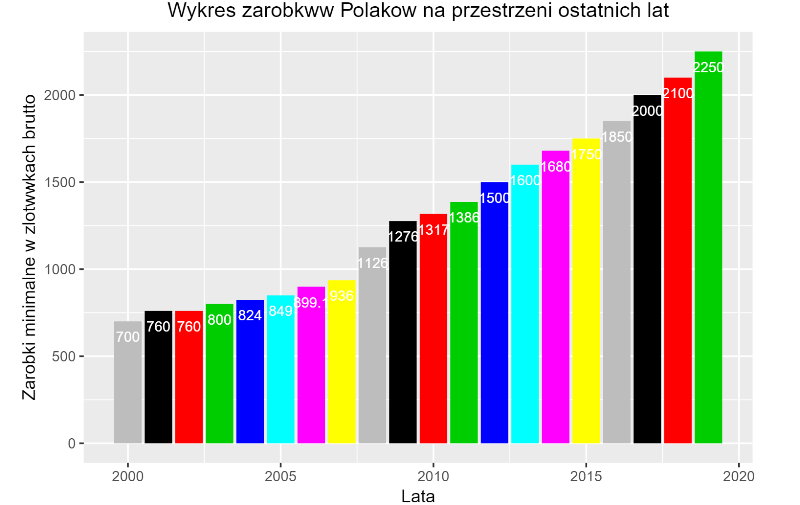

```{r setup, include=FALSE}
knitr::opts_chunk$set(echo = TRUE)
suppressMessages(library(ggplot2))
#tworzenie potrzebnego data.fram'u z płacami minimalnymi
minimum_brutto <- c(700, 760, 760, 800, 824, 849, 899.1, 936, 1126, 1276, 1317, 1386, 1500, 1600, 1680, 1750, 1850, 2000, 2100, 2250)
minimum_netto <- c(512.83, 559.12, 561.82, 588.39, 602.77, 617.39, 647.93, 686.45, 845.17, 954.96, 984.15, 1032.34, 1111.86, 1181.38, 1237.20, 1286.16, 1355.69, 1459.48, 1530, 1633.78)
lata <- c(2000:2019)
dane_minimum_prim <- cbind(minimum_brutto, minimum_netto)
dane_minimum <- as.data.frame(cbind(lata, dane_minimum_prim))
```

# Wykres przed
```{r echo=FALSE, out.width='75%'}

```

#Wykres po 
```{r, echo = TRUE}
 ggplot(data = dane_minimum, aes(x = lata, y = minimum_brutto)) +
  geom_bar(stat='identity', fill='steelblue')+
  geom_text(aes(label = minimum_brutto), size = 3, vjust = -0.3, color = "black") +
  ylab("Zarobki minimalne w zlotówkach brutto") + xlab("Lata") + 
  ggtitle("Wykres zarobków Polaków na przestrzeni ostatnich lat") +
  theme(plot.title = element_text(hjust = 0.5))
```

#Uzasadnienie
Najważniejszą zmianą w wesji "po" jest zmiana kolorów słupków. W wersji "przed" słupki są pokolorowane na różne kolory, co jest niepotrzebne, ponieważ kolory te nie dają żadnej dodatkowej informacji, a nawet mogą wprowadzać w błąd, ponieważ powtarzają się cyklicznie co może sugerować, że dwa słupki o tym samym kolorze są ze sobą w jakiś sposób związane. Dobór kolorów sprawia, że wykres nie wygląda estetycznie oraz powoduje, że niektóre napisy znajdujące się w słupkach są bardzo trudne do odczytania, np. te znajdujące się w słupkach w kolorze żółtym.\
W wersji "po" napisy są nad słupkami zamiast wewnątrz nich jak w wersji "przed" co poprawia ich czytelność, ponieważ w wersji przed niektóre napisy były za szerokie, żeby zmieścić się w słupkach. Najbardziej wyraźnym tego przykładem była liczba 899.1 w słupku dla roku 2006.
