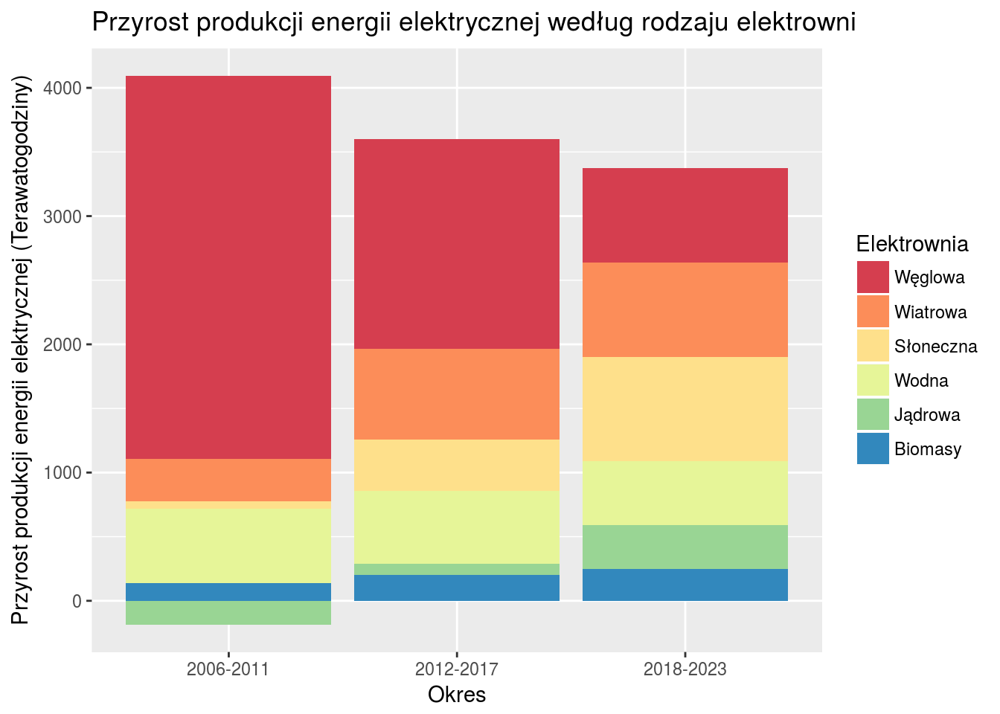

#Przed



#Po

```{r}
library(ggplot2)
library(RColorBrewer)
period <- c('2006-2011', '2012-2017', '2018-2023')
coal <- c(2986.626, 1634.775, 731.727)
wind <- c(332.088, 709.134, 736.441)
solar <- c(59.267, 397.039, 816.49)
hydro <- c(579.268, 566.406, 495.936)
nuclear <- c(-185.312, 88.067, 340.693)
bio <- c(136.045, 203.193, 250.8)
dt2 <- data.frame('Okres'=period, 'Węglowa'=coal, 'Wiatrowa'=wind, 'Słoneczna'=solar, 'Wodna'=hydro, 'Jądrowa'=nuclear, 'Biomasy'=bio)
dt2 <- reshape2::melt(dt2, id.vars = 'Okres', variable.name = 'Elektrownia')

ggplot(data = dt2) + 
  geom_col(aes(x = Okres, y=value, fill = Elektrownia), position = "dodge") +
  scale_y_continuous(name="Przyrost produkcji energii elektrycznej (Terawatogodziny)") +
  scale_fill_manual(values=brewer.pal(6, "Spectral")) +
  ggtitle("Przyrost produkcji energii elektrycznej według rodzaju elektrowni") +
  theme(panel.grid.major.x = element_blank())+ labs(x = "")
```

#Komentarz

Rozbicie poszczególnych kategorii na osobne słupki poprawia czytelność wykresu i pomaga bezpośrednio porównać zmianę przyrostu produkcji enegrii w poszczególnych rodzajach elektrownii.