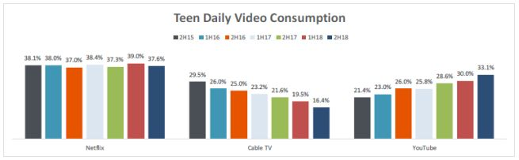

Postanowiłam poprawić wykres dotyczący używania Netflixa, YouTube oraz telewizji kablowej przez nastolatków.

Artykuł pochodzi ze strony wirtualnemedia (https://www.wirtualnemedia.pl/artykul/facebook-traci-uzytkownikow-korzysta-z-niego-36-proc-amerykanskich-nastolatkow-to-inny-organizm-niz-kiedys?fbclid=IwAR0-gpyUSPwtz1jVa5KOJm8qufXtagzR8lcw5jdwIJjweNh9l3KSuPK0VNc).


## Przygotowanie danych

```{r, echo=FALSE, include=FALSE}
library(ggplot2)
library(RColorBrewer)
library(gridExtra)
library(data.table)
```

```{r, echo=FALSE}
netflix <- c(38.1,38.0, 37.0, 38.4, 37.3, 39.0, 37.6)
cable_tv <- c(29.5, 26.0, 25.0, 23.3, 21.6, 19.5, 16.4)
youtube <- c(21.4, 23.0, 26.0, 25.8, 28.6, 30.0, 33.1)
years <- c('Fall 2015', 'Spring 2016', 'Fall 2016', 'Spring 2017', 'Fall 2017', 'Spring 2018', 'Fall 2018')
id <- seq(1,7,1)

df <- data.table(id, years, netflix, cable_tv, youtube)
df
```


## Wykres "PRZED"

```{r echo=FALSE, out.width='100%'}

```

## Wykres "PO"

```{r, echo=FALSE, fig.align='center'}
ggplot(df, aes()) +
  geom_point(aes(x=id, y = netflix, size=2), col='red') + geom_path(aes(x=id, y = netflix), col='red') + 
  geom_point(aes(x=id, y = youtube, size=2), col='blue') + geom_path(aes(x=id, y = youtube), col='blue') +
  geom_point(aes(x=id, y = cable_tv, size=2), col='green') + geom_path(aes(x=id, y = cable_tv), col='green') +
  labs (title = 'Teen Daily Video Consumption', x='Year', y='Users [%]') + 
  scale_x_continuous(breaks=seq(1,7,1), labels=years) + ylim(0,40) +
  annotate("text", x = 4, y = 21, label = "Cable TV", col='green') +
  annotate("text", x = 5, y = 35, label = "Netflix", col='red') +
  annotate("text", x = 6, y = 28, label = "YouTube", col='blue') +
  guides(size=FALSE) +
  scale_colour_manual(name="Line Color",
                      values=c(myline1="red", myline2="blue", myline3="purple")) +
  theme(plot.title = element_text(hjust = 0.5))
```


Przedstawienie danych na jednych wykresie zamiast na trzech wykresach słupkowych pozwala porównywać dane w konretnych okresach czasu dla wszystkich trzech mediów. Widoczny jest na przykład moment, kiedy YouTube wyprzedził telewizję kablową.
Ponadto odczytywanie danych z legendy jest niewygodne, lepiej umieścic etykiety na wykresie.