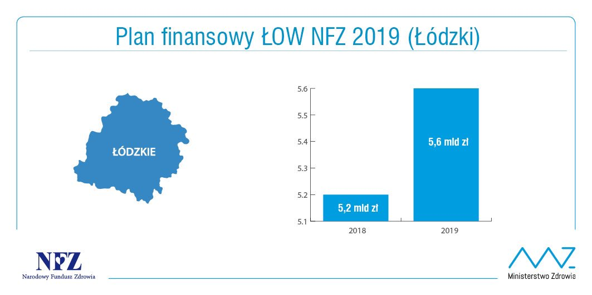
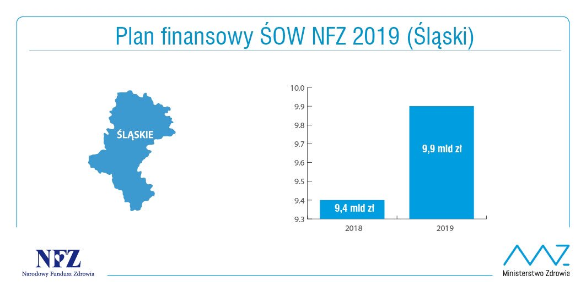

  
```{r setup, echo = FALSE}
knitr::opts_chunk$set(
echo = TRUE,
cache = FALSE)
```

\pagebreak

#Wstęp

15 paździerinka 2018 na portalu Twitter NFZ opublikował serię wykresów mających pokazać ich plany finansowe na najbliższy czas. Były one jednak bardzo wyraźnym aktem manipulacji. Osie Y na każdym z wykresów zaczynają się w takim punkcie, aby przyrost słupka był jak największy. Postanowiłem więc zmienić wykresy, aby pokazać jak na prawdę będzie wyglądał wzrost wydatków. Wybrałem dwa wykresy, które uznałem za najbardziej wprowadzające w błąd: https://twitter.com/NFZ_Centrala/status/1051819431591055362/photo/1
https://twitter.com/NFZ_Centrala/status/1051821277562978304/photo/1

#Wykresy przed zmianami





#Wykresy po zmianach

```{r echo = FALSE}
library(ggplot2)
library(ggthemes)
library(gridExtra)

dane1<-data.frame(cbind(c(9.4, 9.9), c("2018","2019")))
dane1[,1]<-c(9.4,9.9)
colnames(dane1) <- c('zl', 'rok')
dane2<-data.frame(cbind(c(5.2, 5.6), c("2018","2019")))
colnames(dane2) <- c('zl', 'rok')
dane2[,1]<-c(5.2,5.6)

chart1 <- ggplot(data = dane1, aes(x = rok, y = zl)) + 
  geom_bar(stat = 'identity', position = position_dodge(), fill = "#009DE0") +
  theme(panel.grid.major = element_blank(), panel.grid.minor = element_blank(),
  panel.background = element_blank(), axis.line = element_line(colour = "black")) +
  ggtitle("Plan finansowy ŚOW NFZ 2019 (Śląski)") +
  ylab("") + xlab("") + scale_y_continuous(limits = c(0,11),expand = c(0,0)) +
  geom_text(aes(label=c("9.4 mld zł","9.9 mld zł"), vjust = -0.5))
```

Jak widzimy po zmianie wykresy niosą ze sobą zupełnie inny przekaz i nie wprowadzają już czytelnika w błąd.

```{r fig.width= 10}
#pierwszy wykres (chart1) powstał analogicznie
chart2 <- ggplot(data = dane2, aes(x = rok, y = zl)) + 
  geom_bar(stat = 'identity', position = position_dodge(), fill = "#009DE0") +
  theme(panel.grid.major = element_blank(), panel.grid.minor = element_blank(),
  panel.background = element_blank(), axis.line = element_line(colour = "black")) +
  ggtitle("Plan finansowy ŁOW NFZ 2019 (Łódzki)") +
  ylab("") + xlab("") + scale_y_continuous(limits = c(0,6),expand = c(0,0)) +
  geom_text(aes(label=c("5.2 mld zł","5.6 mld zł"), vjust = -0.5))

grid.arrange(chart2, chart1, nrow = 1)
```

