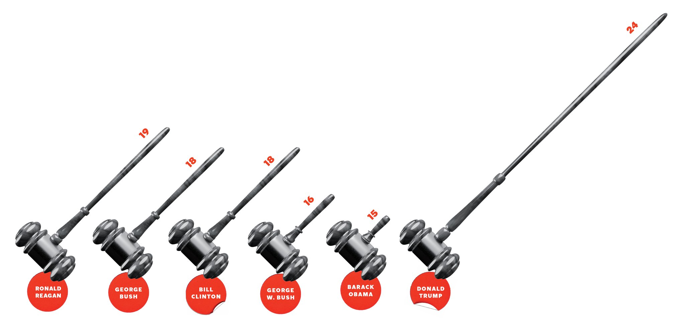

```{r, include=FALSE}
knitr::opts_chunk$set(echo = TRUE)
library(ggplot2)
```

## Poprawa wykresu New York Times

Wykres zamieszczony na stronie New York Times (https://www.nytimes.com/2018/08/22/magazine/trump-remaking-courts-judiciary.html) zawiera masê b³êdów, które sprawiaj¹, ¿e jest on nieczytelny i manipuluje wielkoœciami danych. Na poni¿szym wykresie skala zaczyna siê od 15, a nie od 0. S³upki s¹ w kszta³cie m³otka sêdziowskiego, które s¹ do tego pochylone, co sprawia, ¿e niemo¿liwe jest porównanie wielkoœci s³upków miêdzy sob¹. Wykres poprawiony przeze mnie eliminuje te b³êdy, co sprawia, ¿e jest ³atwy do odczytania i estetyczny.

# Wykres do poprawy




## Wykres poprawiony


```{r, echo=FALSE, out.width="100%"}
x <- read.csv("prezydenci.txt", sep=",")
x <- x[order(x$Judgeships.Confirmed, decreasing=TRUE),]
ggplot(x, aes(x=reorder(President, Judgeships.Confirmed),y=Judgeships.Confirmed, fill=Judgeships.Confirmed)) +
  geom_bar(stat = "identity") +
  scale_x_discrete(limits = x$President[1:6]) +
  scale_fill_gradient(low="lightskyblue2", high="lightslateblue") +
  coord_flip() +
  ggtitle("Appellate Judgeships Confirmed\nDuring First Congressional Term") +
  ylab("\nNumber of confirmed judgeships") + 
  xlab("President") + 
  theme(axis.title.y=element_blank(),
        axis.text.x=element_text(size=12),
        axis.title.x=element_text(size=12,face="bold"),
        axis.text.y=element_text(size=12),
        legend.position = "none",
        plot.title = element_text(size=18,face="bold",hjust=0.5),
        panel.background = element_rect(fill = "grey97",
                                        colour = "grey99",
                                        size = 0.5, linetype = "solid"),
        panel.grid.major = element_line(size = 0.5, linetype = 'solid',
                                        colour = "white"), 
        panel.grid.minor = element_line(size = 0.25, linetype = 'solid',
                                        colour = "white"))
  
```

