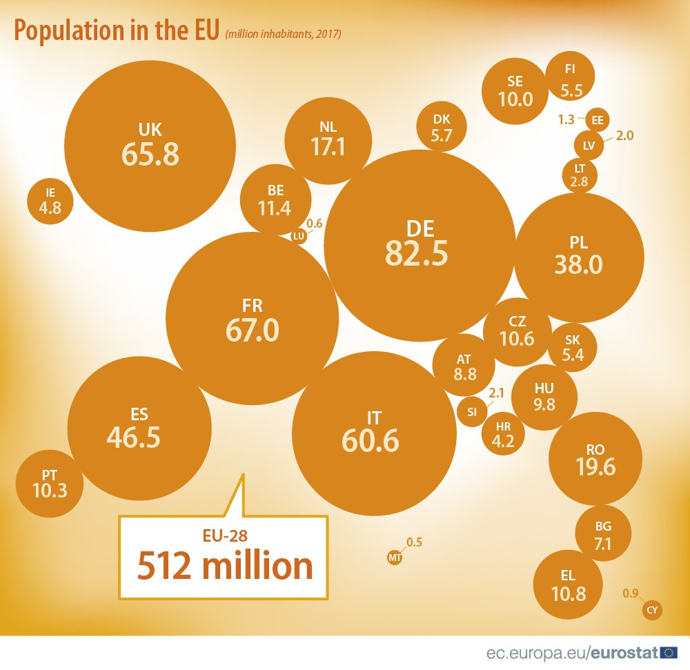

```{r setup, include=FALSE}
knitr::opts_chunk$set(echo = TRUE)
library(ggplot2)
library(dplyr)
library(RColorBrewer)
```

## Wykres

Na twitterze słynnego GUS znalazłem następujący wykres:
<https://twitter.com/GUS_STAT/status/1053227607385354241>.

\newline

Panuje na nim chaos i praktycznie nie da się porównywać wartości przeskalowanych na pola kół. 

\newline

Poniżej przedstawiam posortowany wartościami, estetyczny wykres słupkowy. 

## Przed




## Po

```{r echo=FALSE, out.width="100%"}
data <- read.csv("data.csv") 
data <- arrange(data,Population)
data$Country <- factor(data$Country, levels = data$Country)
kolor <- brewer.pal(5,"Set1")[5]
ggplot(data, aes(x=Country, y=Population)) +
  geom_col(fill = kolor, width=0.85, position = "dodge") +
  coord_flip() +
  theme_dark() +
  theme(axis.ticks.y = element_blank(), panel.grid = element_line(colour = "gray65", size = 0.4)) +
  labs(x="Country", y="Population in millions", title ="Population in the EU (2017)") +
  scale_y_continuous(breaks=seq(0,85,5), expand=c(0.01,0)) +
  geom_text(aes(label = as.character(Population), 
    y = ifelse(Population<3,as.numeric(Population)+1.5,as.numeric(Population-1.7))),
    size=3, color="white", fontface = "bold") +
  geom_rect(aes(ymin=55, ymax=75, xmin="LT", xmax="HU"), color="white", fill=kolor) +
  geom_text(aes(x="DK", y=65, label="EU-28 \n 512 million"), fontface="bold", size = 6, color = "white")
```

