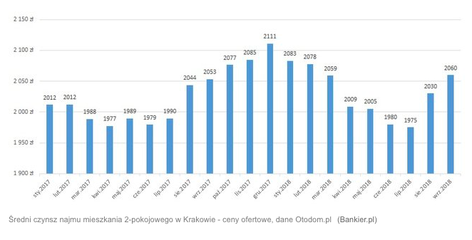

```{r setup, include=FALSE}
knitr::opts_chunk$set(echo = TRUE)
```

## Wstęp

Postanowiłam przerobić wykres dostępny na stronie: https://www.bankier.pl/wiadomosc/Mieszkanie-dla-studenta-kupic-czy-najmowac-7621835.html, pokazujący średni czynsz najmu mieszkania 2-pokojowego w Krakowie. Oś y wykresu (pokazująca miesięczny koszt najmu) nie zaczyna się w 0, tylko w 1900, przez co różnice w cenach z poszczególnych miesięcy są wyolbrzymione, np. wzrost cen wynajmu między lipcem a wrześniem 2018 roku wydaje się być prawie dwukrotny, choć wynosi on mniej niż 100 zł. Mogło to zostać użyte celowo, aby pokazać jak "bardzo" wzrosły ceny wynajmu mieszkań w ostatnim czasie i wspomóc treść arytkułu, w którym rozważana jest kwestia: Czy wynajęcie mieszkania na czas studiów jest tak samo opłacalne jak kupno i sprzedaż mieszkania po upływie 5 lat?

## Wersja przed

```{r echo=FALSE, out.width='100%'}

```

## Wersja po
```{r cars, echo=FALSE, warning=FALSE}
#install.packages("ggplot2")
#install.packages("data.table")
#install.packages("ggthemes")
library(ggplot2)
library(data.table)
library(ggthemes)
```

```{r plot1, fig.width=10}
dt <- data.table(read.csv2("wynajem.csv", stringsAsFactors=FALSE))
names(dt) <- c("daty","koszt")
dt$daty <- factor(dt$daty,levels = dt$daty)

ggplot(dt,aes(x=daty,y = koszt)) + 
  theme_light() +
  geom_col(fill = "#56B4E9", width = .5, aes(x =daty, y = koszt)) +
  theme(axis.text.x = element_text(angle = 45, vjust = 1, hjust=1)) +
  geom_text(angle=45,size = 3.5,aes(label=koszt ),
            position=position_dodge(width=0.9),vjust = -1, hjust = -0.1) +
  theme(legend.position="none") +
  scale_y_continuous(limits=c(0,2500)) +
  labs(y = "Koszt wynajmu mieszkania w zlotowkach",x="Data", 
       title="Miesieczny koszt wynajmu mieszkania w Krakowie w 2017 i 2018 roku")
```

Na moim wykresie wysokości słupków są proporcjonalne do przedstawianych kosztów wynajmu, co zwiększa jego rzetelność. Dodatkowo dodałam do mojego wykresu tytuł i nazwy osi oraz przekrzywiłam liczby ponad kolumnami, żeby były czytelniejsze (nie nakładały się na siebie i nie były zbyt małe).
