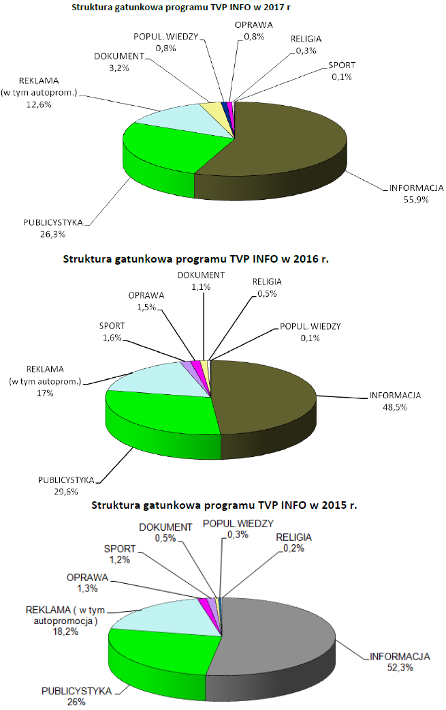

```{r setup, include=FALSE}
knitr::opts_chunk$set(echo = FALSE)
```

#Pierwotny wykres

Zdecydowałem się na porawienie wykresu opublikowanego pod adresem <https://www.wirtualnemedia.pl/artykul/zmalala-liczba-reklam-w-tvp-info-w-tvp1-i-tvp2-bez-zmian>. 


Popełniono tu wiele rażących błędów. Przede wszystkim wybór trzech wykresów kołowych do ukazania zmiany w proporcjach ramówki z roku na rok jest nieracjonalny. Co więcej zastosowano tu trójwymiarowy rzut, oraz nie zachowano przypisania kolorów do kategorii pomiędzy wykresami.

#Poprawiony wykres

Postanowiłem wykonać typowy wykres słupkowy, ponieważ dobrze uwidacznia zmiany w udziale poszczególnych kategorii pomiędzy latami, zachowując widoczność proporcji pomiędzy kategoriami. 

```{r wykres, out.width = "100%"}
library(ggplot2)
library(data.table)

info2017 <- c("Publicystyka" = 26.3, "Reklama" = 12.6, "Dokument" = 3.2, "Pop. wiedzy" = 0.8, "Oprawa" = 0.8, 
              "Religia" = 0.3, "Sport" = 0.1, "Informacja" = 55.9)
info2016 <- c("Publicystyka" = 29.6, "Reklama" = 17, "Dokument" = 1.6, "Pop. wiedzy" = 0.1, "Oprawa" = 1.5, 
              "Religia" = 0.5, "Sport" = 1.6, "Informacja" = 48.5)
info2015 <- c("Publicystyka" = 26, "Reklama" = 18.2, "Dokument" = 0.5, "Pop. wiedzy" = 0.3, "Oprawa" = 1.3, 
              "Religia" = 0.2, "Sport" = 1.2, "Informacja" = 52.3)


info2017d <- data.frame(info2017)
setDT(info2017d, keep.rownames=TRUE)
setkey(info2017d, rn)
info2016d <- data.frame(info2016)
setDT(info2016d, keep.rownames=TRUE)
setkey(info2016d, rn)
info2015d <- data.frame(info2015)
setDT(info2015d, keep.rownames=TRUE)
setkey(info2015d, rn)

dt <- info2017d[info2016d]
dt <- dt[info2015d]

dt <- melt(dt, id="rn", measure=c("info2017", "info2016", "info2015"))


ggplot(dt, aes(x=reorder(rn,-value), y=value, fill=variable)) + geom_bar(position="dodge", stat="identity") + scale_fill_brewer(labels=c("2017", "2016", "2015"), type="qual", palette="Dark2") +
  labs(x="", y="Udział [%]", fill="Rok", title="Struktura gatunkowa programu TVP info w latach 2015-2017")

```
