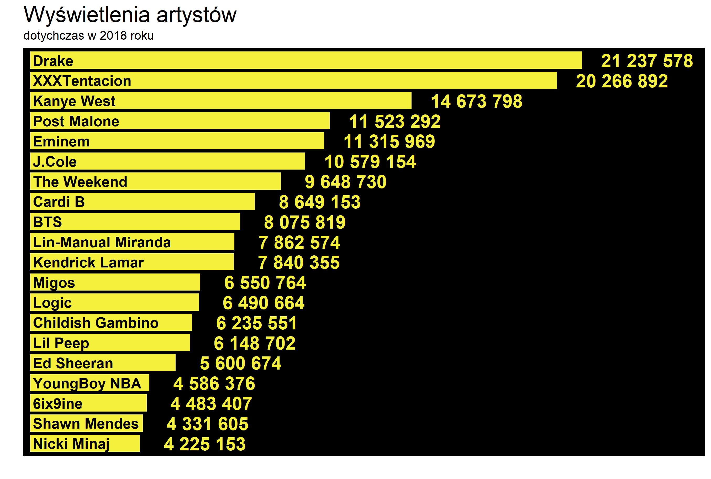

Do manipulacji może przyznać się wiele partii politycznych z całego świata, fundacji, kogoś kto obraca ogromną ilością pieniędzy. Ale czemu portal *Genius* zawierający między innymi teksty piosenek wraz z ich interpretacją (dokonaną przez użytkowników) miałby również dane zakrzywiać? I to jeszcze faworyzując już i tak najbardziej popularnych ... Nieładnie.
<br>
Poniżej wykres, który jest zestawieniem *Genius Presents: The 2018 Year In Lyrics (So Far)*:

<div style="text-align:center">
](genius_2018_artists.png)
</div>

Bardzo nienaturalne zestawienie, gdzie liczba wyświetleń nie gra żadnej roli, a raczej głosy moderatorów są warunkiem długości słupków. Jedyne co się tutaj zgadza to kolejność. No bo jak J.Cole (pozycja 6.) z (hipotetycznie) podwojoną liczbą głosów wyszedłby daleko poza wykres, a mimo tego nawet nie wyprzedziłby w klasyfikacji Drake'a (pozycja 1.). 
<br> <br>
Schodząc trochę niżej mamy Nicki Minaj (pozycja 20.) która ze swoim dorobkiem ma ponad dwa razy mniej wyświetleń niż Ed Sheeran (pozycja 16.) ... Wróć, nie ponad dwa razy mniej tylko trochę ponad milion mniej, czyli w zasadzie słupki powinny się różnić 1/4 długości, a nie ponad całą długością. 
<br> <br> 
Już nie wykładając na powierzchnie faktu, że wspomniana Nicki Minaj przy pięciokrotności swoich wyświetleń dogoniłaby lidera, a jej słupek? Może co najwyżej dogoniłby połowę stawki. 
<br> <br>
Poniżej jak wykres powinien wyglądać naprawdę, z trochę zmodyfikowanymi szatami:

```{r fig.show='hide', message=FALSE}
library(data.table)
library(ggplot2)

artists <- data.table(cbind(
  c('Drake', 'XXXTentacion', 'Kanye West', 'Post Malone', 'Eminem', 'J.Cole', 'The Weekend',
    'Cardi B', 'BTS', 'Lin-Manual Miranda', 'Kendrick Lamar', 'Migos', 'Logic', 'Childish Gambino',
    'Lil Peep', 'Ed Sheeran', 'YoungBoy NBA', '6ix9ine', 'Shawn Mendes', 'Nicki Minaj'), 
  c(21237578, 20266892, 14673798, 11523292, 11315969, 10579154, 9648730, 
    8649153, 8075819, 7862574, 7840355, 6550764, 6490664, 6235551,
    6148702, 5600674, 4586376, 4483407, 4331605, 4225153),
  c('21 237 578', '20 266 892', '14 673 798', '11 523 292', '11 315 969', '10 579 154', '9 648 730', 
    '8 649 153', '8 075 819', '7 862 574', '7 840 355', '6 550 764', '6 490 664', '6 235 551',
    '6 148 702', '5 600 674', '4 586 376', '4 483 407', '4 331 605', '4 225 153')
))
colnames(artists) <- c("Artist", "Views", "Views_view")

ggplot(data = artists, aes(x = reorder(Artist, as.numeric(Views)), y = as.numeric(Views))) +
  geom_bar(position = 'dodge', stat = 'identity', fill = "#f4f03c", width = 0.85) + 
  geom_text(aes(label = as.character(Views_view), y = as.numeric(Views) + 2500000), size = 6, 
            fontface = "bold", color = '#f4f03c') +
  geom_text(aes(label = Artist, y = 100001, hjust = 0), size = 4.7, fontface = "bold", color = "black") +
  theme_classic() +
  theme(axis.text = element_blank(),
        axis.ticks = element_blank(),
        plot.title = element_text(size = 20),
        panel.background = element_rect(fill='black', colour='black')) +
  scale_y_continuous(expand = c(0.01,0), limits = c(0, 25700000)) + 
  labs(title = 'Wyświetlenia artystów', subtitle = 'dotychczas w 2018 roku', x = '', y = '') +
  coord_flip()
```

<div style="text-align:center">

</div>
