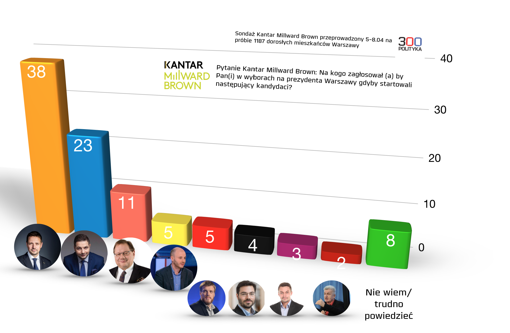

# Wykres bazowy
Wykres przedstawia sondaż, który pokazuje na kogo głosowaliby mieszkańcy, gdyby pokazani kandydaci kandydowali na prezdenta Warszawy.

<center>
{width=700px}
</center>


Główną wadą wykresu, który zamieściłem, są zniekształcone osie. Powoduje to, że wydaje się że słupek po lewej stronie jest stosunkowo o wiele większy od pozostałych. Nie jest to prawidłowy sposób na rzeczywiste przedstawianie danych. Oprócz tego w oczy rzuca się fakt że, słupki są na złej wysokości, np. w przypadku słupka o wysokości 2 wydaje się, że znajduje się on poniżej zera (powoduje to perspektywa 3D).

```{r setup, include=FALSE, echo=FALSE}
knitr::opts_chunk$set(echo = TRUE)
library(ggplot2)
```
```{r, wczytanie danych, include = FALSE, echo = FALSE}
kandydat <- c("Rafał Trzaskowski", 
              "Patryk Jaki", 
              "Ryszard Kalisz", 
              "Jan Śpiewak", 
              "Adrian Zandberg", 
              "Stanisław Tyszka", 
              "Piotr Guział", 
              "Piotr Ikonowicz",
              "nie wiem")
partia <- c("PO",
            "PiS",
            "SLD",
            "Bezpartyjny",
            "Razem",
            "Kukiz15",
            "Bezpartyjny",
            "Bezpartyjny",
            "brak danych")

procent <- c(38, 23, 11, 5, 5, 4, 3, 2, 8)
ord <- 1:9
dat <- data.frame(kandydat,procent,ord,partia)
```

# Kod do stworzenia nowego wykresu
```{r, kod do stworzenia poprawionego wykresu}
p <- ggplot(dat, aes(x = reorder(kandydat, ord), y = procent)) + 
  geom_bar(stat = "identity",aes(fill = reorder(partia, ord)))
p_fin <- p + theme_minimal() +
  theme(
          panel.background = element_blank(),    
          panel.grid.major.x =  element_blank(),
          panel.grid.major.y =  element_line(color = "grey", size = 1),
          panel.grid.minor.y =  element_line(color = "grey", size = 0.2),
          axis.text.x = element_text(angle = 55, hjust = 1, size = 10),
          axis.text.y = element_text(angle = 0, hjust = 0.5, size = 13),
          axis.title.y = element_blank(),
          axis.title.x = element_blank(),
          legend.title=element_blank(),
          legend.text = element_text(size = 13)
          #legend.position="bottom",
          #legend.direction="horizontal"
          ) + 
  scale_y_continuous(expand = c(0, 0), limits = c(0,40)) +
  scale_fill_manual(values = c("#FFB90F", "#00008B", "#A52A2A", "#BB008B", "red", "grey", "#556B2F"))
```

# Poprawiony wykres
Poprawiony wykres ma równe osie, co pozwala na prawidłowe odczytanie danych. Przede wszystkim w oczy bardziej rzuca się różnica pomiędzy wynikiem R. Trzaskowskiego i ludzi, którzy nie wiedzieli co odpowiedzieć. Okazuje się, że liczba niezdecydowanych osiągneła prawie 25% wyniku R. Trzaskowskiego, czego nie było widać na poprzednim wykresie. Oprócz tego dodałem podział na partie, żeby kolory też coś znaczyły, a nie były losowo wybrane.
```{r, echo=FALSE, fig.align='center'}
p_fin
```

