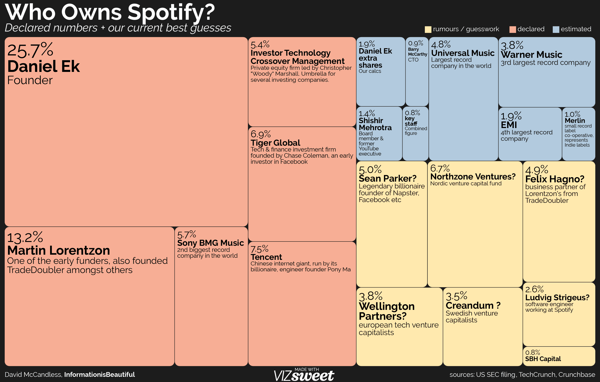

```{r, echo = FALSE, setup, include=FALSE}
library(ggplot2)

kto <- c("Daniel Ek", "Martin Lorentzon", "Tencent", "Tiger Global", "Sony", "ITCM",
         "Northzone Ventures", "Sean Parker", "Felix Hagno", "Wellington Partners", "Creandum", "Ludvig Strigues",
         "Universal Music", "Warner Music", "EMI", "Daniel Ek Extra", "Shishir Mehrotra", "Meriln")

udziały <- c(25.7, 13.2, 7.5, 6.9, 5.7, 5.4,
             6.7, 5, 4.9, 3.8, 3.5, 2.6,
             4.8, 3.8, 1.9, 1.9, 1.4, 1)

dane <- data.frame(kto = factor(kto, levels = rev(kto)), udziały)

stan <- c("Potwierdzone", "Pogłoski", "Szacowane")
stan_liczby <- c(64.4, 26.5, 9.1)
dane_stan <- data.frame(stan = factor(stan, levels = rev(stan)), stan_liczby)
```

W tej pracy domowej skupiłem się na wykresie z tego artykułu: https://informationisbeautiful.net/visualizations/spotify-apple-music-tidal-music-streaming-services-royalty-rates-compared/.

\newline

Mianowicie chodzi o drugi wykres:


\newline

Wykres ten jest w nietypowej postaci, moim zdaniem zdecydowanie utrudnia to porównanie oddalonych od siebie kwadratów i może ułatwiać manipulowanie danymi, przez dobieranie różnych długości boków do kwadratów o zbliżonych polach. Ponadto o wiele łatwiej jest porównywać zależności linowe, takie jak długość, niż kwadratowe jak pole. Zdecydowałem się na wykres słupkowy, ponieważ zdecydowanie łatwiej jest porównać kolejne wartości patrząc na długość słupka. Wybrałem 3 kolory dla słupków i na drugim wykresie/legendzie jest wyjaśnione co, który oznacza.

\newline

Kod tworzący nowy wykres:
```{r}
wykres_udziałów <- ggplot(data = dane, aes(x = kto, y = udziały)) + 
          geom_col(fill = c(rep("#ff3300", 6), rep("#3366ff", 6),rep("#00ff00",6))) +
          coord_flip() + ylab("Procent udziału") + xlab("Udziałowiec") +
          ggtitle("Posiadacze akcji giełdowych spółki 'Spotify'") +
          theme(plot.background = element_rect(fill = "white"),
                panel.background = element_rect(fill = "black"),
                axis.text.x = element_text(colour = "black", size = 11),
                axis.title.y = element_text(colour = "black"),
                axis.text.y = element_text(colour = "black", size = 9.5),
                panel.grid.major = element_line(colour = "gray20"),
                panel.grid.minor = element_line(colour = "gray20"),
                plot.margin = unit(c(3, 3, 1, 1), "lines")) +
          scale_y_continuous(limits = c(0, 30), breaks = seq(0, 30, 5)) +
          geom_text(aes(label=udziały, size = 10), show.legend = FALSE,
                hjust = -0.3, color = "White")
```

Nowy wykres:
```{r, echo = FALSE}
wykres_udziałów
```

Legenda do kolorów w postaci drugiego wykresu:
```{r}
wykres_calosc <- ggplot(data = dane_stan, aes(x = stan, y = stan_liczby)) +
          geom_col(fill = c("#ff3300","#3366ff","#00ff00")) +
          coord_flip()+ ylab("Procent udziału") + xlab("Rodzaj informacji") +
          ggtitle("Rozkład akcji giełdowych spółki 'Spotify'") +
          theme(plot.background = element_rect(fill = "white"),
               panel.background = element_rect(fill = "black"),
               axis.text.x = element_text(colour = "black", size = 11),
               axis.title.y = element_text(colour = "black"),
               axis.text.y = element_text(colour = "black", size = 9.5),
               panel.grid.major = element_line(colour = "gray20"),
               panel.grid.minor = element_line(colour = "gray20"),
               plot.margin = unit(c(3, 3, 1, 1), "lines")) +
          scale_y_continuous(limits = c(0, 70), breaks = seq(0, 70, 5)) +
          geom_text(aes(label = stan_liczby, size = 10), show.legend = FALSE,
               hjust = -0.3, color = "White")
```

```{r, echo = FALSE}
wykres_calosc
```

