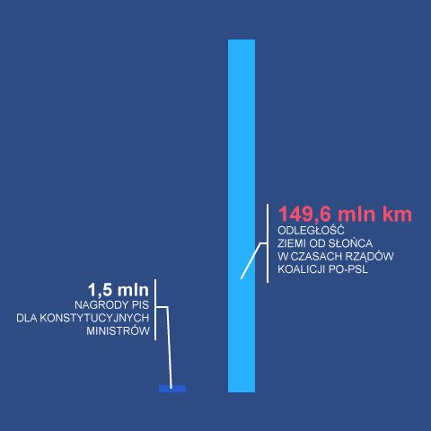

```{r setup, include=FALSE}
knitr::opts_chunk$set(echo = TRUE)
library(ggplot2)
```

# Wybrany wykres
Postanowiłem zastanowić się nad tym, jak mógłby bardziej rzetelnie wyglądać wykres zamieszczony na Twitterze w kwietniu 2018 r.

* link do wykresu: https://twitter.com/MichaFrckowiak/status/981637274042593280
* link do dyskursu, do którego odnosi się wykres: https://twitter.com/michalrachon/status/981616001052741632




Nie odnosząc się do kontekstu publikacji tego wykresu, dokonuje on

* porówniania dwóch różnych wielkości - pieniądzy i odległości
* wysokości prostokątów nie są proporcjonalne do przedstawionych liczb (pomijając kwestię jednostek)

#Moja propozycja
Postanowiłem:

* przeliczyć kwotę pieniężną na wysokość wieży złożonej z pięciogroszówek o sumarycznej wartości tej kwoty
* dodać rzetelną skalę długości


```{r, echo=FALSE, out.width = "50%"}
dane <- c(42, 149600000)
data.frame(dane) -> dane_df
ggplot(dane_df) + geom_bar(aes(x=c("Pięciogroszówki", "Odległość"),y = dane), stat = "identity", width = 0.7, alpha = 0.9) + scale_y_log10(name = "[km]") +
  labs(title="Wielkość nagród PiS dla konstytucyjnych ministrów a odległość\n Ziemi od Słońca - w skali logarytmicznej [km]")+
  theme_minimal() +
  annotate("text", x = 2, y= 400, label = "Wysokość wieży\n ułożonych na sobie\n pięciogroszówek o łącznej kwocie \n1.5mln złotych")+
    annotate("text", x = 1, y= 400, label = "Odległośc Ziemi od Słońca")+
  theme(
    axis.title.y = element_blank(),
    axis.title.x = element_blank(),
    axis.title = element_text(size = 12, family = "Monserrat", color = "grey40", vjust = 5)
  ) 

```

Zastosowanie skali logarytmicznej nie jest idealnym rozwiązaniem, postanowiłem, jednak zachować pierwotne porównanie do odlogłości Ziemia-Słońce, a nie da się go przedstawić w rzetelny sposób na skali ciągłej - wysokość prostokąta dla wieży pięciogroszówek jest mniejsza od rzędu pikseli:

```{r, echo=FALSE, out.width = "50%"}
dane <- c(42, 149600000)
data.frame(dane) -> dane_df
ggplot(dane_df) + geom_bar(aes(x=c("Pięciogroszówki", "Odległość"),y = dane), stat = "identity", width = 0.7, alpha = 0.9) + scale_y_continuous(name = "[km]") +
  labs(title="Wielkość nagród PiS dla konstytucyjnych ministrów a odległość\n Ziemi od Słońca [km]")+
  theme_minimal() +
  annotate("text", x = 2, y= 18000000, label = "Wysokość wieży\n ułożonych na sobie\n pięciogroszówek o łącznej kwocie \n1.5mln złotych")+
    annotate("text", x = 1, y= 18000000, label = "Odległośc Ziemi od Słońca")+
  theme(
    axis.title.y = element_blank(),
    axis.title.x = element_blank(),
    axis.title = element_text(size = 12, family = "Monserrat", color = "grey40", vjust = 5)
  ) 

```