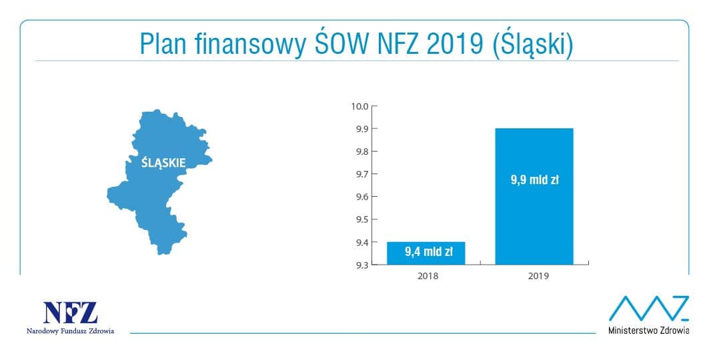

Wykres, na jaki się natknąłem, a który jest wybitnie wprowadzający w błąd, pochodzi z [oficjalnego Twittera NFZ](https://twitter.com/NFZ_Centrala/status/1051821277562978304?fbclid=IwAR0hLehuZBFJ183Tx6lhBfT20V2_qfUzJebya_8nzB5L0L8XhN91aWV4_pk)



Poniżej prezentuję bardziej uczciwe zaprezentowanie tych samych danych na wykresie słupkowym:

```{r fig.align="center", fig.width=6, fig.height=4}
library(ggplot2)

dat <- data.frame(c("2018", "Plan na 2019"), c(9.4, 9.9))
colnames(dat) <- c("Rok", "Finansowanie")

ggplot(data = dat, aes(x = Rok, y = Finansowanie)) +
  geom_bar(stat = "identity", fill = "#009DE0") +
  geom_text(aes(label = paste(Finansowanie, "mld PLN")), color = "white", nudge_y = -0.5, size = 5) +
  scale_y_continuous(name = "Finansowanie (w mld PLN)", breaks = 1:10) +
  ggtitle("Finansowanie Slaskiego OW")

```

Oś y oryginalnego wykresu jest niewyskalowana od 0, w efekcie uzyskane jest wrażenie olbrzymiego wzrostu, jako że drugi słupek jest wielokrotnie większy od pierwszego. W rzeczywistości zmiana względna wynosi kilka procent, co dobrze widać na mojej wersji wykresu.