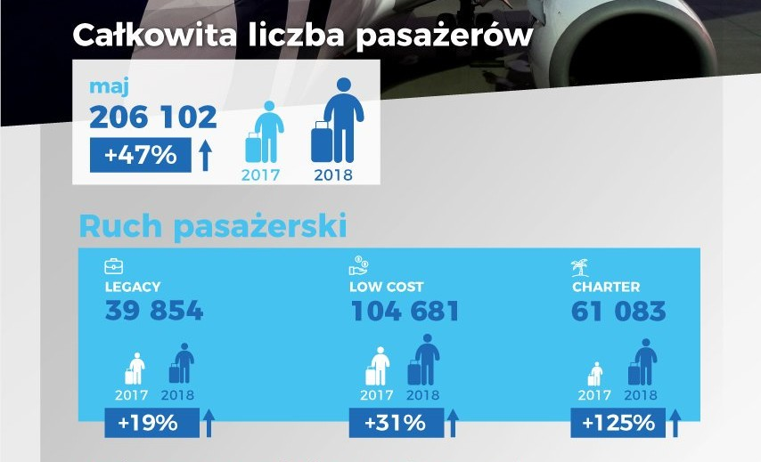

```{r setup, include=FALSE}
knitr::opts_chunk$set(echo = TRUE, cache = TRUE)
library(ggplot2)
```

Przeglądając twittera w celu uzyskania inspiracji natrafiłem na grafikę opublikowaną w czerwcu 2018 roku przez [Oficjalny profil Portu Lotniczego Poznań-Ławica im. Henryka Wieniawskiego](https://twitter.com/poz_airport/status/1007249064814153728/photo/1) prezentującą porównanie liczby pasażerów w maju 2017 i 2018 roku.



\
\
\


Grafika pod względem estetycznym jest nie najgorsza, lecz pomimo tego znalazłem w niej kilka mankamentów. Pierwszym z nich jest wykorzystanie ludzików zamiast słupków i skalowanie ich wielkości na podstawie wysokości. Przez taki zabieg dwukrotny wzrost, podświadomie może jawić się jako czterokrotny. Drugim jest niepokazanie danych z poprzedniego okresu, oglądający może tylko próbować doliczać się ich na podstawie podanych procentów. Zatem żeby naprawić te błędy przygotowałem następującą wizualizację.

```{r visualization, include=TRUE, fig.width = 10}
data <- read.csv("poznan_airport.csv")
data$year <- as.character(data$year)
ggplot(data = data , aes(x = year,y = number_of_passengers, group = type, fill = year)) +
  geom_bar(stat = "identity")+
  scale_fill_brewer(palette = "Greens",guide=guide_legend(reverse = TRUE))+
  geom_text(aes(label=number_of_passengers), vjust=1.5, size=3.5)+
  facet_grid(.~type)+
  theme_linedraw()+
  theme(title = element_text(colour = "black"))+
  labs(title="Zestawienie liczby pasażerów na lotnisku w Poznaniu w maju 2017 i 2018 roku", y="liczba pasażerów",x="")

```