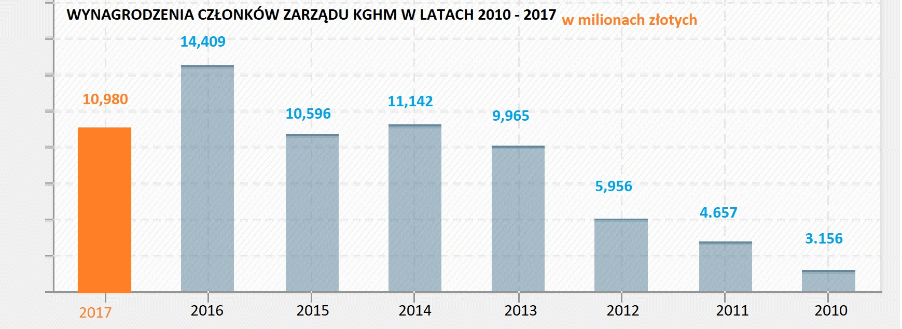

# Stary wykres

<br><br>
Do tej pracy domowej wybrałem wykres z serwisu [24legnica.pl](http://24legnica.pl/11-mln-zl-dla-czlonkow-zarzadu-kghm-w-2017-r/) przedstawiający wynagrodzenie członków zarządu KGHM w latach 2010-2017. Zabiegi zastosowane na tym wykresie sprawiają, że osoba na niego patrząca ma wrażenie jakby wynagrodzenia silnie malały i na końcu były bliskie zeru. Jeśli porównamy słupek \(10,980\) ze słupkiem \(3,156\) okazuje się, że pierwszy słupek jest ponad \(4\)&nbsp;razy wyższy od drugiego. Możemy wnioskować z tego, że przedstawiona oś \(Y\) nie zaczyna się od \(0\). Wiemy już w takim razie, że&nbsp;różnice nie są aż tak duże jak przedstawia ten wykres, jednakże to nie koniec niespodzianek. W oczy uderza nas chronologia osi \(X\). Przez to, że daty są ustawione malejąco to mamy wrażenie, że wynagrodzenie maleje, ale w rzeczywistości ma ono tendecję raczej wzrostową. Oczywiście brakuje labeli osi oraz labeli ticków osi \(Y\), a informacja, że wartości na wykresie są podane w&nbsp;milionach złotych jest dopisana mało widocznym pomarańczowym w pobliżu tytułu. 


# Nowy wykres
```{r setup, echo=FALSE}
library(ggplot2)
knitr::opts_chunk$set(echo = TRUE)
dane <- read.csv2(file = "data.csv")
ggplot(dane, aes(x=Rok, y=Wynagrodzenie)) +
  geom_bar(stat = "identity", fill = "#66c2a5", width = 0.5) +
  geom_text(data = dane, aes(x = Rok, y = Wynagrodzenie, label = Wynagrodzenie), vjust = -1) +
  labs(y = "Wynagrodzenie [mln zł]") +
  theme(text = element_text(face = "bold")) +
  ggtitle("Wynagrodzenia członków zarządu KGHM w latach 2010-2017") +
  ylim(c(0, 15))
```
