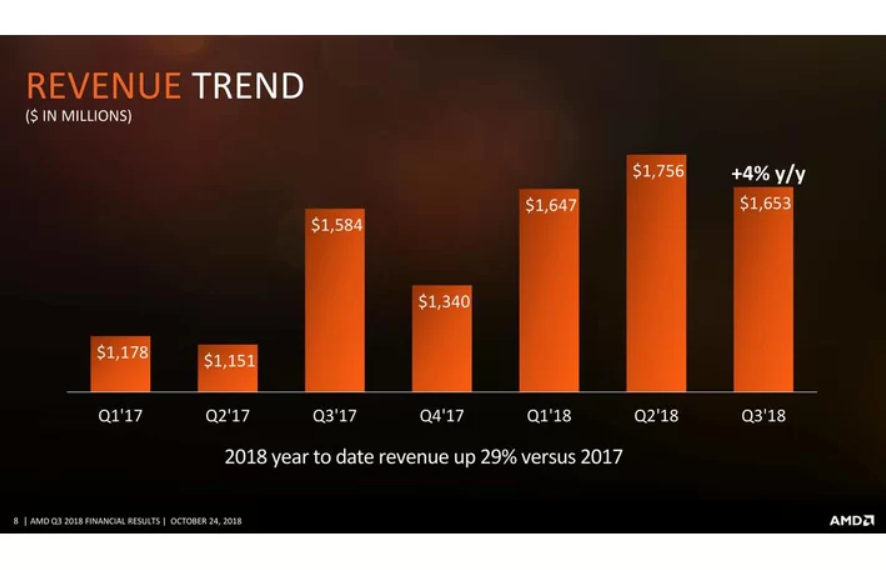

```{r setup, include=FALSE}
library(ggplot2)
library(ggpubr)
library(grid)
data <- data.frame(time = c("Q1'17", "Q2'17", "Q3'17", "Q4'17", "Q1'18", "Q2'18", "Q3'18"),
                   values = c(1.178, 1.151, 1.584, 1.340, 1.647, 1.756, 1.653),
                   stringsAsFactors = FALSE)
```

Tym razem na warsztat wziπ≥em jeden z wykresÛw pojawiajπcych siÍ w [tym artykule](https://www.tomshardware.com/news/amd-stock-drop-cryptocurrency-gpu,37975.html) (wczorajszym z punktu widzenia daty wyprodukowania tej pracy).



Jak widaÊ, na wykresie brakuje osi y, dlatego postanowi≥em jπ dodaÊ. Ponadto jest ona wyskalowana od oko≥o $1,000M zamiast od zera, co zniekszta≥ca przedstawiane dane, wizualnie powiÍkszajπc rzeczywiste rÛønice. Dla zwiÍkszenia czytelnoúci zamieni≥em rÛwnieø miliony na miliardy (billion w krajach anglojÍzycznych) oraz doda≥em siatkÍ pomagajπcπ przyrÛwnaÊ wartoúci s≥upkÛw (aczkolwiek delikatnπ, poniewaø i tak sπ dok≥adne wartoúci na s≥upkach). Pominπ≥em teø informacjÍ o 4% wzroúcie przychodÛw w 3. kwartale wzglÍdem poprzedniego roku jako potencjalne ürÛd≥o dezinformacji (musia≥em wczytaÊ siÍ w treúÊ artyku≥u, by domyúliÊ siÍ, øe chodzi o przyrost w Q3'18 wzglÍdem Q3'17).

Stara≥em siÍ nie modyfikowaÊ oryginalnej szaty graficznej wykresu w maksymalnym moøliwym stopniu, by u≥atwiÊ porÛwnywanie wykresÛw "przed" i "po".

```{r revenue, echo=FALSE}
p <- ggplot(data, aes(x = time, y = values, label = paste("$", values, "B", sep = ""))) + 
  geom_bar(stat = "identity", fill = "#ea4800", width = 0.75) + 
  geom_text(nudge_y = -0.09, colour = "white", size = 4) + 
  scale_x_discrete(limits = data$time, name = NULL) + 
  labs(y = "Revenue (billion $)") + 
  annotation_custom(grobTree(
    textGrob(expression("REVENUE " * phantom("TREND")), x = 0.15, y = 1.11, gp = gpar(col = "#ea4800", fontsize = 20)),
    textGrob(expression(phantom("REVENUE ") * "TREND"), x = 0.15, y = 1.11, gp = gpar(col = "white", fontsize = 20)),
    textGrob("2018 year to date revenue up 29% vs 2017", y = -.12, gp = gpar(col = "gray80", fontsize = 14, fontface = "italic"))
  )) + 
  theme(panel.background = element_rect(fill = "black"),
        plot.background = element_rect(fill = "black"),
        axis.text.x = element_text(colour = "white", size = 11),
        axis.title.y = element_text(colour = "gray62"),
        panel.grid.major = element_line(colour = "gray35"),
        panel.grid.minor = element_line(colour = "gray15"),
        plot.margin = unit(c(4, 1, 3, 1), "lines"))

# StackOverflow sugeruje, ze ponizszy kod jest konieczny, by napisy generowane przez annotation_custom() nie wchodzily POD dodatkowo powiekszone przez plot.margin tlo
g <- ggplot_gtable(ggplot_build(p))
g$layout$clip[g$layout$name == "panel"] <- "off"

grid.draw(g)
```
