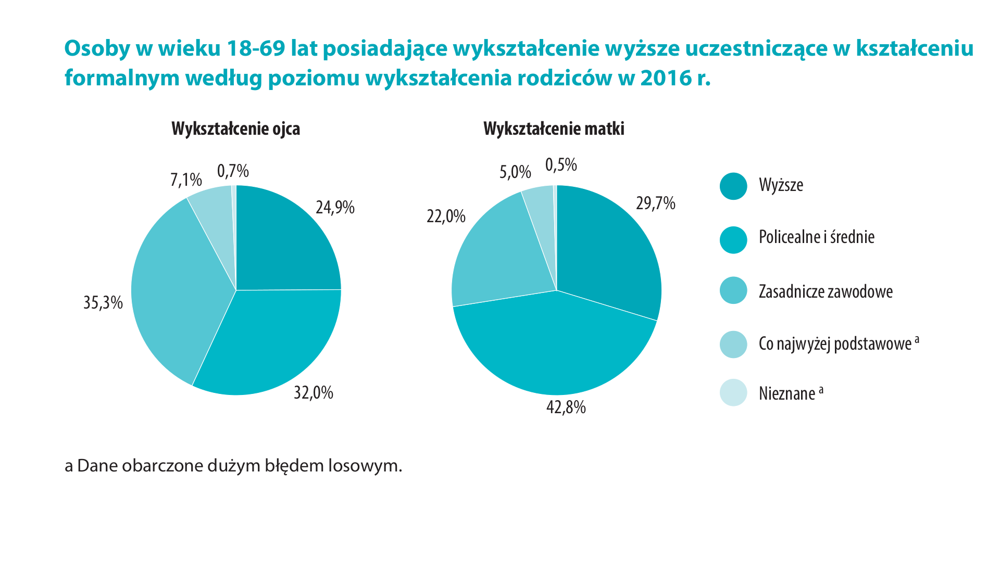

```{r setup, include=FALSE}
knitr::opts_chunk$set(echo = FALSE)
```

```{r message=FALSE}
library(ggplot2)
library(dplyr)
```
##Praca została wykonana na podstawie wykresu 8 z [GUSu](http://stat.gov.pl/obszary-tematyczne/edukacja/edukacja/ksztalcenie-doroslych-2016,3,3.html) 

```{r}
Wykształcenie=c("Wyższe","Policealne i\n średnie","Zasadnicze\n zawodowe","Co najwyżej\n podstawowe","Nieznane")
Wykształcenie=factor(Wykształcenie,levels = rev(Wykształcenie))
Wykształcenie=rep(Wykształcenie,2)
Procenty=c(24.9,32,35.3,7.1,0.7,29.7,42.8,22,5,0.5)
Rodzic=rep(factor(c("Ojciec","Matka")),each=5)
df<-data_frame(Wykształcenie,Procenty,Rodzic)
```


##Na oryginalnym wykresie są dwa wykresy kołowe przez co ciężko odczytać z niego proporcje miedzy nimi.
##Na moim wykresie użyłem wykresów słupkowych by lepiej było widać.


```{r}
ggplot(df,aes(x=Rodzic,y=Procenty,fill=Wykształcenie,group=Rodzic))+geom_bar(stat = "identity",position = position_dodge2())+
  scale_fill_brewer(palette = "Blues",guide=guide_legend(reverse = TRUE))+
  geom_text(aes(label=Procenty), vjust=1.6, color="black", size=3.5)+
  facet_grid(.~Wykształcenie)+
  theme_linedraw()+
  theme(title = element_text(colour = "blue"))+
  labs(title="Osoby w wieku 18-69 lat posiadające wykształcenie wyższe uczestniczące\n w kształceniu formalnym według poziomu wykształcenia rodziców w 2016 r.",x="",caption="Dane obarczone dużym błędem losowym")
  
  
```


