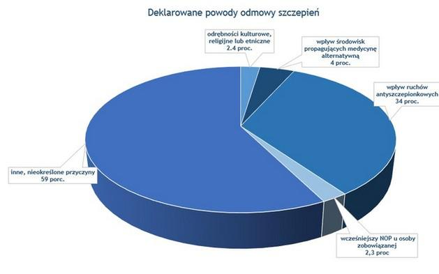

  
```{r setup, include=FALSE}
knitr::opts_chunk$set(echo = FALSE)
```

## Znaleziony wykres
Tym razem znalazłem artykuł na portalu money.pl mówiący o braku chęci szczepienia dzieci za darmo, ale z drugiej strony ludzie wydają dużo własnych pieniędzy na szczepienia.  
https://www.money.pl/gospodarka/wiadomosci/artykul/szczepienia-odra-koszty-szczepien,243,0,2418931.html  
Wykres dotyczy powodów odmowy szczepień i jest przedstawiony poniżej.



Na wykresie głównym problemem jest rodzaj wykresu, czyli wykres kołowy 3D. Na takim wykresie ciężko porównywać 2 wartości ze względu na różne kąty w zależności od tego, czy dana informacja jest blisko osi X, czy osi Y. Ciężko porównać wartości 2.3%, 2.4% i 4%. Mimo, że 4% jest wyraźnie większe to nie widać jak bardzo.
Poza tym kolory są tylko odcieniami niebieskiego, co w pewnych warunkach może powodować trudności z odczytaniem.
Dodatkowo wartości nie sumują się równo do 100%, tylko do 101.7%. Niestety danych surowych nie ma, więc na moim wykresie również wartości nie będą sumować się do 100% (próba przeskalowania skończyła się brakiem różnicy przy 2 najmniejszych wynikach, więc z niej zrezygnowałem).

## Poprawiony wykres

```{r wykres,warning=FALSE}
#install.packages(c('ggplot2','ggrepel','dplyr','data.table'))
suppressMessages(library(ggplot2))
suppressMessages(library(ggrepel))
options(stringsAsFactors = FALSE)

odmowy <- read.csv2('dane.csv')
nazwy <- paste0(odmowy$powod1,'\n',odmowy$powod2)
odmowy <- data.frame(powod=nazwy,procent=odmowy$procent)
#odmowy$procent <- round(odmowy$procent*100/sum(odmowy$procent),1)

ggplot(odmowy, aes(x=powod,y=procent,label = paste0(procent, "%"))) +
  coord_flip() +
  geom_bar(stat="identity", fill="steelblue") +
  xlab('Powód odmowy szczepienia') + ylab('Procent') + 
  theme_bw() +
  scale_x_discrete(limits = odmowy$powod[order(odmowy$procent)]) +
  scale_y_discrete(limits = seq(0,60,10), expand = expand_scale(add = c(0,9)),
                   labels = function(x) paste0(x, "%")) +
  geom_text(hjust = -0.5)+
  ggtitle("Deklarowane powody odmowy szczepień")


```
  
Na poprawionym wykresie łatwiej jest zauważyć różnicę między konkretnymi powodami. Wyniki są również posortowane, dzięki czemu od razu widać, że odrębności kulturowe są niewiele częstszym powodem od wcześniejszego NOP u osoby zobowiązanej.


