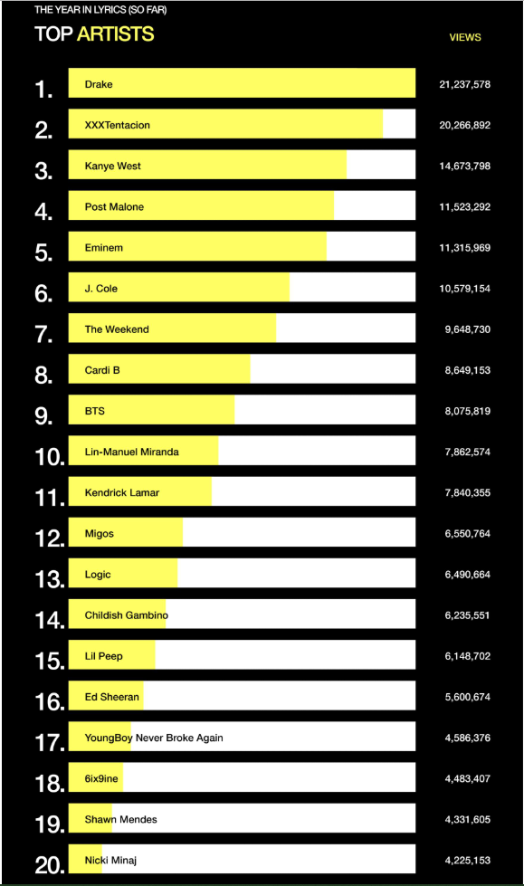

```{r setup, include=FALSE}
knitr::opts_chunk$set(echo = TRUE)
library(ggplot2)
library(dplyr)
library(grid)
data <- read.csv2("genius-data.csv")
data$Artist <- factor(data$Artist, levels = data$Artist[order(data$Views)])
data <- mutate(data, percent_view = Views/Views[1], Views = prettyNum(Views, big.mark = ","))
```
Jako przykład niepoprawnego przedstawienia danych znalazłem wykres zawarty w artykule "Genius Presents: The 2018 Year In Lyrics(So Far)"([link](https://genius.com/a/genius-presents-the-2018-year-in-lyrics-so-far), stan z 6 lipca 2018).



Powyższy wykres przedstawia najlepszych artystów w 2018 roku pod względem wyświetleń słów do ich utworów(tym zajmuje się serwis genius.com). Wykres przedstawia dane w sposób mylący, ponieważ nie są zachowane proprcje w długości słupków.

Poprawiony wykres zachowujący odpowiednie proporcje wygląda tak:
```{r, fig.height=11, echo=FALSE}
p <- ggplot(data, aes(x= Artist, label = Artist)) + 
  geom_col(mapping = aes(y=percent_view[1]), fill='white', width = 0.75, position = position_dodge()) +
  geom_col(mapping = aes(y = percent_view), fill='yellow2', width = 0.75, position = position_dodge()) +
  geom_text(mapping = aes(y=rep(0,20)),hjust = 0, size=5.5) +
  labs(title = "TOP ARTIST BY VIEWS") +
  theme(panel.border = element_blank(),
        panel.grid = element_blank(),
        panel.background = element_rect(fill = "black"),
        axis.ticks = element_blank(),
        axis.text.x = element_blank(),
        axis.text.y = element_text(colour = "white", size = 15),
        axis.title = element_blank(),
        plot.background = element_rect(fill="black"),
        title = element_text(colour = "white")) +
  scale_x_discrete(labels = paste0(seq(20,1),"."), expand = c(0,0)) + 
  scale_y_continuous(expand = expand_scale(add=c(0,0.3))) +
  coord_flip()
# dodanie liczby wyświetleń po prawej
for(i in 1:20){
p <- p + annotation_custom(grob = textGrob(label = data$Views[i], hjust = 0, gp = gpar(col = "white")),
                    ymax = 1.05, 
                    ymin = 1.05,
                    xmax =  data$Artist[i],
                    xmin = data$Artist[i])
}
p
```