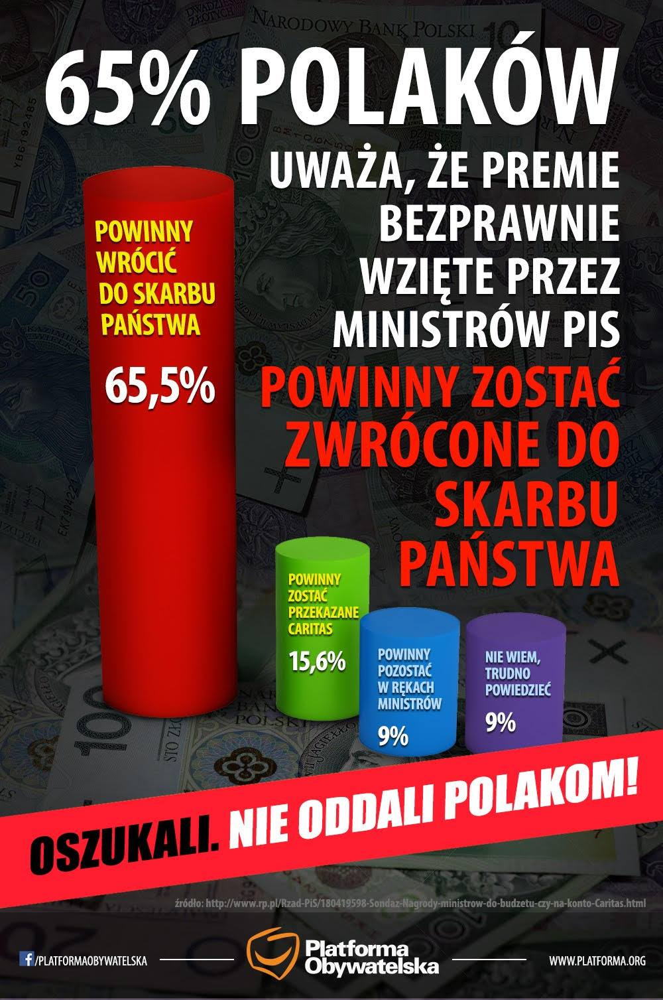

```{r setup, include=FALSE}
knitr::opts_chunk$set(echo = TRUE)
library(ggplot2)
library(RColorBrewer)
```

#Dlaczego ten wykres?

Wykres wziąłem ze strony Platformy Obywatelskiej na Facebooku. Pochodzi on z 15 maja. Zawiera dwa błędy. Po pierwsze jest on trójwymiarowy, dwa słupki ze zdaniem zgodnym z twierdzeniami partii są odsunięte do tyłu, co wizualnie podnosi je do góry i sprawia wrażenie, że przewaga głosów jest bardziej wyraźna niż jest ona w rzeczywistości. Po drugie słupki mają nierówne promienie, słupek największy ma zauważalnie większy promień od pozostałych. Ciężko jest stwiedzić, czy skalowanie odbywa się wg jakiejś zasady, ale na pewno sprawia wrażenie, że czerwony słupek jest optycznie większy od pozostałych.



#Moja propozycja

A oto moja propozycja, bez manipulacji.

```{r, echo = FALSE}
df <- data.frame(
  opinia = c("Powinny wrócić do skarbu państwa", "Powinny zostać przekazane Caritas", "Powinny zostać w rękach ministrów", "Nie wiem, trudno powiedzieć"),
  procent = c(65.5, 15.6, 9, 9)
)

df$opinia <- factor(df$opinia, levels = rev(df$opinia))

ggplot(data = df, aes(x = opinia, y = procent, label = opinia)) + geom_col(show.legend = FALSE, fill = c('purple', 'blue', 'green', 'red')) + coord_flip() + xlab("") + ylab("[%]") + 
  theme(title = element_text(color = 'white'), panel.background = element_rect(fill = 'gray8'), plot.background = element_rect("gray15"), axis.text = element_text(color = 'white')) +
  ggtitle("Opinie")
```