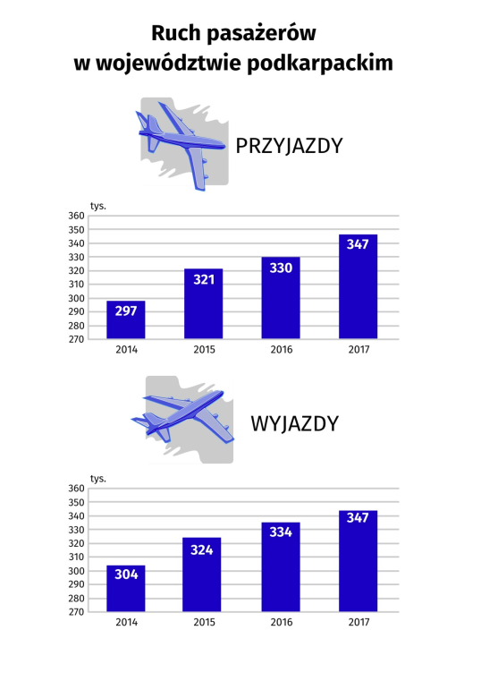

<style>
  body {
    font-family: Calibri Light;
    text-align: justify;
  }
</style>

## Przed:
<center>

</center>

Wykres jest właściwie w porządku - poza oszukaniem wartości dla osi y. Przyloty wydają się wzrosnąć aż trzykrotnie w latach 2014-2017. Niemniej jednak wykorzystanie wykresów słupkowych dla tych danych wydaje się być dobrym wyborem.

[Źródło](http://rzeszow.stat.gov.pl/infografiki-us/infografika-swieto-lotnictwa,66,1.html)

```{r setup, include=FALSE}
library(ggplot2)

knitr::opts_chunk$set(echo = TRUE)
data <- data.frame(
  y = c(297, 312, 330, 347, 304, 324, 334, 347),
  x = rep(2014:2017, 2),
  dir = rep(c("in", "out"), each = 4)
)

plot <- ggplot(data, aes(x, y, fill=dir)) + 
  geom_bar(stat = "identity", position = "dodge") + 
  theme_minimal() +
  theme(
    axis.title.x = element_blank(),
    plot.margin = unit(c(4, 0, 0, 0), "lines"),
    axis.text.x = element_text(size = 12),
    axis.text.y = element_text(size = 12),
    panel.grid.minor = element_blank(),
    panel.grid.major.x = element_blank()
  ) +
  scale_y_continuous(labels=function(x) paste0(x, " tys.")) + 
  labs(
    title = "Ruch pasażerów w województwie podkarpackim",
    subtitle = "Zestawienie liczby pasażerów przylatujących i wylatujących w latach 2014-2017",
    caption = "Dane: GUS"
  ) + 
  scale_fill_manual(values = c("dodgerblue3", "firebrick3"), 
                    name = "Kierunek podróży",
                    labels = c("przyloty", "odloty")) +
  ylab("Liczba pasażerów w roku") +
  geom_text(aes(label = y, hjust = ifelse(dir == 'in', 1.4, -0.5)), vjust = -0.25)
```

## Po
<center>
```{r, echo=FALSE}
plot
```
</center>

Wykorzystanie dwóch wykresów wydaje mi się być nadmiarowe. Nie pozwala na łatwe porównanie wartości przylotów i odlotów w odpowiadających latach. Na zaproponowanym wykresie do rozróżnienia przylotów i odlotów wykorzystano wolny stopień swobody - kolor. 

Wykorzystałem też zabieg naniesienia wartości nad słupki - dla tak małych różnic wydają się być pomocne w odczycie wykresu. Dodatkowo, po zestawieniu obu wykresów jako jeden zauważyłem, że w Rzeszowie liczba pasażerów odlatujących i przylatujących wyrównała się. Nie było to na pierwszy rzut oka widoczne na poprzednim wykresie - mimo umieszczenia na obu wykresach dokładnych wartości. 

Zastanawiałem się czy w takiej sytuacji warto umieszczać oś y - wszakże wartości bezwzględne mamy podane nad słupkami. Postanowiłem jednak ją zostawić - czytelnik mógłby zastanawiać się jaka skala została wykorzystana oraz czy poziom zerowy to rzeczywiście 0.

Warto też zauważyć jak różna interpretacja narzuca się po zmianie osi y. Na pierwszym wykresie wydaje się, że ogólna liczba pasażerów wielokrotnie rośnie - co w rzeczywistości nie ma miejsca. Drugi wykres sugeruje już zacierające się różnice pomiędzy liczbą przylatujących i odlatujących.