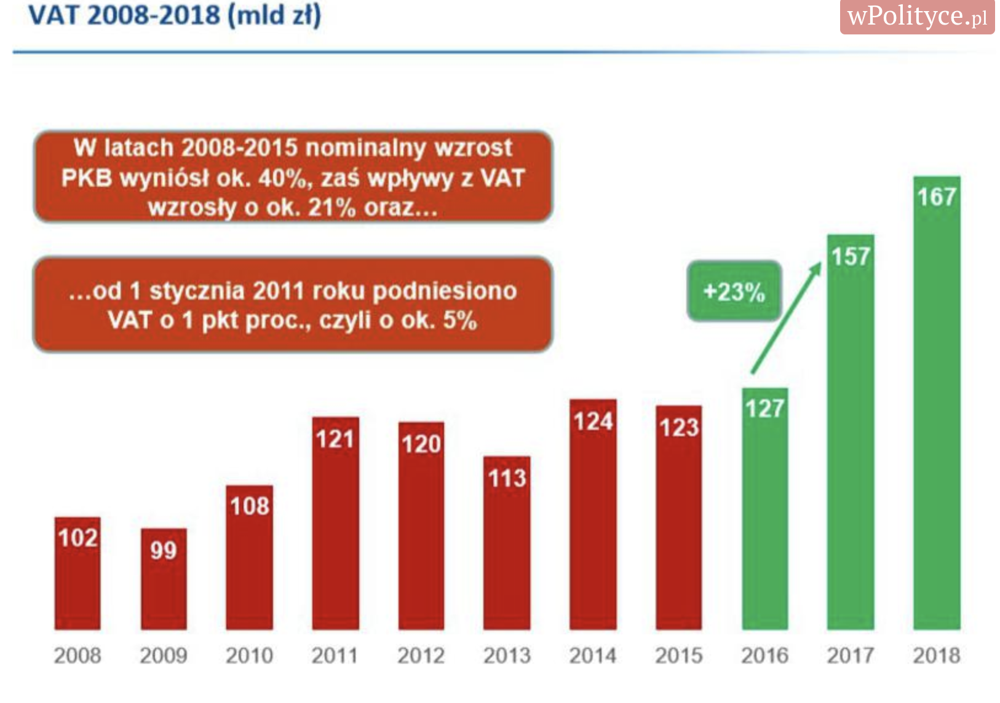

```{r setup, include=FALSE}
knitr::opts_chunk$set(echo = FALSE)

```

# Cel zadania

Celem zadania było znalezienie wykresu pochodzącego z 2018 roku, który wprowadza użytkownika w błąd, oraz poprawienie go. 

# Wybrany wykres

Wybrałam wykres zamieszczony w następującym artykule: https://wpolityce.pl/gospodarka/376988-te-dane-robia-wrazenie-uszczelnienie-vat-dalo-juz-polsce-ponad-30-mld-zlotych-rocznie-a-moze-dac-drugie-tyle, a oryginalnie pochodzący z ministerstwa finansów, przedstawiający wpływy z podatku VAT. 
Oś wykresu zdecydowanie nie zaczyna się w wartości 0, przez co proporcje słupków są zdecydowanie zaburzone, przykładowo słupek z wartością 167 wydaje się kilka razy większy niż słupek z wartością 102. Nie jesteśmy w stanie nawet ocenić w jakiej wartości zaczyna się oś, ponieważ wykres pozbawiony jest skali.
        


# Poprawiony wykres

```{r plot, warning=FALSE}
library(ggplot2)

data <- data.frame("vat_income" = c(102, 99, 108, 121, 120, 113, 124, 123, 127, 157, 167),
                   "year" = c(2008, 2009, 2010, 2011, 2012, 2013, 2014, 2015, 2016, 2017, 2018)
                   )

data$year <- as.factor(data$year)

ggplot(data, aes(x = year, y = vat_income)) +  
  geom_col(size=4, width=0.7, fill=c(rep("orangered3", 8), rep("olivedrab4", 3))) + 
  geom_text(aes(label = as.character(vat_income), y = vat_income -5), size = 5, color='white') + 
  ggtitle(label = "Wplywy z podatku VAT w latach 2008-1018") +
  ylab("Wplyw z podatku VAT [mld PLN]") + 
  xlab('Rok') +
  theme_light() + 
  theme(axis.text.x = element_text(face = 'bold'))
```

  
Na poprawionym wykresie różnice nie wydają się być już tak duże, jak to miało miejsce na wykresie oryginalnym.