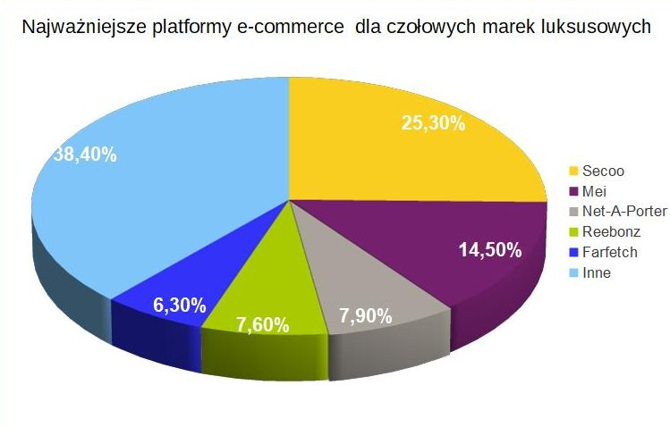

```{r setup, include=FALSE}
library(ggplot2)
```

### Wykres oryginalny

Przedstawiony poniżej wykres pochodzi z [artykułu opublikowanego na portalu Foray China](http://www.foraychina.pl/segment-e-commerce-chinach-rynku-dobr-luksusowych/). Przedstawia on udział w rynku największych platform e-commerce dystrybuujących produkty luksusowe w Chinach.

```{r, echo=FALSE, fig.align='center'}

```

Wykresy kołowe nie są zalecaną formą wizualizacji danych. Wynika to z trudności w szacowaniu kątów i powierzchni wycinków przez ludzi. Dodatkowym utrudnieniem w tym przypadku jest dodanie trzeciego wymiaru. Związane z nim rzutowanie sprawia, że kąty na rysunku ulegają zniekształceniu. Poszerzone są kąty bliskie osi pionowej, a zwężone te bliskie osi poziomej, przez co trudno jest odczytać rzeczywiste proporcje. 

### Wykres poprawiony

Dane zostały przedstawione na wykresie słupkowym, który ułatwia określenie proporcji między liczbami. Dodatkowo słupek odpowiadający kategorii *Inne*, który jako jedyny nie odpowiada konkretnej platformie, został wyróżniony przez zmianę koloru i przeniesienie go na dół wykresu.

```{r, echo=FALSE, fig.width=12, fig.align='center'}
market_shares <- data.frame(name = c("Inne", "Fartech", "Reebonz", "Net-A-Porter", "Mei", "Secoo"), 
                            value = c(38.4, 6.3, 7.6, 7.9, 14.5, 25.3))

ggplot(data = market_shares, aes(x = name, y = value, label = paste(value, "%"), fill = name != "Inne")) + 
  geom_bar(stat = 'identity', show.legend = FALSE) + 
  geom_text(hjust = -0.2, color = "black") + 
  scale_x_discrete(limits = market_shares$name) + 
  scale_y_continuous(limits = c(0, 40)) + 
  scale_fill_manual(values = c("slateblue1", rep("slateblue4", 5))) + 
  labs(x = "", y = "Udział w rynku", title = "Największe platformy e-commerce dla marek luksusowych w Chinach") + 
  coord_flip() + 
  theme_minimal() + 
  theme(text = element_text(size=20), 
        axis.title.y = element_blank(), 
        plot.title = element_text(hjust = 0.5), 
        legend.position = "none")
```