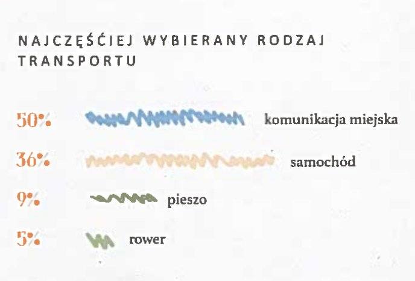

<style>
body {
text-align: justify}
</style>


```{r setup, include=FALSE}
knitr::opts_chunk$set(echo = TRUE)
library(ggplot2)
```


## Zadanie
Należy znaleźć przykład złego wykresu (wprowadzającego w błąd) w mediach papierowych lub elektronicznych. Wykres powinien pochodzić z roku 2018. Obok przykładu złego wykresu należy wykonać jego poprawną wersję "po".

## Realizacja

### Wykres oryginalny 
Poniższy wykres przedstawia najczęściej wybierany rodzaj transportu dojazdu do pracy. Możemy zauważyć, że długość kreski nie odpowiada faktycznej wartości procenta, długość odpowiadająca 50% jest mniejsza niż dla 36%. Nie zostały zachowane proporcje długości, 9% jest ponad dwa razy dłuższe niż 5%. Dodatkowo nie wiemy czy podane wartości zaczynają się w zerze.

Źródło: EKOLOGICZNY PRZEWODNIK Eurocentrum Office Complex



## Wykres poprawiony

```{r, include = FALSE}
df <- data.frame(procent = c(50, 36, 9, 5), transport = c("komunikacja miejska", "samochód", "pieszo", "rower"))
df$transport <- factor(df$transport, level = df$transport[order(df$procent)])
```

Poprawiony wykres zawiera odpowiednie długości słupków, a oś rozpoczyna się od zera. 
```{r, warning=FALSE, message=FALSE, error=FALSE, fig.width=10}
ggplot(df, aes(x = transport, y = procent, label = paste0(procent, "%"))) +
  geom_bar(stat = "identity", fill = "#2ca25f", width = 0.5) + 
  geom_text(hjust = -0.3, nudge_x = 0.05) + 
  coord_flip() + 
  ggtitle("Najczęściej wybierany rodzaj transportu") + 
  ylab("Procent") + 
  xlab("Rodzaj transportu") 
```