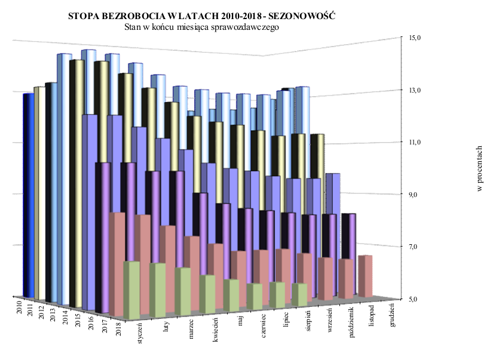

```{r setup, include=FALSE}
knitr::opts_chunk$set(echo = FALSE)
options(stringsAsFactors = FALSE)
library(ggplot2)
```

```{r, include=FALSE}
miesiace <- c("styczeń", "luty","marzec","kwiecień",
              "maj","czerwiec","lipiec","sierpień",
              "wrzesień","październik","listopad","grudzień")
df <- na.omit(data.frame(rok=as.character(rep(seq(2018,2011),each=12)),
                miesiac=rep(miesiace, times=8),
                stopa=c(6.8,6.8,6.6,6.3,6.1,5.8,5.8,5.8,5.7,NA,NA,NA,
        8.5,8.4,8.0,7.6,7.3,7.0,7.0,7.0,6.8,6.6,6.5,6.6,
        10.2,10.2,9.9,9.4,9.1,8.7,8.5,8.4,8.3,8.2,8.2,8.2,
        11.9,11.9,11.5,11.1,10.7,10.2,10.0,9.9,9.7,9.6,9.6,9.7,
        13.9,13.9,13.5,13.0,12.5,12.0,11.8,11.7,11.5,11.3,11.4,11.4,
        14.2,14.4,14.3,14.0,13.6,13.2,13.1,13.0,13.0,13.0,13.2,13.4,
        13.2,13.4,13.3,12.9,12.6,12.3,12.3,12.4,12.4,12.5,12.9,13.4,
        13.1,13.4,13.3,12.8,12.4,11.9,11.8,11.8,11.8,11.8,12.1,12.5)))
df$miesiac <- factor(df$miesiac, levels = miesiace)
```

## Opis
Wykresy przedstawiają poziom bezrobocia rejestrowanego na przestrzeni lat. Dane zostały pokazane w przejrzysty sposób bez niepotrzebnego efektu 3D. Oryginalny wykres pochodzi ze strony Ministerstwa Rodziny, Pracy i Polityki Społecznej, http://psz.praca.gov.pl/-/7899509-statystyki-strukturalne-sierpien-2018

## Przed



## Po
```{r}
ggplot(df, aes(x=miesiac, y=stopa, group=rok)) +
  geom_line(aes(color=rok))+
  geom_point(aes(color=rok))+
  scale_color_brewer(type="qual", palette = 2)+
  scale_y_continuous(breaks = seq(0, 16, 2)) +
  theme_minimal() + 
  theme(axis.text.x = element_text(angle = 45)) + 
  labs(x="miesiąc", y="stopa (%)", title="Poziom bezrobocia w latach 2011-2018 - Sezonowość")
```
