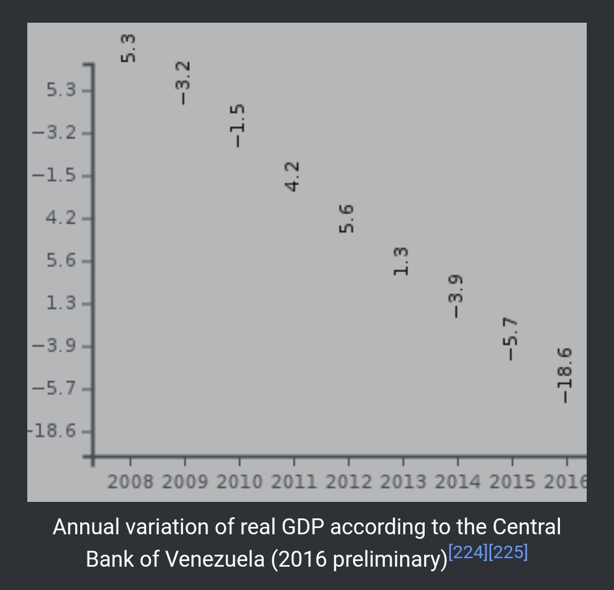

```{r setup, include=FALSE}
knitr::opts_chunk$set(echo = TRUE)
```

**Cel zadania**

Celem zadania jest znalezienie w dowolnym artykule z 2018 roku złego wykresu i przygotowanie jego własnej wersji z uzasadnieniem wprowadzonych poprawek.

**Wybór wykresu**

Wybrany wykres pochodzi z [artykułu](https://en.wikipedia.org/w/index.php?title=Venezuela&oldid=865039580#Economy) o ekonomice Wenezuely i przedstawia zmianę PKB w poszczególnych latach.

```{r echo=FALSE, out.width="70%"}

```

Wykres ten jest zły z wielu powodów, przede wszystkim: położenie punktów na nim nic nie znaczy, oś Y ma bezssensownie uporządkowaną skalę i brakuje podpisów osi.

**Wykres poprawiony** 

```{r include=FALSE}
library(ggplot2)
library(scales)
```

```{r}
values <- c(5.3, -3.2, -1.5, 4.2, 5.6, 1.3, -3.9, -5.7, -18.6) / 100
years <- 2008:2016
dane <- data.frame(values,years)

ggplot(data=dane, aes(x = years, y = values, width=0.5, fill=values < 0)) +
  geom_bar(stat="identity") +
  geom_text(aes(label = paste(ifelse(values > 0, '+', ""), values * 100, " %", sep=""), vjust = ifelse(values >= 0, -0.5, 1.5))) +
  scale_y_continuous("GDP Change", labels = percent_format(), limits = c(-0.2, 0.07)) +
  scale_x_discrete(name ="Year", limits=years) + 
  scale_fill_manual(guide = FALSE, breaks = c(TRUE, FALSE), values=c("#a6d96a", "#d7191c")) +
  ggtitle('Annual variation of real GDP according to the Central Bank of Venezuela')
```

W nowej wersji wykresu jasno widać jak się zmieniał PKB kraju i dobrze widoczna jest tendencja na jego spadek.

