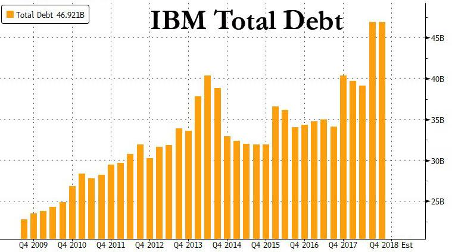

```{R, echo = FALSE}
library("ggplot2")
```

<style>
p {
  text-align: justify;
}
</style>

<center>
<h1>Techniki wizualizacji danych</h1>
<h3>Praca domowa 3</h3>
<h4>Autor: Patryk Wołosz</h4>
</center><br/>
</center>

<h3>
Wykres przed:
</h3>

<h3>
Wykres po:
</h3>


```{R, message = FALSE, echo = FALSE, warning = FALSE}

debt <- c(25.47, 26.10, 26.32, 26.65, 27.46, 28.62, 30.26, 29.77, 30.16, 31.32, 32.05, 32.44,
          33.65, 33.27,33.40,34.12,36.18,39.72,43.98,46.47,45.70,40.72,38.83,38.67,39.66,39.89,
          45.56,44.52,42.48,42.17,42.78,45.67,45.63,46.82,46.39,45.50,46.92)
months_x <- 1:37
x_labels <- c("Q3 2009","2010","2011","2012","2013","2014","2015","2016","2017","2018","")
ggplot(data = data.frame(debt,months_x), aes(x = months_x, y = debt)) +
  geom_line(size = 1.5) +
  scale_y_continuous(breaks = c(0,10,20,30,40,50), limits = c(0,50), labels = c("0","10mld","20mld","30mld","40mld","50mld"), expand = c(0,0)) +
  theme_light() +
  ggtitle("IBM Total Debt") +
  theme(plot.title = element_text(size = 20, face = "bold", hjust = 0.5),
        axis.line = element_line(color = "#4e5056", size = 1)) +
  labs(x = "Lata", y = "Zadłuzenie") +
  scale_x_discrete(labels = x_labels, breaks = c(1,4,8,12,16,20,24,28,32,36,38), limits = 1:38)

```
<div>Źródło: <i>https://www.zerohedge.com/news/2018-10-29/ibm-bond-yields-default-risk-spike-after-red-hat-deal</i></div>