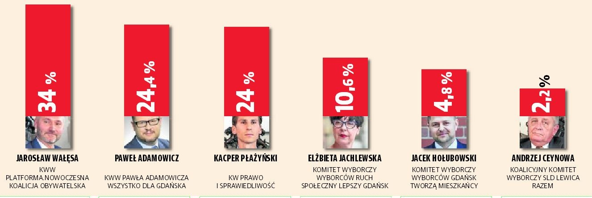

```{r setup, include=FALSE}
knitr::opts_chunk$set(echo = TRUE)
library(ggplot2)
library(RColorBrewer)
```

## Zadanie

Nale¿y znaleŸæ przyk³ad z³ego wykresu (wprowadzaj¹cego w b³¹d) w mediach papierowych lub elektronicznych. Wykres powinien pochodziæ z roku 2018. Obok przyk³adu z³ego wykresu nale¿y wykonaæ jego poprawn¹ wersjê ,,po''.

## Wersja wyjœciowa

Postanowi³em poprawiæ wykres który pojawi³ siê na stronie dziennika ba³tyckiego: https://dziennikbaltycki.pl/wybory-samorzadowe-2018-sondaz-dziennika-baltyckiego-kto-wygra-wybory-prezydenckie-w-gdansku-i-gdyni-walesa-i-szczurek-na-czele/ar/13529252

Przedstawia on wyniki sonda¿owe wyborów na prezydenta miasta Gadañsk. Wprowadza on czytelnika w b³¹d sugeruj¹c, ¿e ró¿nice miedzy poparciem dla kandydatów s¹ niewielkie i ca³y czas toczy sie zaciêta walka.

Dodatkowo, za³ó¿my, ¿e Jacek Ho³ubowski rezygnuje oraz poprosi swoich wyborców by zag³osowali na Paw³a Adamowicza. Jeœli nie dodamy wartoœci procentowych a wyobrazimy sobie sumê obu s³upków dojdziemy do wniosku ¿e Pawe³ Adamowicz wysunie siê na pierwsz¹ pozycjê co nie jest zgodne z rzeczywistoœci¹.



```{r, echo=FALSE, out.width = "100%"}

nazwiska <- c('Jaros³aw Wa³êsa', 'Pawe³ Adamowicz', 'Kacper P³a¿yñski', 'El¿bieta Jachlewska', 'Jacek Ko³ubowski', 'Andrzej Ceynowa')
wyniki <- c(34,24.4,24,10.6,4.8,2.2)
partie <- c('Koalicja Obywatelska', 'Wszystko dla Gdañska', "Prawo i Sprawiedliwoœæ", "Ruch Spo³eczny Lepszy Gdañsk", "Gdañsk Tworz¹ Mieszkañcy", "SLD Lewica Razem")
dane <- data.frame(nazwiska = nazwiska, wyniki = wyniki, partie = partie)
dane$opisy = paste(dane$nazwiska, dane$partie, sep="\n")
dane$opisy <- factor(dane$opisy, levels = dane$opisy[order(dane$wyniki)])

```

## Wersja poprawiona

```{r warning=FALSE, echo=TRUE, out.width = "100%"}

ggplot(dane, 
  aes(x = opisy, y = wyniki, label = paste0(wyniki, "%"))) +
  scale_y_continuous(limits = c(0, 40), labels = function(x) paste0(x, "%")) +
  geom_text(hjust = -0.3) +
  geom_col(width=0.8) +
  labs(title="Sonda¿owe wyniki wyborów na prezydenta Gdañska", 
       subtitle="Badanie zrealizowane przez Polska Press Grupê", 
       x="Kandydat", y="Wynik") + 
  coord_flip()
```

## Wyjaœnienie

1. D³ugoœci s³upków s¹ teraz proporcjonalne do wyników danego kandydata.
2. Orientacja wykresu zosta³a zmieniona dziêki czemu wykres jest czytelniejszy.