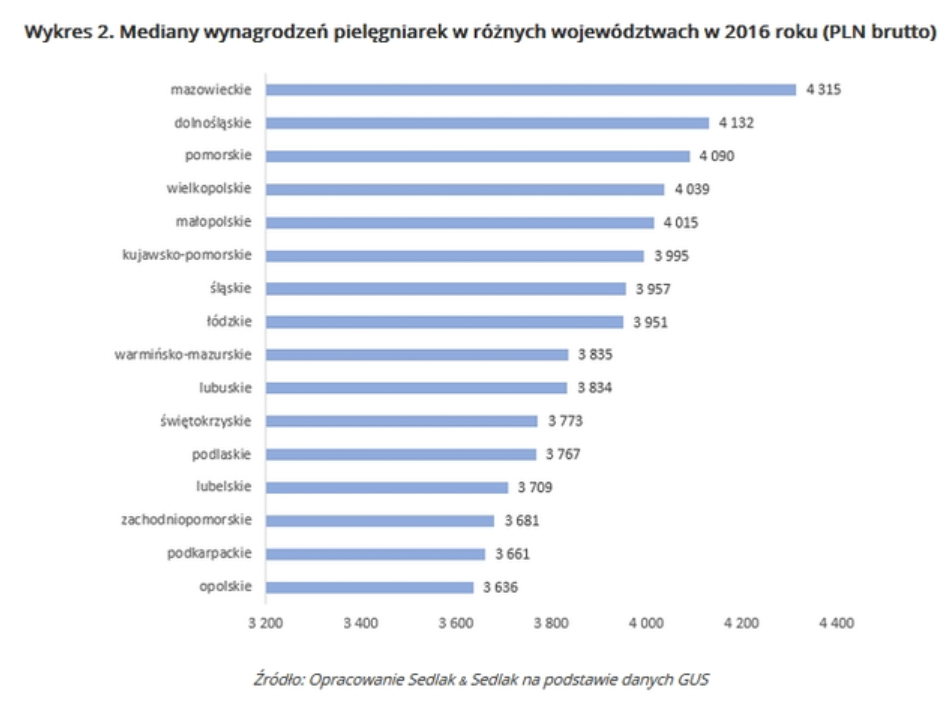

```{r setup, include=FALSE}
knitr::opts_chunk$set(echo = TRUE)
library(ggplot2)
```

## Wykres przed

```{r echo=FALSE, out.width="70%"}

```

G³ównym problem tego wykresu jest zlokalizowanie punktu zero poza wykresem.
Z tego powodu zosta³a uwypuklona ró¿nica miêdzy wartoœciami.
W oryginalnym wykresiem na pierwszy rzut oka mo¿na wywnioskowaæ, i¿ pielêgniarki w województiwe opolskim zarabiaj¹ dwukrotnie mniej ni¿ w województwie mazoweckim. Nie jest to oczywiœcie prawd¹. Ró¿nice owszem s¹, ale na poziomie 15%, a nie 50%.


## Poprawiony Wykres

```{r po}
Wojewodztwo <- c("mazowieckie", "dolnoœl¹skie", "pomorskie","wielkopolskie","ma³opolskie", "kujawsko-pomorskie","œl¹skie", "³ódzkie", "warmiñsko-mazurskie", "lubuskie","œwiêtokrzyskie","podlaskie","lubelskie","zachodniopomorskie","podkarpackie","opolskie")
Wojewodztwo <- factor(Wojewodztwo, levels = Wojewodztwo)
Mediana <- c(4315,4132,4090,4039,4015,3995,3957,3951,3855,3834,3773,3767,3709,3681,3661,3636)
data <- data.frame(Wojewodztwo, Mediana)

ggplot(data=data, aes(x=Wojewodztwo, y=Mediana)) +
  geom_bar(stat="identity", width=0.5, color="#66a3ff", fill = "#66a3ff") +
  geom_text(aes(label=Mediana), hjust=1.3, color="white", size=4) +
  labs(x = "Województwo", y = "Mediana [PLN]", title = "Mediany wynagrodzeñ pielêgniarek w 2016 roku") +
  coord_flip() +
  theme_minimal()
```
