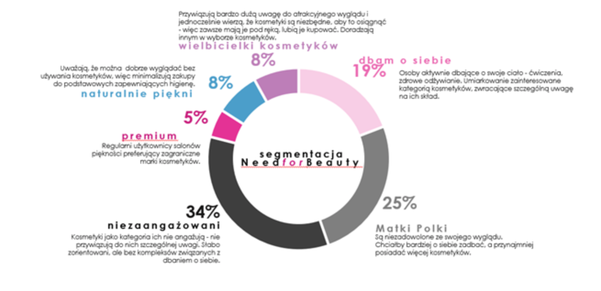

###Oryginalny wykres
Source: https://www.wirtualnemedia.pl/artykul/zakupow-kosmetykow-u-mezczyzn-i-kobiet-raport


####Problemy wykresu oryginalnego
1. Wykres kołowy - percepcja kąta i odcinka na kole a nie liczby.
2. Wiele wyjaśniającego tekstu w małym rozmiarze czcionki.

### Poprawiony wykres
```{R, warning = FALSE, message = FALSE}
data <- data.frame(segmenty = c("niezaangazowani", "Matki Polki", "dbam o siebie", 
              "wielbicielki kosmetykow", "naturalnie piekni", 
              "premium"), value = c(34, 25, 19, 8, 8, 5))
library(ggplot2)
library(dplyr)
ggplot(data, aes(x = reorder(segmenty, value), y = value)) +
  geom_col(width = 0.7, fill = "plum") +
  coord_flip() +
  ylab("%") +
  theme_classic() +
  theme(axis.title.y = element_blank()) +
  ggtitle("Segmentacja Need for Beuaty") +
  geom_text(aes(label=value), position=position_dodge(width=0.75), hjust=1.3)
```