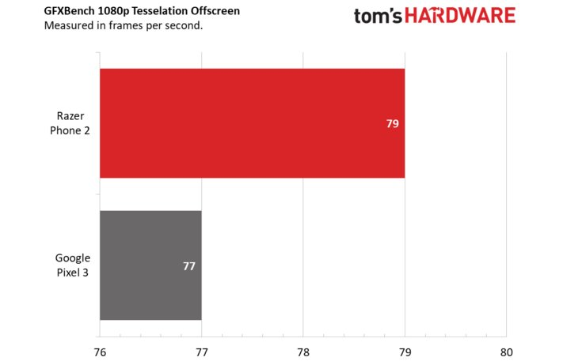

```{r setup, include=FALSE}
knitr::opts_chunk$set(echo = TRUE)
suppressMessages(library(ggplot2))
x <- c("Razer Phone 2", "Google Pixel 3")
y <- c(79, 77)
df <- data.frame(x, y)
```

# Wykres przed
```{r echo=FALSE, out.width='75%'}

```

#Wykres po 
```{r, echo = TRUE}
 ggplot(data = df, aes(x = x, y = y)) +
  geom_bar(stat='identity', fill='steelblue')+
  geom_text(aes(label = y), size = 5, hjust = 1.2, color = "white")  +
  ggtitle("GFXBench 1080p Tesselation Offscreen \n Measured in frames per seconds") +
  theme(plot.title = element_text(hjust = 0.5),
        axis.title.x=element_blank(),
        axis.title.y = element_blank())+
  coord_flip()
```

#Uzasadnienie
Wykres "przed" wprowadza w błąd, ponieważ zaczyna się od 76 zamiast od 0. Sprawia to, że wartość dla Razer Phone 2 wydaje się kilkukrotnie większa niż dla Google Pixel 3.

#Źródło
Zdjęcie wykresu pochodzi z artykułu: https://www.tomshardware.com/reviews/razer-phone-2,5862.html. Został on jednak zmodyfikowany pod wpływem negatywnych komentarzy pod artykułem.