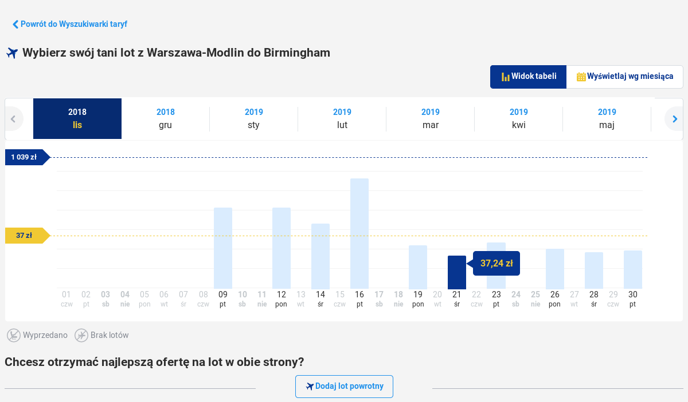

# Dziwny wykres, nic nie dający uzytkownikowi


# Wykres poprawiony
```{r, message=FALSE}
library(ggplot2)
library(scales) 
library(xkcd)
data <- read.csv('dane.csv')
data$Data <- as.POSIXct(data$Data)
data$minmax_col <- "#000000"
data$minmax_col[which.min(data$Cena)] <- "#0000FF"
data$minmax_col[which.max(data$Cena)] <- "#FF0000"
ggplot(data, aes(x = Data, y = Cena,label = dollar(Cena,suffix = "zł", prefix = NULL, decimal.mark = ","))) +
  geom_col(width = 50000, fill = data$minmax_col) +
  geom_text(vjust = -1, size = 5, family = "xkcd") +
  scale_x_datetime(labels = date_format("%a\n%d-%b"), breaks = data$Data) +
  scale_y_continuous(limits = c(0,1200),labels = dollar_format(suffix = "zł", prefix = NULL, big.mark = " ")) +
  xlab("Data przelotu") +
  ylab("Cena biletu") +
  theme_xkcd()
```

Wykres oryginalny jest *bez sensu*, ponieważ w sposób absurdalny wręcz zakłamuje ceny.

