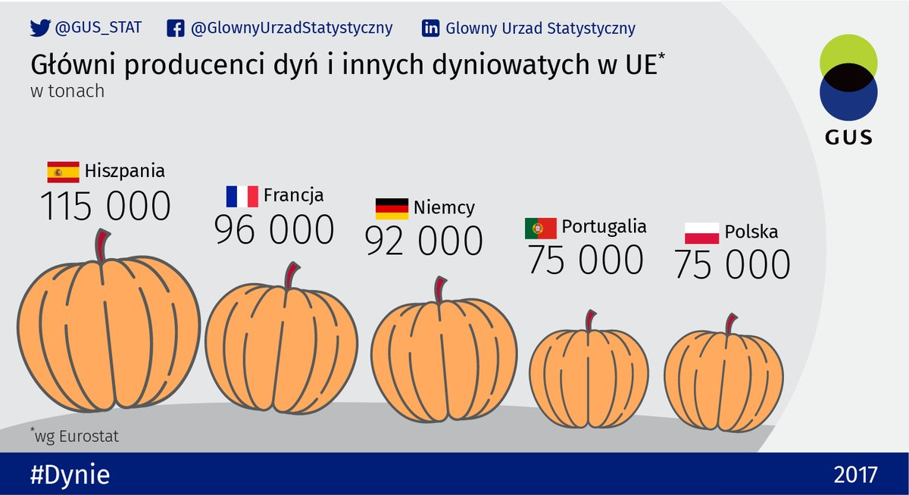

Z okazji Haloween GUS przygotował wykres obrazujący wielkość produkcji dyń w Unii Europejskiej. Do wizualizacji zastosowano dynie różnej wielkości, jednak trudno jest ustalić jakie są proporcje między nimi i w jaki sposób zakodowano wartości liczbowe - czy liczy się pole, czy wysokość. Gdyby nie było oznaczeń liczbowych, trudno by było odczytać równość wielkości produkcji dla Polski i Portugalii. Dodatkowo odbiór wykresu utrudnia fakt, że część obrazków przechylona pod różnym kątem i rozmieszczono je na różnych wysokościach. Wykres zaciemnia również ciemnoszare tło imitujące pole i potęgujące wrażenie losowego ułożenia dyni.

# Wykres oryginalny

```{r pressure, echo=FALSE, fig.cap="Pomysłowa, lecz mało czytelna forma prezentacji.", out.width = '100%'}

```

Źródło: https://twitter.com/GUS_STAT/status/1057642985326891008

# Wykres poprawiony

```{r }
library(ggplot2)

country <- c("Hiszpania", "Francja", "Niemcy", "Portugalia", "Polska")
production <- c(115000, 96000, 92000, 75000, 75000)

data <-  data.frame(country, production)
colnames(data) <- c("country", "production")


ggplot(data, aes(x=reorder(country, -production), y=production)) +
  geom_bar(stat = "identity", fill = "#ffab52", colour="black") +
  geom_text(aes(label=production), vjust=1.6, color="white", size=5.5) +
  labs(title="Główni producenci dyń i innych dyniowatych w UE", 
         x="Kraj", y = "Wielkość produkcji (w tonach)") + 
  theme(plot.title = element_text(size=18, hjust = 0.5), axis.text=element_text(size=14))
```