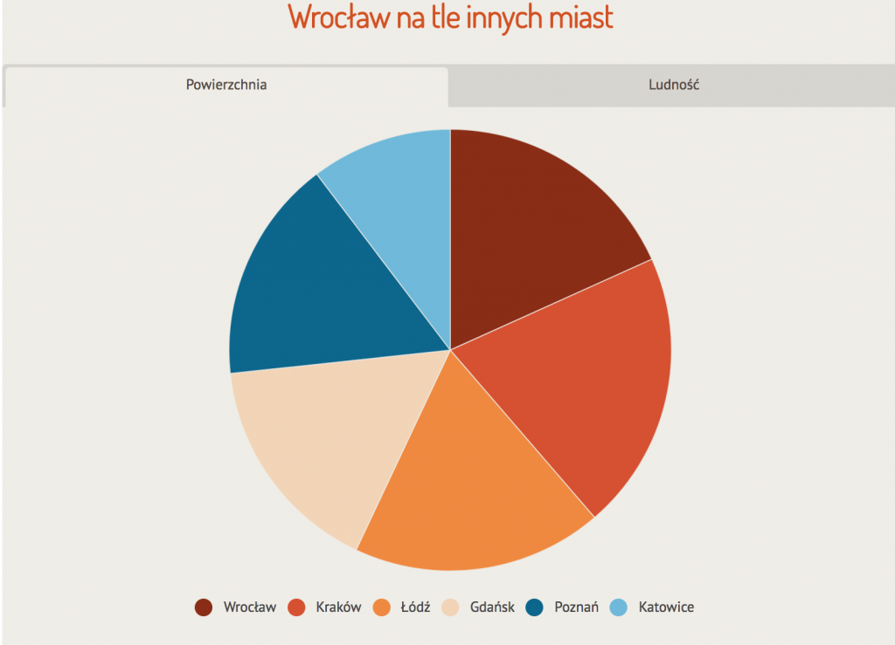
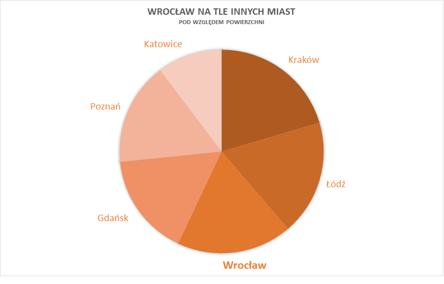
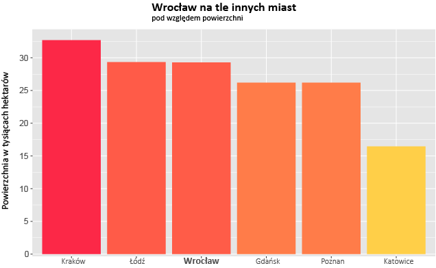
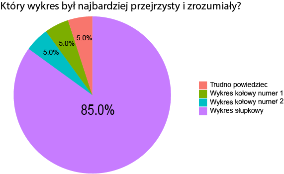

```{r setup, include=FALSE}
knitr::opts_chunk$set(echo = TRUE)
```

# Wprowadzenie

Na potrzeby pracy domowej numer 5 wykona³em ankietê (link do ankiety: https://goo.gl/forms/zKUFPfcnbXWFNFCT2), która sprawdza³a ró¿nice w odbiorze tych samych danych przedstawionych na ró¿nych wykresach. G³ównym celem by³o porównanie przydatnoœci wykresów ko³owych w wizualizacji danych i porównanie ich z wykresami s³upkowymi. Grup¹ ankietowan¹ byli moi koledzy i kole¿anki z liceum, czyli m³odzi ludzie, którzy s¹ obeznani z odbiorem ró¿nego rodzaju wykresów. £¹cznie na ankietê odpowiedzia³o 20 osób, w tym 11 mê¿czyzn i 9 kobiet. Ankietowani musieli odpowiedzieæ na cztery pytania po obejrzeniu ka¿dego z trzech wykresóW, a brzmia³y one:

1. Które miasto jest najwiêksze?

2. Które miasto jest najmniejsze?

3. Które miasto ma wiêksz¹ powierzchniê, Wroc³aw, czy £ódŸ?

4. Które miasto ma wiêksz¹ powierzchniê, Wroc³aw, czy Gdañsk?

```{r, echo=FALSE}
library(ggplot2)
library(png)
odp1 <- data.frame(c(16,16,18,4,4,2),c("Poprawna","Poprawna","Poprawna","B³êdna/Brak","B³êdna/Brak","B³êdna/Brak"),c("Wykres ko³owy 1", "Wykres ko³owy 2", "Wykres s³upkowy","Wykres ko³owy 1", "Wykres ko³owy 2", "Wykres s³upkowy"))


odp2 <- data.frame(c(19,18,19,1,2,1),c("Poprawna","Poprawna","Poprawna","B³êdna/Brak","B³êdna/Brak","B³êdna/Brak"),c("Wykres ko³owy 1", "Wykres ko³owy 2", "Wykres s³upkowy","Wykres ko³owy 1", "Wykres ko³owy 2", "Wykres s³upkowy"))
odp3 <- data.frame(c(7,9,19,13,11,1),c("Poprawna","Poprawna","Poprawna","B³êdna/Brak","B³êdna/Brak","B³êdna/Brak"),c("Wykres ko³owy 1", "Wykres ko³owy 2", "Wykres s³upkowy","Wykres ko³owy 1", "Wykres ko³owy 2", "Wykres s³upkowy"))
odp4 <- data.frame(c(7,10,18,13,10,2),c("Poprawna","Poprawna","Poprawna","B³êdna/Brak","B³êdna/Brak","B³êdna/Brak"),c("Wykres ko³owy 1", "Wykres ko³owy 2", "Wykres s³upkowy","Wykres ko³owy 1", "Wykres ko³owy 2", "Wykres s³upkowy"))
odp5 <- data.frame(c(17,1,1,1),c("Wykres ko³owy 1", "Wykres ko³owy 2", "Wykres s³upkowy", "Trudno powiedzieæ"))
library(RColorBrewer)
df <- data.frame(
  group = c("Wykres ko³owy 1", "Wykres ko³owy 2", "Wykres s³upkowy", "Trudno powiedzieæ"),
  value = c(1/20*100,1/20*100,17/20*100,1/20*100)
)

library(scales)
colnames(odp1) <- c("Popr","PoprawnoϾ odpowiedzi", "Rodzaj")
colnames(odp2) <- c("Popr","PoprawnoϾ odpowiedzi", "Rodzaj")
colnames(odp3) <- c("Popr","PoprawnoϾ odpowiedzi", "Rodzaj")
colnames(odp4) <- c("Popr","PoprawnoϾ odpowiedzi", "Rodzaj")
```

# Wizualizacja danych

Dane, które postanowi³em przedstawiæ pochodz¹ z portalu www.wroclaw.pl, gdzie przedstawiony zosta³ wykres porównuj¹cy powierzchniê Wroc³awia na tle innych miast w Polsce. Dane przedstawi³em na trzech wykresach: dwóch ko³owych i jednym s³upkowym.

## Wykres 1

Pierwszym przedstawionym w ankieie by³ wykres ko³owy pochodz¹cy ze strony www.wroclaw.pl, nazywany póŸniej przeze mnie "Wykresem ko³owym 1".



## Wykres 2

Drugi wykres by³ moj¹ prób¹ poprawienia wykresu ko³owego numer 1, jednak bez zmiany rodzaju wykresu, czyli jest to równie¿ wykres ko³owy, jednak z sensown¹ kolejnoœci¹ przedstawionych miast i spójnym doborem kolorów, oraz wyró¿nieniem Wroc³awia, który jednak jest gwiazd¹ tego wykresu.



## Wykres 3

Trzeci wykres to wykres s³upkowy, który przedstawia te same dane.



# Wyniki ankiety

# Odpowiedzi na pierwsze pytanie: 
## Które miasto jest najwiêksze?

```{r, echo=FALSE}
ggplot(odp1, aes(x=Rodzaj, y=Popr, fill=`PoprawnoϾ odpowiedzi`)) + geom_bar(stat='identity',position="dodge2") +
  xlab("Rodzaj wykresu")+ ylab("Liczba odpowiedzi") + 
  scale_fill_brewer(type="qual",palette=6)+
  theme(
        axis.text=element_text(size=12),
        axis.title=element_text(size=12,face="bold"),
        legend.position = "bottom",
        legend.text = element_text(size=12),
        legend.title = element_text(size=12,face="bold"),
        plot.title = element_text(size=18,face="bold",hjust=0.5),
        panel.background = element_rect(fill = "grey97",
                                        colour = "grey99",
                                        size = 0.5, linetype = "solid"),
        panel.grid.major = element_line(size = 0.5, linetype = 'solid',
                                        colour = "white"), 
        panel.grid.minor = element_line(size = 0.25, linetype = 'solid',
                                        colour = "white"))
```

Mo¿na na podstawie tych odpowiedzi wywnioskowaæ, ¿e okreœlenie najwiêkszego miasta nie sprawi³o wiêkszych trudnoœci nawet przy wykresach ko³owych, jednak widaæ, ¿e najwiêcej poprawnych odpowiedzi by³o przy wykresie s³upkowym.

# Odpowiedzi na drugie pytanie:
## Które miasto jest najmniejsze?

```{r, echo=FALSE}
ggplot(odp2, aes(x=Rodzaj, y=Popr, fill=`PoprawnoϾ odpowiedzi`)) + geom_bar(stat='identity',position="dodge2") +
  xlab("Rodzaj wykresu")+ ylab("Liczba odpowiedzi") + 
  scale_fill_brewer(type="qual",palette=7)+
  theme(
    axis.text=element_text(size=12),
    axis.title=element_text(size=12,face="bold"),
    legend.position = "bottom",
    legend.text = element_text(size=12),
    legend.title = element_text(size=12,face="bold"),
    plot.title = element_text(size=18,face="bold",hjust=0.5),
    panel.background = element_rect(fill = "grey97",
                                    colour = "grey99",
                                    size = 0.5, linetype = "solid"),
    panel.grid.major = element_line(size = 0.5, linetype = 'solid',
                                    colour = "white"), 
    panel.grid.minor = element_line(size = 0.25, linetype = 'solid',
                                    colour = "white"))
```

Przy okreœlaniu najmniejszego miasta, by³a tak du¿a ró¿nica powierzchni miêdzy nim, a reszt¹ miast, ¿e na podstawie ka¿dego wykresu znaczna wiêkszoœæ badanych odpowiedzia³a poprawnie, wiêc do tego celu wykres s³upkowy nie by³ w zupe³noœci potrzebny.

# Odpowiedzi na trzecie pytanie
## Które miasto ma wiêksz¹ powierzchniê, Wroc³aw, czy £ódŸ?

```{r, echo=FALSE}
ggplot(odp3, aes(x=Rodzaj, y=Popr, fill=`PoprawnoϾ odpowiedzi`)) + geom_bar(stat='identity',position="dodge") +
  xlab("Rodzaj wykresu")+ ylab("Liczba odpowiedzi") + 
  scale_fill_brewer(type="qual",palette=7)+
  theme(
    axis.text=element_text(size=12),
    axis.title=element_text(size=12,face="bold"),
    legend.position = "bottom",
    legend.text = element_text(size=12),
    legend.title = element_text(size=12,face="bold"),
    plot.title = element_text(size=18,face="bold",hjust=0.5),
    panel.background = element_rect(fill = "grey97",
                                    colour = "grey99",
                                    size = 0.5, linetype = "solid"),
    panel.grid.major = element_line(size = 0.5, linetype = 'solid',
                                    colour = "white"), 
    panel.grid.minor = element_line(size = 0.25, linetype = 'solid',
                                    colour = "white"))
```

Jak mo¿na zaobserwowaæ na powy¿szym wykresie, przy porównywaniu dwóch bliskich siebie powierzchni¹ miast poprawnoœæ odpowiedzi w obu wykresach ko³owych diametralnie spad³a. Cz³owiek ma problem z porównaniem powierzchni dwóch bardzo podobnych wycinków ko³a, a ³atwiej mu okreœliæ róznicê d³ugoœci dwóch s³upków stoj¹cych przy sobie. Drugi wykres ko³owy zapewni³ poprawê wzglêdem pierwszego dziêki odpowiedniego zastosowania skali kolorów.

# Odpowiedzi na czwarte pytanie
## Które miasto ma wiêksz¹ powierzchniê, Wroc³aw, czy Gdañsk?

```{r, echo=FALSE}
ggplot(odp4, aes(x=Rodzaj, y=Popr, fill=`PoprawnoϾ odpowiedzi`)) + geom_bar(stat='identity',position="dodge") +
  xlab("Rodzaj wykresu")+ ylab("Liczba odpowiedzi") + 
  scale_fill_brewer(type="qual",palette=4)+
  theme(
    axis.text=element_text(size=12),
    axis.title=element_text(size=12,face="bold"),
    legend.position = "bottom",
    legend.text = element_text(size=12),
    legend.title = element_text(size=12,face="bold"),
    plot.title = element_text(size=18,face="bold",hjust=0.5),
    panel.background = element_rect(fill = "grey97",
                                    colour = "grey99",
                                    size = 0.5, linetype = "solid"),
    panel.grid.major = element_line(size = 0.5, linetype = 'solid',
                                    colour = "white"), 
    panel.grid.minor = element_line(size = 0.25, linetype = 'solid',
                                    colour = "white"))
```

W przypadku czwartego pytania, zachowanie by³o bardzo podobne jak w trzecim pytanie, jednak jeszcze bardziej uwidoczni³a siê ró¿nica w zastosowaniu odpowiedniej skali kolorów i kolejnoœci wystêpowania miast, poniewa¿ w wykresie ko³owym 2 a¿ 50% ankietowanych odpowiedzia³o poprawnie. Bez zaskoczeñ, najwiêcej poprawnych odpowiedzi by³o po obejrzeniu wykresu s³upkowego.

# Podsumowanie




Na podstawie odpowiedzi na ostatnie pytanie widaæ, ¿e a¿ 85% ankietowanych uzna³o wykres s³upkowy za najbardziej przejrzysty, zrozumia³y. Dane te przedstawi³em jednak za pomoc¹ wykresu ko³owego i s¹ one jasne, oraz czytelne. 
Jaki wiêc mo¿na wyci¹gn¹æ z tego wniosek?


1. Przy porównywaniu bliskich sobie wartoœci wykres s³upkowy sprawdzi siê o wiele lepiej od ko³owego

2. Przy pokazywaniu dominacji pewnej wartoœci nad reszt¹ oba rodzaje wykresów s¹ równie czytelne

3. Dobre zastosowanie kolorów pomaga w poprawnym odbiorze informacji z wykresu

4. Poprawna kolejnoœæ wystêpowania wartoœci umo¿liwia odczytanie dodatkowych informacji


