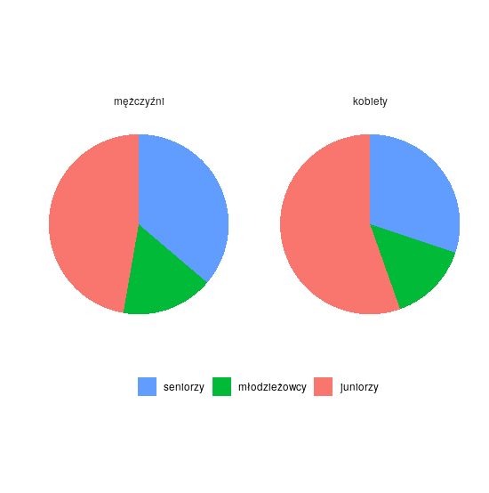
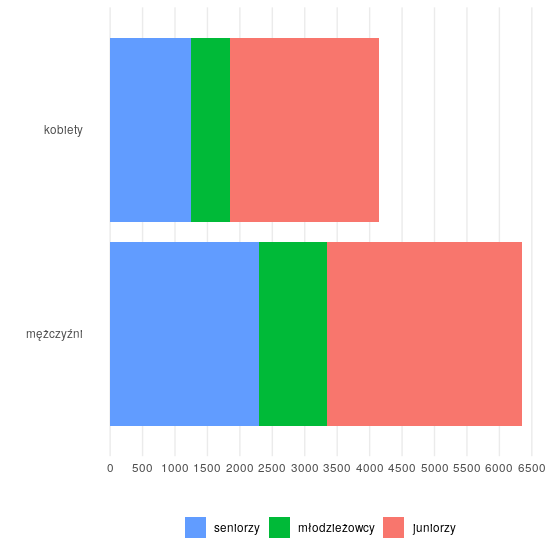
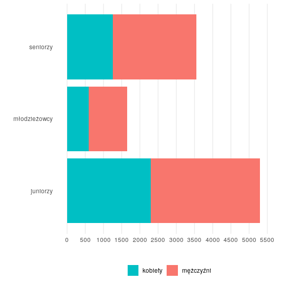
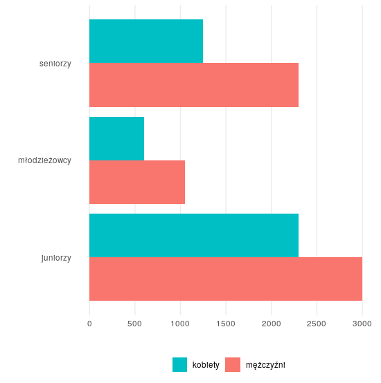

<div style="text-align: justify">
Eksperyment, który postanowiłem przeprowadzić to zweryfikowanie czy wykresy słupkowe są rzeczywiście czytelniejsze niż wykresy kołowe. Zadawane pytania były niekiedy podchwytliwe. Chciałem zobaczyć jakie wnioski wyciągają osoby kiedy postawieni są w obliczu pytań, na które nie da się odpowiedzieć na podstawie zaprezentowanych faktów. Często przecież wykresy spotykane w internecie są przekłamane - a wyciągane wnioski błędne. Ankietowani gorąco ze mną dyskutowali na temat eksperymentu - cel uważam za osiągnięty.

Moja grupa kontrolna to pracownicy firmy, w której pracuję i kilka innych osób. Wypełniono 24 ankiety. Wszyscy posiadają wykształcenie wyższe.

Użyte dane: http://stat.gov.pl/obszary-tematyczne/kultura-turystyka-sport/sport/kultura-fizyczna-w-2017-roku,13,1.html
Link do ankiety: https://goo.gl/forms/GLtBqXcVS9JbNqNV2

## Pytania
Ankietowani mieli odpowiedzieć na trzy pytania.

- określić liczność grup - seniorów, młodzieży i juniorów,
- określić proporcje kobiet do mężczyzn,
- określić proporcje grup - seniorów, młodzieży i juniorów.

Na koniec należało określić, który wykres jest najczytelniejszy.

## Wykresy
Pierwszy wykres znacząco różni się od pozostałych. Rozpoczynając eksperyment spodziewałem się, że dla pozostałych wykresów uzyskane wyniki będą podobne.

---

## Wykres pierwszy
<center>

</center>

## Wykres drugi
<center>

</center>

## Wykres trzeci
<center>

</center>

## Wykres czwarty
<center>

</center>

## Pytanie pierwsze
<center>
```{r, echo=FALSE}
library(ggplot2)
df <- data.frame(
  q = rep(c("1", "2", "3", "4"), each=4),
  a = rep(c("Seniorzy", "Młodzieżowcy", "Juniorzy", "Nie da się powiedzieć"), times=4),
  v = c(0, 0, 24, 0, 
        1, 0, 23, 0,
        0, 0, 24, 0,
        1, 0, 23, 0)
)

ggplot(df) +
  geom_bar(aes(q, v, fill=a), stat="identity") + 
  theme_minimal() +
  labs(title = "Która grupa jest najliczniejsza?", x = "Wykres", y = "Ilość odpowiedzi") +
  scale_y_continuous(breaks = seq(0, 24, 6)) +
  scale_fill_discrete(name = "Odpowiedź")
```
</center>

Na to pytanie da się odpowiedzieć dokładnie na podstawie tych danych. Ankietowani nie mieli problemów.

## Pytanie drugie
<center>
```{r, echo=FALSE}
library(ggplot2)
df <- data.frame(
  q = rep(c("1", "2", "3", "4"), each=4),
  a = rep(c("Tak", "Rzadziej", "Tak samo często", "Nie da się powiedzieć"), times=4),
  v = c(0, 2, 7, 15, 
        1, 23, 0, 0,
        0, 24, 0, 0,
        0, 24, 0, 0)
)

ggplot(df) +
  geom_bar(aes(q, v, fill=a), stat="identity") + 
  theme_minimal() +
  labs(title = "Czy kobiety częściej reprezentują Polskę niż mężczyźni?", x = "Wykres", y = "Ilość odpowiedzi") +
  scale_y_continuous(breaks = seq(0, 24, 6)) +
  scale_fill_discrete(name = "Odpowiedź")
```
</center>

Z wykresami słupkowymi nie było większych problemów - to mnie nie dziwi. Bardzo wiele osób wpadło w pułapkę wykresu kołowego, gdzie nie da się porównać bezwzględnych ilości. Mimo to mamy aż 7 odpowiedzi "Tak samo często".

## Pytanie trzecie
<center>
```{r, echo=FALSE}
library(ggplot2)
df <- data.frame(
  q = rep(c("1", "2", "3", "4"), each=4),
  a = rep(c("Tak", "Rzadziej", "Tak samo często", "Nie da się powiedzieć"), times=4),
  v = c(14, 2, 6, 2, 
        0, 22, 2, 0,
        0, 23, 1, 0,
        1, 22, 1, 0)
)

ggplot(df) +
  geom_bar(aes(q, v, fill=a), stat="identity") + 
  theme_minimal() +
  labs(title = "Czy wśród juniorów kobiety częściej reprezentują Polskę niż mężczyźni?", x = "Wykres", y = "Ilość odpowiedzi") +
  scale_y_continuous(breaks = seq(0, 24, 6)) +
  scale_fill_discrete(name = "Odpowiedź")
```
</center>

Najmniej błędnych odpowiedzi uzyskujemy dla wykresu trzeciego. Po raz kolejny widzimy, że największą różnorodność odpowiedzi uzyskujemy dla wykresu pierwszego. To pytanie jest najtrudniejsze. Nawet osoby, które nie miały problemów z&nbsp;odpowiedzią na poprzednie pytanie tym razem myliły się. Wiele osób stwierdziło, że kobiet juniorów jest więcej!

## A który jest najczytelniejszy?
<center>
```{r, echo=FALSE}
library(ggplot2)
df <- data.frame(
  q = c("1", "2", "3", "4"),
  v = c(2, 4, 2, 16)
)

ggplot(df) +
  geom_bar(aes(q, v), stat="identity") + 
  theme_minimal() +
  labs(title = "Który z wykresów wydał ci się najczytelniejszy?", x = "Wykres", y = "Ilość odpowiedzi") +
  scale_y_continuous(breaks = seq(0, 16, 4))
```
</center>

Dwie trzecie ankietowanych wybrało wersję zaprezentowaną w raporcie GUSu. To chyba dobrze świadczy o osobach tworzących wykresy dla tej instytucji. Dla nas najważniejsze jest to, że niewiele osób wybrało wykres kołowy.

## Wnioski
W mojej grupie kontrolnej znalazł się socjolog. Bardzo ciekawym doświadczeniem była rozmowa z nim na temat tej ankiety. Stwierdził, że ich tworzenie to sztuka, a każde słowo ma wpływ na ostateczny wynik. Istnieją bowiem badania, które jasno pokazują, że takie same grupy kontrolne udzielają zupełnie różnych odpowiedzi na pytania inaczej sformułowane. Ma to nawet swoją nazwę: [Response bias](https://en.wikipedia.org/wiki/Response_bias).

Zgodnie z przewidywaniami - ludzie lepiej postrzegają i analizują wykresy kołowe. 4 osoby z badanej grupy poruszyło w&nbsp;rozmowie temat zadawania pytań, na które nie da się odpowiedzieć na podstawie wykresu kołowego. Ludzie są świadomi pułapek. Rozmawiając o wykresach z ankietowanymi często padało stwierdzenie, że nawet nie zdajemy sobie sprawy o ile łatwiej jest zauważać fakty w innej reprezentacji wizualnej. Pytanie o najliczniejszą grupę jest oczywiste na wykresie trzecim - a najmniej oczywiste na kołowym.
</div>

