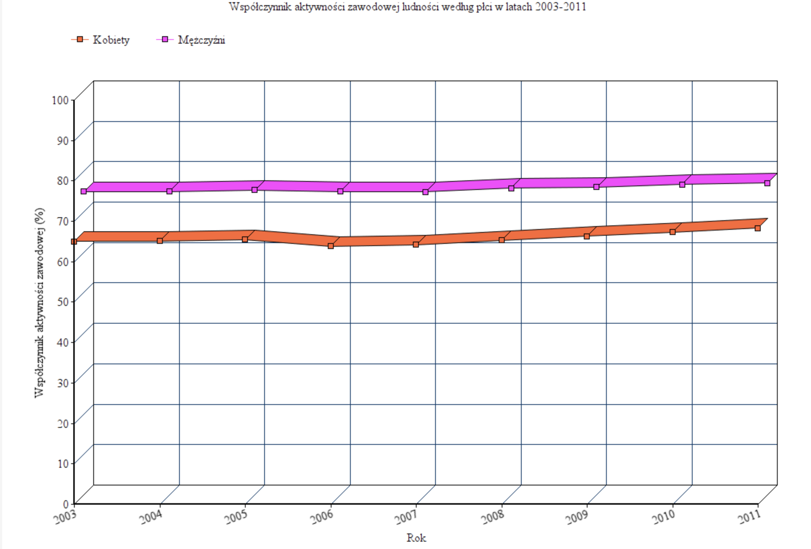

```{r setup, include=FALSE}
knitr::opts_chunk$set(echo = TRUE)
```

# Zadanie

Celem zadania było przeprowadzenie eksperymentu sprawdzającego istnienie problemów z odczytywaniem danych znajdujących się na źle wykonanych wykresach. W ramach mojego eksperymentu zdecydowałam się przetestować poprawność odczytywania danych na wykresach liniowych 3D.

# Przygotowane wykresy

Przygotowałam dwa wykresy prezentujące współczynnik zatrudnienia w Polsce w latach 2003-2011 z podziałem na płeć. Pierwszy z wykresów wykonany był w 3D, drugi w 2D. Uwaga! Zdaję sobie sprawę, że również drugi wykres, wykonany w 2D, nie jest w pełni czytelny, jednakże w celu zapewnienia rzetelności eksperymentu postanowiłam, że wykresy będą się różnić jedynie tym, że pierwszy będzie w 3D, a drugi w 2D.

* Pierwszy wykres:



* Drugi wykres:


# Ankieta

Oba wykresy zamieściłam w ankiecie znajdującej się pod adresem: https://docs.google.com/forms/d/e/1FAIpQLSeiUlu7uZcOc5BPApdB-s9XYf5xVD5HBFGWc53Cer8ZH4v9Dw/viewform?usp=sf_link . 
Na podstawie każdego z wykresów użytkownicy mieli odpowiedzieć na 2 pytania jednokrotnego wyboru:

1. Ile wynosił współczynnik zatrudnienia wśród kobiet w 2006 roku?
* 60%
* 61%
* 63%
* 65%

2. O ile punktów procentowych różnił się współczynnik zatrudnienia kobiet i mężczyzn w 2007 roku? 
* Około 5%
* Około 10%
* Około 13%
* Około 15%

Poprawna odpowiedź na pytanie 1 to 63%, na pytanie 2 to 10%.

# Wyniki

Ankietę przeprowadzono wśród 21 osób. Poniżej przedstawione są otrzymane wyniki.

## Pytanie 1

```{r firstquestion, echo=FALSE, warning=FALSE}
library(ggplot2)

question1 <- data.frame("answer" = c("60%", "61%", "63%", "65%", "60%", "61%", "63%", "65%"),
                        "results" = c(8, 4, 3, 6, 0, 0, 21, 0),
                        "Wykres" = c("wykres 1","wykres 1","wykres 1","wykres 1","wykres 2","wykres 2","wykres 2","wykres 2"))
ggplot(question1, aes(x=answer,y=results, fill=Wykres)) +
  geom_bar(stat="identity", width=.5, position = "dodge") +
  xlab("Odpowiedz") + ylab("Ilosc odpowiedzi") +
  theme_minimal() +
  ggtitle("Ile wynosil wspolczynnik zatrudnienia wsrod kobiet w 2006 roku?")

```

Jak możemy zauważyć na powyższym wykresie niewielu respondentów (3) wskazało poprawną odpowiedź na podstawie wykresu numer jeden, mimo iż widać zróżnicowanie w odpowiedziach. Właściwie każda inna odpowiedź uzyskała więcej głosów. Wręcz przeciwnie wygląda sytuacja w wypadku odpowiedzi na podstawie wykresu nr 2 (2D) - wszyscy respondenci udzielili prawidłowej odpowiedzi.

## Pytanie 2

```{r secondquestion, echo=FALSE, warning=FALSE}
library(ggplot2)

question1 <- data.frame("answer" = c("Ok. 5%", "Ok. 10%", "Ok. 13%", "Ok. 15%", "Ok. 5%", "Ok. 10%", "Ok. 13%", "Ok. 15%"),
                        "results" = c(0, 5, 14, 2, 0, 16, 5, 0),
                        "Wykres" = c("wykres 1","wykres 1","wykres 1","wykres 1","wykres 2","wykres 2","wykres 2","wykres 2"))
ggplot(question1, aes(x=answer,y=results, fill=Wykres)) +
  geom_bar(stat="identity", width=.5, position = "dodge") +
  xlab("Odpowiedz") + ylab("Ilosc odpowiedzi") +
  theme_minimal() +
  ggtitle("O ile punktow procentowych roznil sie wspolczynnik\n zatrudnienia kobiet i mezczyzn w 2007 roku? ")

```

Na pytanie 2 niewielu respondentów odpowiedziało poprawnie na podstawie wykresu nr 1. Większość wskazała wartość większą. W wypadku wykresu drugiego odpowiedź poprawna również nie była oczywista - jak już wcześniej wspomniano on również nie jest idealny i w pełni poprawny. Jednakże zdecydowana większość (ponad 75%) udzieliła poprawnej odpowiedzi. Skłania nas to do wniosku, że nawet średnio dobrze wykonany wykres 2D zdecydowanie lepiej przekazuje informacje niż ten w perspektywie ukośnej.

## Wnioski

Przeprowadzony eksperyment pokazał jak bardzo mylące są wykresy liniowe w perspektywie skośnej, z dodaniem sztucznego 3 wymiaru. Nawet niezbyt dobrze wykonany wykres 2D zdecydowanie mniej wprowadza użytkowników w błąd, są oni w stanie odczytać wynik. Większość uczestników ankiety miała problem z poprawnym odczytaniem wykresu w wersji 3D. Mimo, iż na pozór ten typ wykresu może się wydawać ciekawym zabiegiem artystycznym, to jednak w bardzo negatywny sposób wpływa na percepcje i odczyt danych. Cytując jednego z odpowiadających "ten pierwszy wykres to był beznadziejny".