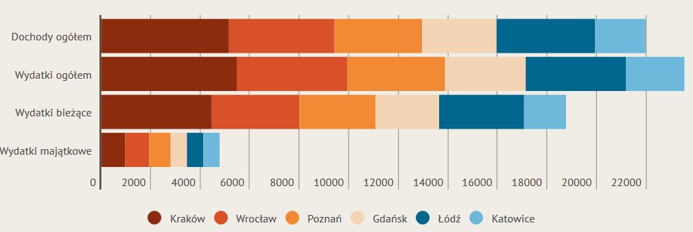
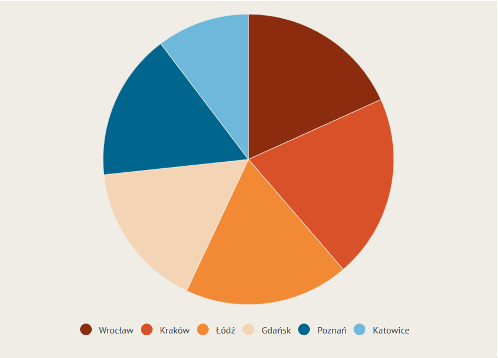

## Cel zadania

Podczas realizacji zadania chciałam sprawdzić jak źle dobrany rodzaj wykresu może wpłynąć na problemy z prawidłową interpretacją danych.

## Zastosowane wykresy

Użyte przeze mnie wykresy pochodzą z badania przeprowadzonego przez miasto Wrocław. W artykule porównano 6 miast pod kilkoma względami (m.in. powerzchni, liczby ludności oraz zaplanowwanego budżetu). 

## Wykres I

 
Przedstawia budżety miast w postaci wykresu słupkowego skumulowanego z podziałem na 4 wartości. Miasta zostały oznaczone kolorami.

Taki rodzaj wykresu utrudnia jednoznacze porównanie danej wartości dla kolejnych miast (słupki położone są obok siebie). Ponadto poza pierwszym od lewej miastem, wszystkie kolejne słupki (prostokąty) w danym kolorze są względem siebie przesunięte, więc nie może porównać np. wielkości sumarycznych wydatków i dochodów dla danego miasta.

Żeby sprawdzić czy moje obserwacje co do trudności odczytywania danych z tego wykresu są słuszne, zadałam ankietowanym 3 pytania.

I Które z poniższych miast ma mniejsze "wydatki ogółem"? Poznań/Łódź

II Które w poniższych miast ma większe "wydatki bieżące"? Wrocław/Łódź

III W Łodzi większe są "dochody ogółem" czy "wydatki ogółem"?

Sposród 15 odpowiedzi na każde pytanie poprawnych było: 

pytanie I - 10, pytanie II - 6, pytanie 3 - 10

Mogło być lepiej, ale i tak wyniki nie są najgorsze.
Jednak gdyby słupki dotyczące kolejnych wielkości umieścić obok siebie, na tym samym poziome, ich odczytanie byłoby jednoznaczne.

## Wykres II

Przedstawia porównanie powierzchni miast na wykresie kołowym. Sama idea przedstawienia tych danych w takiej postaci nie ma zbyt wiele sensu, ale najbardziej problematyczne okazuje się odczytanie, które miasto jest większe od którego. Dane NIE są uporządkowane rosnąco.

W ankiecie poprosiłam o wskazanie większego w dwóch parach miast: Łodź i Wrocław oraz Gdańsk i Poznań. 
Na pierwsze pytanie prawidłowo odpowiedziało 12 z 15 osób, na drugie 3 z 15. Z jednej strony wyniki mogą byc losowe (dane są naprawdę zbliżone), z drugiej wpływ na wskazywanie wycinka o większej powierzchni może mieć również jego kolor (ciemniejsze barwy bardziej przyciągają uwagę, wydają się większe).

Ponownie; przy danych przedstawionych na wykresie słupkowym odczytanie różnic między miastami byłoby zdecydowanie łatwiejsze.

## Link do ankiety

https://docs.google.com/forms/d/e/1FAIpQLSdKj342y8ZlUU9BEgSHJKPWezmIOC36M-RB0KGotlIgX7CXsQ/viewform