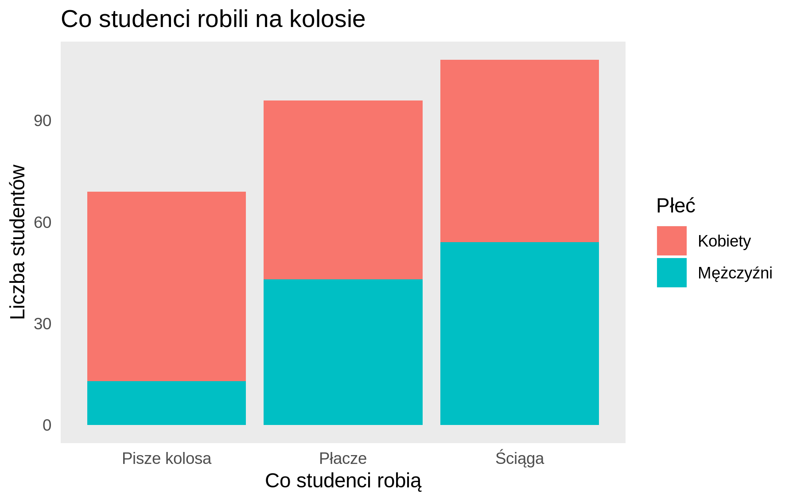
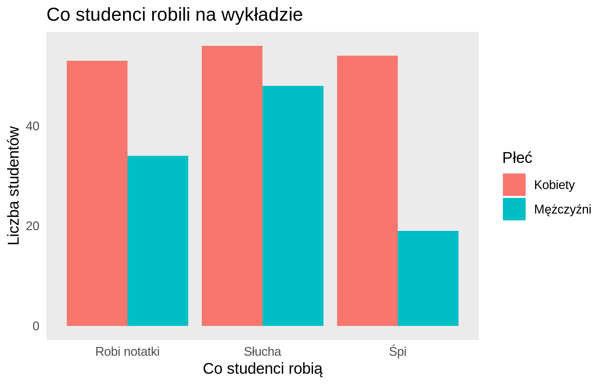
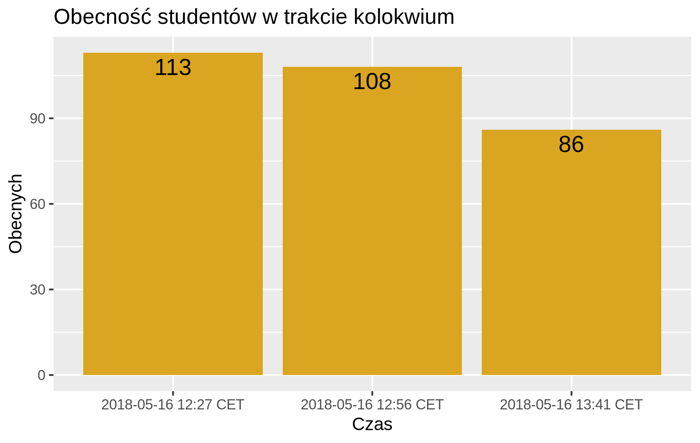

```{r setup, include=FALSE}
knitr::opts_chunk$set(echo = FALSE)
suppressMessages(library(ggplot2))
```

## Wstęp
W tej pracy domowej badaliśmy dokładność odczytu danych z wykresu w zależności od typu wykresu. Najpierw sprawdziliśmy jak dokładnie odczytuje się długości słupków, gdy są zaczepione w tym samym punkcie oraz w różnych punktach. Następnie sprawdziliśmy dokładność odczytu danych gdy wartości są zaprezentowane jako długość słupków w porównaniu z kątami w kole. Na koniec sprawdziliśmy, czy ludzie zwracają uwagę na całe wartości na osiach, czy tylko na ich fragmenty.  
W ankiecie dostępnej https://goo.gl/forms/DK8DtZsUnX004SIm2 wzieło udział 77 osób. Zebraliśmy dane statystyczne o ankietowanych, które się przedstawiają następująco:

```{r}
wyniki <- read.csv('Wykresy.csv')
wyniki[54,'Wiek'] <- 22 #ktoś napisał 22 lata (wybaczamy, bo to była 2:47 w nocy)

ggplot(data=wyniki, aes(x=Płeć, fill=Płeć)) +
  geom_bar() + labs(title = 'Płeć osób biorących udział w ankiecie') +
  theme(legend.position = 'none') + 
  xlab("Płeć") +
  ylab("Liczba ankietowanych")

ggplot(data=wyniki, aes(x=Wiek, fill=Wiek)) +
  geom_bar() + labs(title = 'Wiek osób biorących udział w ankiecie') +
  theme(legend.position = 'none') + 
  xlab("Wiek") +
  ylab("Liczba ankietowanych")
```

## Eksperyment 1 - punkt zaczepienia słupków

Pierwszy z eksperymentów miał na celu sprawdzić, czy rzeczywiście trudniej jest porównać długość słupków w momencie, gdy są one zaczepione w różnych punktach niż, gdy słupki zaczynają się z początkiem osi. W tym celu zostały stworzone 2 fikcyjne zbiory danych na temat tego co studenci robili podczas jednego wykładu oraz jednego kolokwium. Na obu wykresach studenci byli podzieleni ze względu na płeć.





Pytaliśmy, który ze słupków jest drugi pod względem długości w przypadku kobiet. Na pierwszym wykresie (różne punkty zaczepienia) poprawną odpowiedzią było "Ściąga", a na drugim (ten sam punkt zaczepienia) było to "Śpi". Odpowiedzi według ankietowanych przedstawiają się następująco (na zielono są poprawne odpowiedzi):

```{r, fig.width=12, fig.height=2.5}
rysuj <- function(dane, title, legend.row = 1){
tmp <- as.data.frame(round(table(dane)/length(dane) * 100,0))
tmp$cum <- cumsum(tmp$Freq)
colnames(tmp)[1] <- "Var1"
  ggplot(tmp, aes(x=1, y= -Freq, fill = Var1)) +
  geom_col(width = 0.4)+
  geom_text(aes(y = cum-100 - (Freq/2), label = paste0(Freq,"%")), size=4) +
    ggtitle(title) +
    theme_bw() +
    theme(legend.position = "bottom",
          axis.text.x=element_blank(),
          axis.text.y=element_blank(),
          axis.title.x=element_blank(),
          axis.title.y=element_blank(),
          panel.border = element_blank(),
    panel.background = element_blank(),
    panel.grid.major = element_blank(),
    panel.grid.minor = element_blank(),
    axis.ticks.x=element_blank(),
    axis.ticks.y=element_blank(),
    legend.title = element_blank())+
    guides(fill = guide_legend(nrow = legend.row)) +
    scale_fill_manual(values = c("#8dd3c7", "#ffffb3", "springgreen2"))+
    coord_flip()
} #źródło - https://github.com/pbiecek/TechnikiWizualizacjiDanych2017/blob/master/PraceDomowe/PD_04/Gosiewska_Jamroz_Kalinowska_Marcinkowska/pd4.Rmd
rysuj(wyniki$Bierzemy.pod.uwagę.liczbę.kobiet..Która.grupa.jest.druga.co.do.liczności., "Różne punkty zaczepienia")

rysuj(wyniki$Bierzemy.pod.uwagę.liczbę.kobiet..Która.grupa.jest.druga.co.do.liczności..1, "Wspólny punkt zaczepienia")
```

Widać, że ciężko porównywać 2 wartości słupków gdy są zaczepione w różnych punktach. W tym przypadku skuteczność wyniosła tylko 38%, co w porównaniu z wartością oczekiwania wynoszącą 33% wygląda słabo. Jeśli wzięlibyśmy pod uwagę tylko drugi i trzeci słupek i kazali je porównywać to moglibyśmy dostać wynik mniejszy od wartości oczekiwanej (ok 40% zamiast 50%). Możemy mieć tu więc nawet doczynienia z iluzją (ale nie to było celem tego wykresu). Długości słupków prawie się nie różnią: są to 54 i 53 w skali liczbowej.  
Porównanie długości słupków zaczepionych w tym samym punkcie było łatwym zadaniem na co wskazuje 87% poprawnych odpowiedzi.

## Eksperyment 2: percepcja kątów a percepcja długości.

Na poniższych dwóch wykresach zaprezentowane są dane o identycznych rozkładach, zwizualizowane na różne sposoby oraz inaczej opisane (tzn dla pewnej kolejności etykiet procentowe wartości danych na drugim wykresie odpowiadają procentowym wartościom danych na pierwszym wykresie):

```{r message=FALSE, echo=FALSE, fig.align="center", fig.width = 9, fig.height=6, warning=FALSE}
require(ggplot2)

tricky_data_percs <- c(8, 7, 6, 9.75, 10.5, 9.5, 2.5, 8.5, 6, 8.25, 9, 5)

mts <- c("Styczeń", "Luty", "Marzec", "Kwiecień",
         "Maj", "Czerwiec", "Lipiec", "Sierpień",
         "Wrzesień", "Październik", "Listopad", "Grudzień")

lab1 <- factor(mts[12:1], 
          levels = mts[12:1], ordered = T)

dat1 <- data.frame(vals = tricky_data_percs * 124, mies = lab1)

dat0 <- cbind(dat1, percs = tricky_data_percs)

set.seed(123)
t2 <- tricky_data_percs[sample(1:12, 12)]

lab2 <- c("Dopełniacz", "Dyplomata", "Handlarz", "Kat", "Matrymonista",  "Osiłek", "Patron",
          "Rogownik",  "Słuchawka",  "Śmigacz","Szperacz", "Waltornista")


dat2 <- data.frame(vals = t2 * 5124, klas = lab2)
set.seed(123)
dat0 <- cbind(dat0[sample(1:12,12), ], dat2)


ggplot(data = dat1, aes(x = mies, y = vals, fill = mies)) +
  geom_bar(stat = "identity") +
  xlab("Miesiąc") +
  ylab("Sprzedane sztuki") +
  scale_fill_discrete(guide = FALSE) +
  coord_flip() +
  ggtitle("Sprzedaż młotków w powiecie marnobrzeskim w 2015 r.") +
  theme_minimal() +
  theme(panel.grid.major.x = element_blank(),
        panel.grid.minor.x = element_blank())

s <- sum(dat2$vals)
hts <- c(cumsum(dat2$vals))
hts <- s - hts + dat2$vals / 2 

ggplot(data = dat2, aes(x = factor(1),  y = vals, fill = klas)) +
  geom_bar(stat = "identity", color = "black", width = 1) +
  xlab("") +
  ylab("") +
  scale_fill_discrete(guide = FALSE) +
  geom_text(aes(x = 1.75, y = hts, label = klas)) +
  coord_polar("y") +
  ggtitle("Liczba postaci poszczególnych klas w grze MMO Pawlilandy", subtitle = "stan na 2014 r.") + 
  theme_void() 

```

Dane te celowo są nieposortowane względem wielkości grupy. Ponadto na pierwszym wykresie celowo zostały nieumieszczone linie pionowe. Poniżej prezentujemy dane posortowane, z dodaną wartością procentową względem całości oraz etykietami na obu wykresach:

```{r studio, fig.align="center", fig.width = 9, fig.height=6, echo = FALSE, message=FALSE, warning=FALSE}

colnames(dat0) <- c("val_m", "mies", "percs", "val_k", "klas")

dat0b <- data.frame(percs = tricky_data_percs, x1 = lab1)
set.seed(123)
dat2$vals <- tricky_data_percs[sample(1:12)]
dat0b <- merge(x = dat0b, y = dat2, by.x = "percs", by.y = "vals", all.x = TRUE)[-c(4,5),]
mts2 <- as.character(lab1[order(tricky_data_percs, decreasing = TRUE)])
dat0b$x1 <- factor(mts2, levels = mts2[12:1], ordered = T)

ofh <- rep(1, 12)
ofh[7] <- 2
ofh<- as.factor(ofh)

ord = order(order(abs(dat0$percs - 8.25)))

ggplot(data = dat0b, aes(x = x1, y = percs)) +
  geom_bar(stat = "identity", aes(fill = ofh)) +
  scale_x_discrete(labels = paste(c("Sierpień", "Wrzesień", "Lipiec", "Luty", 
                                    "Maj", "Marzec", "Grudzień", "Listopad", "Kwiecień", "Październik",
                                    "Styczeń", "Czerwiec")[1:12], "\n", dat0b$klas[12:1], sep = "")) +
  xlab("Nazwa grupy") +
  ylab("Wartość procentowa") +
  ggtitle("Porównanie posortowanych danych") +
  scale_fill_discrete(guide = FALSE) +
  geom_text(aes(label = paste(percs, "%", sep = "")), nudge_y = -0.5) 

```
Ankietowanym zostały zaprezentowane oba wykresy, jeden po drugim, wraz z identycznym pytaniem do każdego - która z grup jest *szósta* co do liczności (na powyższym wykresie została wyróżniona). Zgodnie z przypuszczeniem, o wiele łatwiej było udzielić prawidłowej odpowiedzi w przypadku wykresu słupkowego. Na poniższym wykresie prezentujemy udzielone odpowiedzi:

```{r message=FALSE, echo = FALSE, fig.align="center", fig.width = 9, fig.height=6, warning=FALSE}
require(dplyr)
require(reshape2)
wyniki <- read.csv(file = "Wykresy.csv") %>% 
  mutate( pie = Która.grupa.jest.szósta..6..co.do.liczności., 
          bar = Która.grupa.jest.szósta..6..co.do.liczności..1) %>% 
  select("pie", "bar")

pie_stat <- table(wyniki$pie)
pie_stat <- as.data.frame(pie_stat) %>% mutate( czestosc_klasa = Freq, Var1 = factor(Var1)) %>% select(Var1, czestosc_klasa)
bar_stat <- table(wyniki$bar)
bar_stat <- as.data.frame(bar_stat) %>% mutate( czestosc_miesiac = Freq, Var1 = factor(Var1)) %>% select(Var1, czestosc_miesiac)


poprawnosc <- merge(x = dat0, y = bar_stat, by.x = "mies", by.y = "Var1", all.x = TRUE)

poprawnosc <-  merge(x= poprawnosc, y = pie_stat, by.x = "klas", by.y = "Var1", all.x = TRUE)

colnames(poprawnosc) <- c("klas", "mies", "wartosc_miesiac", "percs", "wartosc_klasa", "czestosc_miesiac", "czestosc_klasa")
poprawnosc <- mutate(poprawnosc, ord = order(order(abs(dat0$percs - 8.25))))

ggplot(data = poprawnosc, aes(x = ord)) +
  geom_bar(stat = "identity", aes(y = czestosc_miesiac), fill = c("#91cf60", "#ffffbf", "#ffffbf", rep("#fc8d59", 4)), color = "black") +
  geom_bar(stat = "identity", aes(y = -czestosc_klasa), fill = c("#69ad58", "#dddd9d", "#dddd9d", rep("#da6b37", 9)), color = "black") +
  ylab("Liczba odpowiedzi") +
  xlab("Odpowiedzi") +
  ggtitle("Wyniki eksperymentu") +
  geom_line(data = data.frame(x = c(0,13), y = c(0,0)), aes(x = x, y=y)) +
  scale_y_continuous(breaks = seq(-50, 50, 10), labels = abs(seq(-50, 50, 10)), limits = c(-50,50)) +
  geom_text(data = data.frame(x = seq(1, 12, 1), y = rep(40, 12), txt = poprawnosc$mies[order(poprawnosc$ord)]), aes(x=x, y=y, label = txt)) +
  geom_text(data = data.frame(x = seq(1, 12, 1), y = rep(-40, 12), txt = poprawnosc$klas[order(poprawnosc$ord)]), aes(x=x, y=y, label = txt)) +
  theme(axis.text.y = element_blank(),
        axis.ticks.y = element_blank()) +
  coord_flip()
```

Na powyższym wykresie widzimy rozkład odpowiedzi udzielonych na oba pytania - po lewej na pytanie z wykresu kołowego, po prawej, z wykresu słupkowego. Na zielono zaznaczone są odpowiedzi poprawne, na żółto te różniące sie od odpowiedzi poprawnej o $0.25$ p. proc., na czerwono odpowiedzi różniące się o co najmniej $0.5$ p. proc. Jak widać, zdecydowanie więcej odpowiedzi poprawnych udzielono w przypadku wykresu słupkowego - ponad dwukrotnie więcej. W przypadku wykresu kołowego, większość pozostałych odpowiedzi rozdzieliła się w przybliżeniu po równo pomiędzy dwie inne grupy o podobnych wielkościach. Wszystkie pozostałe grupy jednakże również otrzymały co najmniej jedną odpowiedź. Wskazuje to wyraźnie, że *o wiele łatwiej jest porównać podobne wartości na wykresach słupkowych niż na kołowych*, nawet jeżeli zostaną usunięte pomocnicze linie. Tak wysoka liczba odpowiedzi **grudzień** w przypadku wykresu słupkowego wynika zapewne właśnie z faktu usunięcia pomocniczych linii, przez co słupek grudnia mógł zdawać się dłuższy niż słupek marca, bądź też może być to kwestia niezrozumienia polecenia przez ankietowanych.

## Eksperyment 3 – czytanie różnicami 

Ostatni z eksperymentów miał na celu sprawdzenie hipotezy, jakoby czytelnicy skracali czas czytania powtarzających się podobnych do siebie napisów poprzez skupianie swojej uwagi na fragmentach różniących się między kolejnymi napisami. W tym celu przygotowany został wykres przedstawiający (zmyśloną) obecność studentów w trzech momentach kolokwium. Ilość prezentowanych danych została ograniczona do minimum, aby pozwolić uczestnikom eksperymentu zapamiętać jak najwięcej szczegółów.



Kluczowym elementem wykresu były podpisy na osi X. Były to trzy daty, wszystkie umiejscowione 16 maja 2018 r. i różniące się od siebie jedynie godziną. Ochotnicy byli pytani o czas podany pod pierwszym słupkiem. Dostępne były cztery odpowiedzi stanowiące kombinację dWóch dni oraz dwóch godzin. Zgodnie z hipotezą, uczestnicy powinni częściej pamiętać prawidłową godzinę, gdyż to był jedyny element różniący sąsiednie opisy osi X.

```{r kolokwium, echo=FALSE}
data <- table(read.csv("Wykresy.csv")[,8])
data <- data.frame(ilosc = as.vector(data), czas = names(data), poprawny = ifelse(names(data)=="2018-05-16 12:27 CET", "tak", "nie"))
ggplot(data = data, aes(x = czas, y = ilosc, fill = poprawny)) + 
  geom_bar(stat = "identity") + 
  geom_label(aes(label = ilosc), hjust = 1.5) + 
  scale_fill_manual(values = c("firebrick", "forestgreen")) + 
  theme_light() + 
  coord_flip() + 
  labs(x = "Odpowiedź", y = "Liczba odpowiedzi", fill = "Prawidłowa odpowiedź?") + 
  ggtitle("Kiedy dokonano pierwszego pomiaru?")
```

Wyniki eksperymentu zdają się potwierdzać hipotezę. Aż 35 osób podało błędną datę, co w porównaniu do 17 osób, które podały błędną godzinę, stanowi dwukrotną przebitkę. Gdybyśmy pominęli odpowiedzi, w których błędne były obie wartości, otrzymujemy stosunek 24 do 6 błędnych odpowiedzi na "korzyść" daty.

## Podsumowanie

Przeprowadzone eksperymenty pokazały nam, jak istotne jest dobieranie prawidłowych środków prezentacji danych oraz zwracanie uwagi na szczegóły: 

* Wykresy słupkowe skumulowane należy stosować ostrożnie, jako że praktycznie uniemożliwiają porównanie wartości składowych (pomijając tę położoną najniżej).

* Wykresy słupkowe są dobrą metodą prezentowania danych licznościowych. Wykresy kołowe NIE są dobrą metodą prezentowania danych licznościowych.

* W przypadku dłuższych opisów dobrą praktyką może być unikanie powtarzających się fragmentów napisów – poprzez usuwanie nieistotnych bądź przenoszenie istotnych w inne miejsce wykresu.
