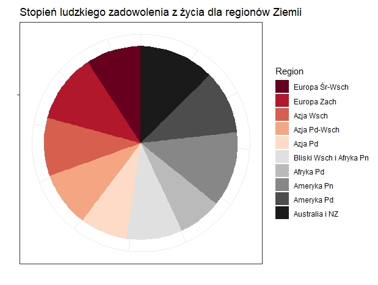
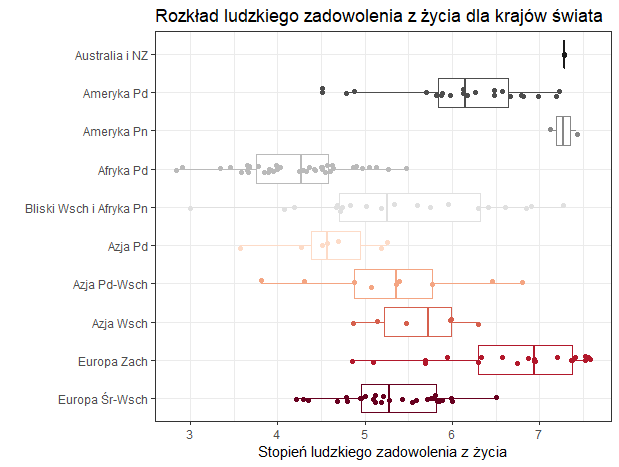

```{r setup, include=FALSE}
knitr::opts_chunk$set(echo = TRUE)
library(dplyr)
library(ggplot2)
library(RColorBrewer)
data <- read.csv("quiz.csv")
colnames(data) <- NULL
data <- as.data.frame(data)

multiplot <- function(..., plotlist=NULL, file, cols=1, layout=NULL) {
  library(grid)

  # Make a list from the ... arguments and plotlist
  plots <- c(list(...), plotlist)

  numPlots = length(plots)

  # If layout is NULL, then use 'cols' to determine layout
  if (is.null(layout)) {
    # Make the panel
    # ncol: Number of columns of plots
    # nrow: Number of rows needed, calculated from # of cols
    layout <- matrix(seq(1, cols * ceiling(numPlots/cols)),
                    ncol = cols, nrow = ceiling(numPlots/cols))
  }

 if (numPlots==1) {
    print(plots[[1]])

  } else {
    # Set up the page
    grid.newpage()
    pushViewport(viewport(layout = grid.layout(nrow(layout), ncol(layout))))

    # Make each plot, in the correct location
    for (i in 1:numPlots) {
      # Get the i,j matrix positions of the regions that contain this subplot
      matchidx <- as.data.frame(which(layout == i, arr.ind = TRUE))

      print(plots[[i]], vp = viewport(layout.pos.row = matchidx$row,
                                      layout.pos.col = matchidx$col))
    }
  }
}
```

## Wtęp
W ramach 5 pracy domowej przeprowadziłem eksperyment porównania prezentacji danych w formie PieChart i BoxPlot. Dane o zadowoleniu ludzi w poszczególnych krajach świata w 2015 roku pochodziły z [Kaggle](https://www.kaggle.com/unsdsn/world-happiness). **Dane te idealnie pasowały do stworzenia mało czytelnego wykresu kołowego oraz bardzo treściwego wykresu BoxPlot. Chciałem sprawdzić jak ten drugi pomaga nam odczytać więcej różnych przydatnych informacji.**
Stworzyłem dwa następujące wykresy, a następnie zadałem ankietowanym po 3 pytania do każdego z nich.

<center></center>

<center></center>


## Wyniki eksperymentu
### 1. Który region świata jest najszczęśliwszy?
```{r echo = FALSE, out.width="100%", fig.height=4, warning=FALSE}
plot1 <- data[,1]
plot1 <- as.character(plot1)
plot1 <- table(plot1)
plot1 <- t(plot1)
plot1 <- as.data.frame(plot1)
p1 <- ggplot(plot1, aes(y=Freq, x=plot1)) + geom_col(aes(fill=plot1)) + 
  labs(x = "", y = "Liczba odpowiedzi", subtitle="PieChart") + 
  scale_y_continuous(breaks = seq(0,12,2)) +
  scale_fill_manual(name = "Region", values = brewer.pal(3,"Pastel1"))  + guides(fill=FALSE)

plot4 <- data[,4]
plot4 <- as.character(plot4)
plot4 <- table(plot4)
plot4 <- t(plot4)
plot4 <- as.data.frame(plot4)
p2 <- ggplot(plot4, aes(y=Freq, x=plot4)) + geom_col(aes(fill=plot4)) + 
  labs(subtitle="BoxPlot", x = "", y = "Liczba odpowiedzi") + 
  scale_y_continuous(breaks = seq(0,12,2)) +
  scale_fill_manual(name = "Region", values = brewer.pal(3,"Pastel1")) + guides(fill=FALSE)
multiplot(p1, p2, cols=2)

```

Ogólnie kraje w Ameryce Pn oraz Australii i NZ mają bardzo podobny średni wynik zadowolenia. Ciężko ocenić to na wykresie kołowym, stąd wiele osób pomyliło się i zaznaczyło odpowiedź Europa Zachodnia. Poprawny wynik, Australia i NZ, został wskazany więcej razy na wykresie BoxPlot.

### 2. Który kolor zwrócił Twoją uwagę jako pierwszy?
```{r echo = FALSE, fig.width=5, fig.height=5, warning=FALSE, fig.align='center'}
kolory <- brewer.pal(9,"Set1")[c(1,5)]
plot2 <- cbind(c("Czerwony", "Czarny", "Pomarańczowy","Szary"),c(10,9,1,0))
colnames(plot2) <- c("plot2","Freq")
plot2 <- as.data.frame(plot2)
plot2$Freq <- as.numeric(as.character(plot2$Freq))
plot2$plot2 <- factor(plot2$plot2, levels = plot2$plot2)
ggplot(plot2, aes(y=Freq, x=plot2)) + geom_col(aes(fill=plot2)) + 
  labs( x = "", y = "Liczba odpowiedzi", subtitle="PieChart") + 
  scale_fill_manual(name = "Kolor", values = c(kolory[1],"black",kolory[2],"black"))  + scale_y_continuous(breaks = seq(0,10,2)) + guides(fill=FALSE)
```

Przy pierwszym wykresie interesowało mnie na jakie kolory zwracamy szczególną uwagę przy oglądaniu wykresów. Wyniki mówią same za siebie. Będą to głownie wyraziste, wyróżniające się kontrastem kolory.

### 3. Czy 2 najciemniejsze kolory miały większą powierzchnie od 2 najjaśniejszych?
```{r echo = FALSE, fig.width=5, fig.height=5, warning=FALSE, fig.align='center'}

plot3 <- data[,3]
plot3 <- as.character(plot3)
plot3 <- table(plot3)
plot3 <- t(plot3)
plot3 <- as.data.frame(plot3)
ggplot(plot3, aes(y=Freq, x=plot3)) + geom_col(aes(fill=plot3)) +
  labs( x = "", y = "Liczba odpowiedzi", subtitle="PieChart") + 
  scale_y_continuous(breaks = seq(0,12,2)) +
  scale_fill_manual(name = "Region", values = brewer.pal(2,"Pastel1")) + guides(fill=FALSE)
```

Zdziwiło mnie, że aż 1/3 ankietowanych miała problem ze wskazaniem poprawnej odpowiedzi w tym pytaniu. Niestety ciężko jest nam porównywać kąty na wykresie kołowym.

### 4. Który region miał najwięcej krajów?

```{r echo = FALSE, fig.width=5, fig.height=5, warning=FALSE, fig.align='center'}
plot5 <- data[,5]
plot5 <- as.character(plot5)
plot5 <- table(plot5)
plot5 <- t(plot5)
plot5 <- as.data.frame(plot5)
plot5$plot5 <- factor(c("Afryka Pd","Ameryka Pd","Europa Śr-Wsch"), levels=c("Afryka Pd","Ameryka Pd","Europa Śr-Wsch"))
ggplot(plot5, aes(y=Freq, x=plot5)) + geom_col(aes(fill=plot5)) + 
  labs(subtitle="BoxPlot", x = "", y = "Liczba odpowiedzi") + 
  scale_y_continuous(breaks = seq(0,18,3)) +
  scale_fill_manual(name = "Region", values = brewer.pal(3,"Pastel1")) + guides(fill=FALSE)
```


### 5. Który region miał największą różnicę pomiędzy najbardziej i najmniej zadowolonym krajem?

```{r echo = FALSE, fig.width=5, fig.height=5, warning=FALSE, fig.align='center'}
plot6 <- data[,6]
plot6 <- as.character(plot6)
plot6 <- table(plot6)
plot6 <- t(plot6)
plot6 <- as.data.frame(plot6)
plot6 <- plot6[order(plot6$Freq, decreasing=TRUE),-1]
plot6$plot6 <- factor(plot6$plot6, levels=plot6$plot6)
ggplot(plot6, aes(y=Freq, x=plot6)) + geom_col(aes(fill=plot6)) + 
  labs( subtitle="BoxPlot", x = "", y = "Liczba odpowiedzi") + 
  scale_y_continuous(breaks = seq(0,14,2)) +
  scale_fill_manual(name = "Region", values = brewer.pal(3,"Pastel1")) + guides(fill=FALSE)
```

W 5. i 6. pytaniu ankietowani w większości wskazali poprawną odpowiedź. Zastosowanie innego rodzaju wykresu pozwoliło zakodować więcej informacji. Okazało się, że duża cześć osób jest w stanie analizować wykres BoxPlot. Nie przeszkodziły w tym maskujące lub wyróżniające kolory.

## Podsumowanie
Mamy problem z odczytywaniem danych na wykresach kołowych, kolory o mocnym kontraście zwracają naszą uwagę, a wykres BoxPlot nie jest taki straszny, jak się może wydawać. Pozwala również na przedstawienie większej ilości danych.
